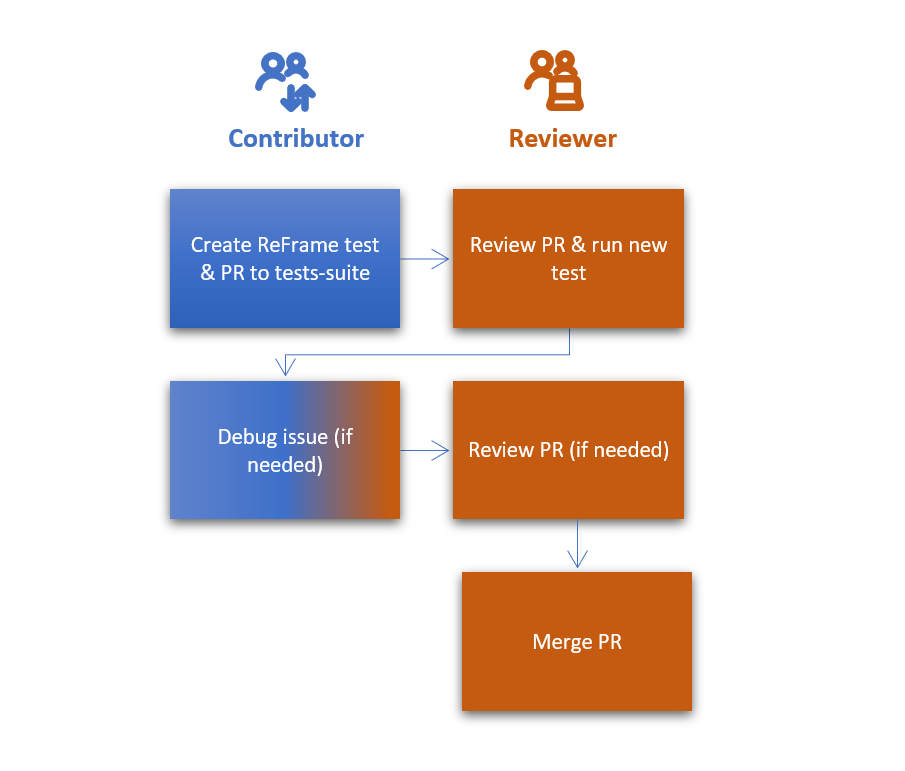

# Overview of adding software to EESSI

We welcome contributions to the EESSI software stack. This page shows the procedure and provides links to the contribution policy and the technical details of making a contribution. 

## Contribute a software to the EESSI software stack

  

## Contributing a ReFrame test to the EESSI test suite

Ideally, a contributor prepares a ReFrame test for the software to be added to the EESSI software stack. 

  

# More about adding software to EESSI

* [Contribution policy](contribution_policy.md)
* [Opening a pull request *(for contributors)*](opening_pr.md)
* [Building software *(for maintainers)*](building_software.md)
* [Debugging failed builds *(for contributors + maintainers)*](debugging_failed_builds.md)
* [Deploying software *(for maintainers)*](deploying_software.md)

If you need help with adding software to EESSI, please [open a support request](../support.md).
