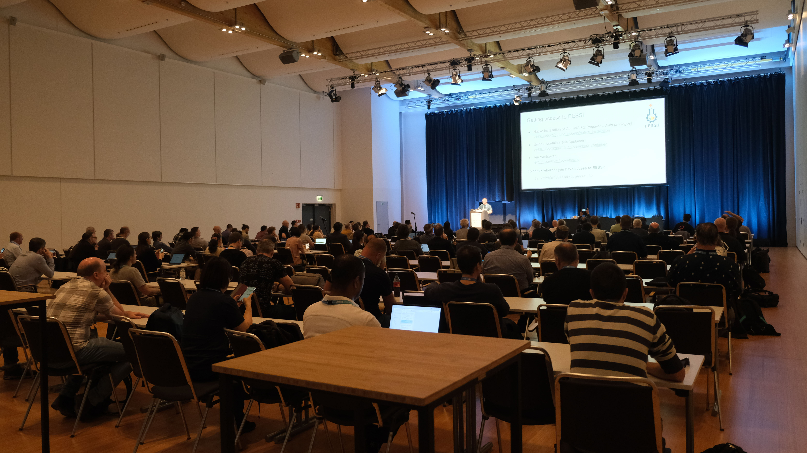
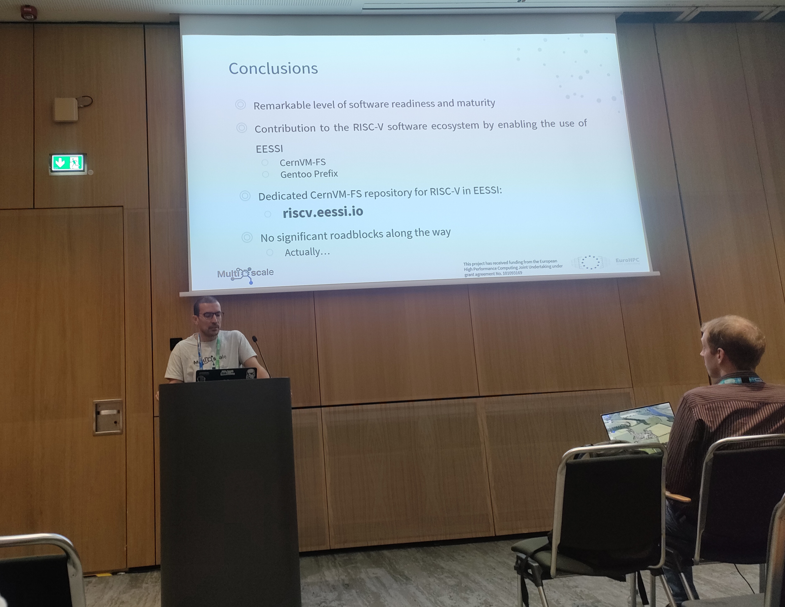
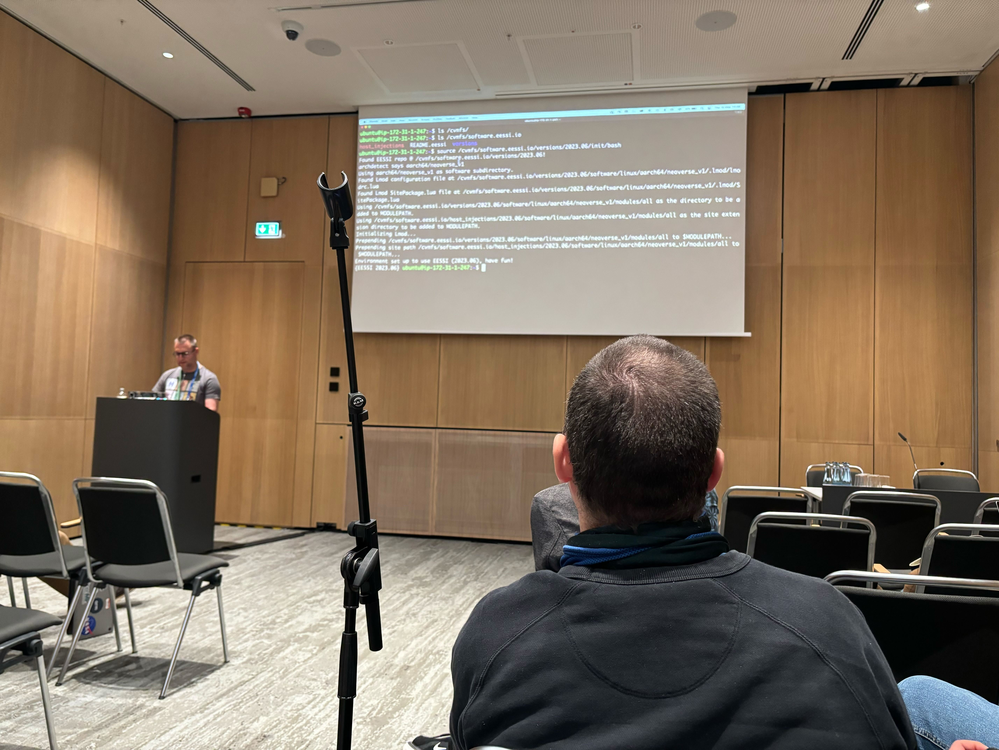
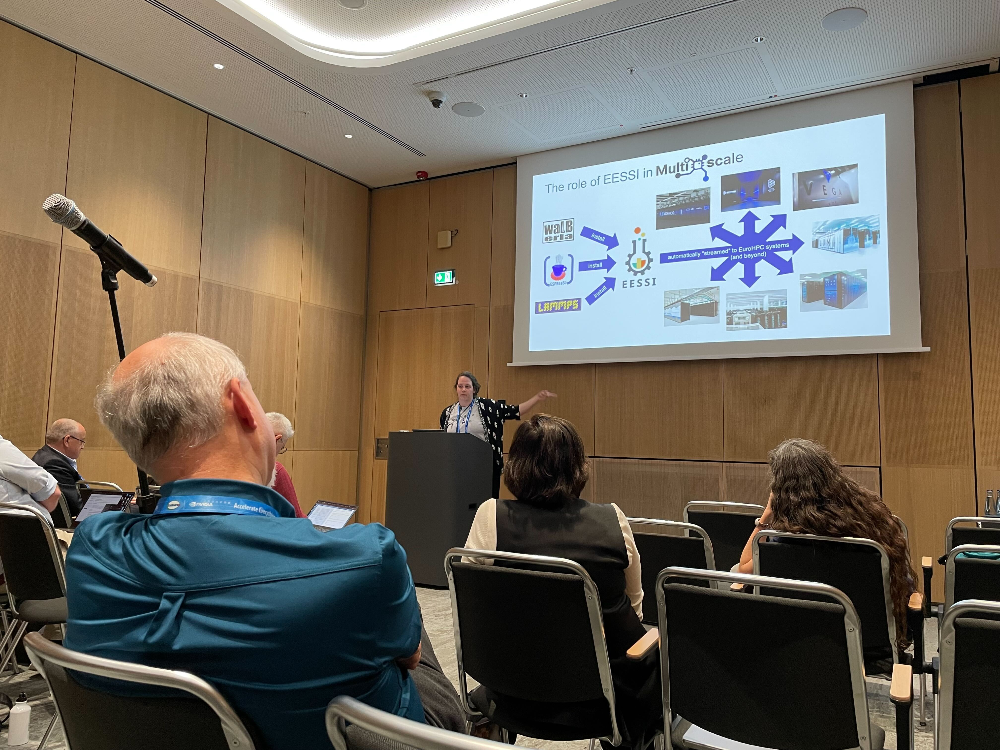
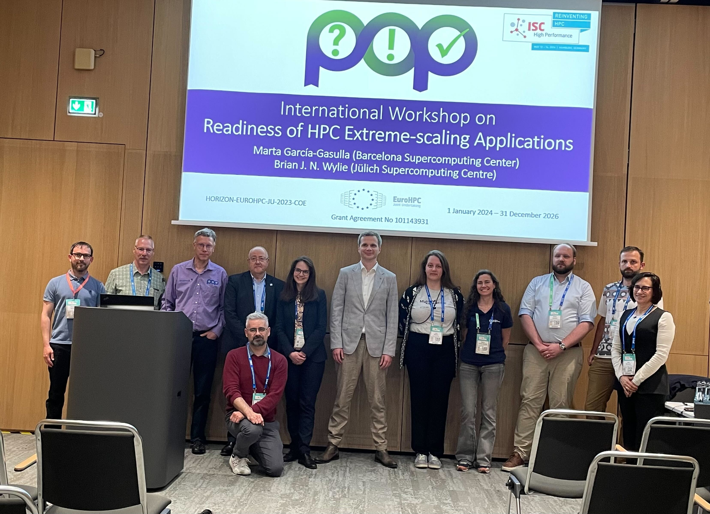
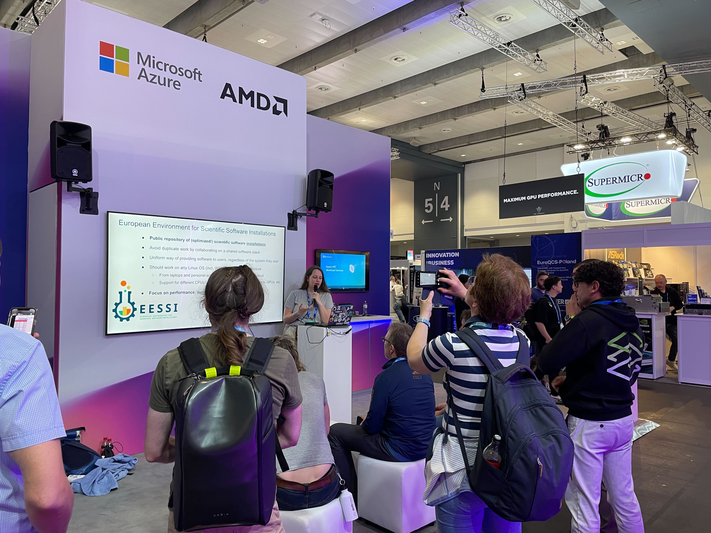
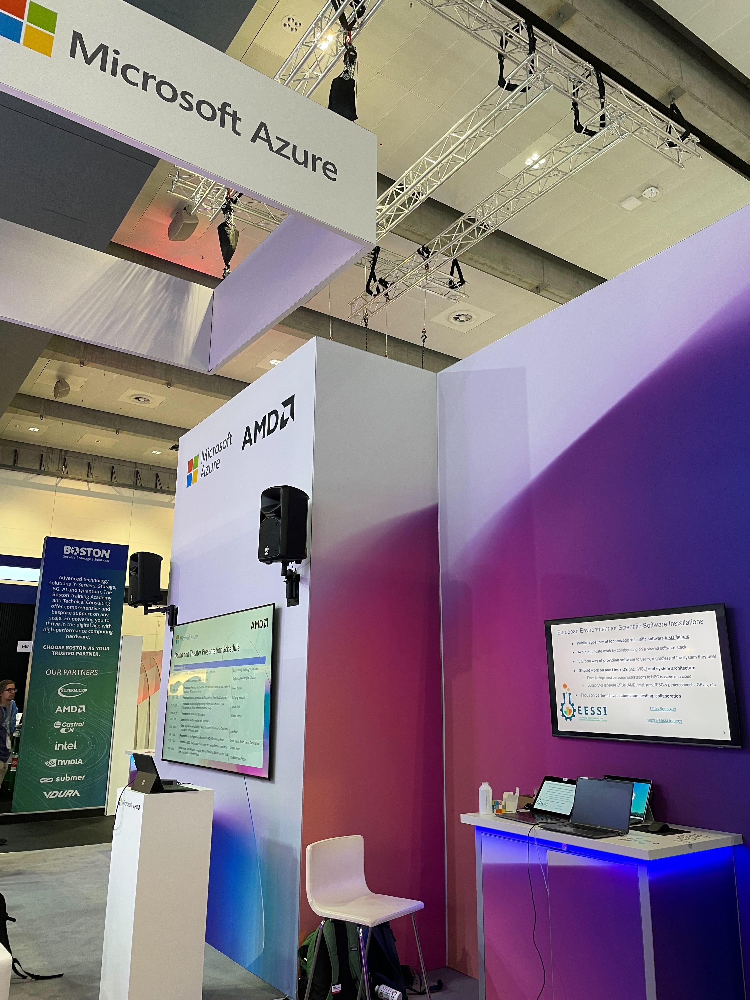
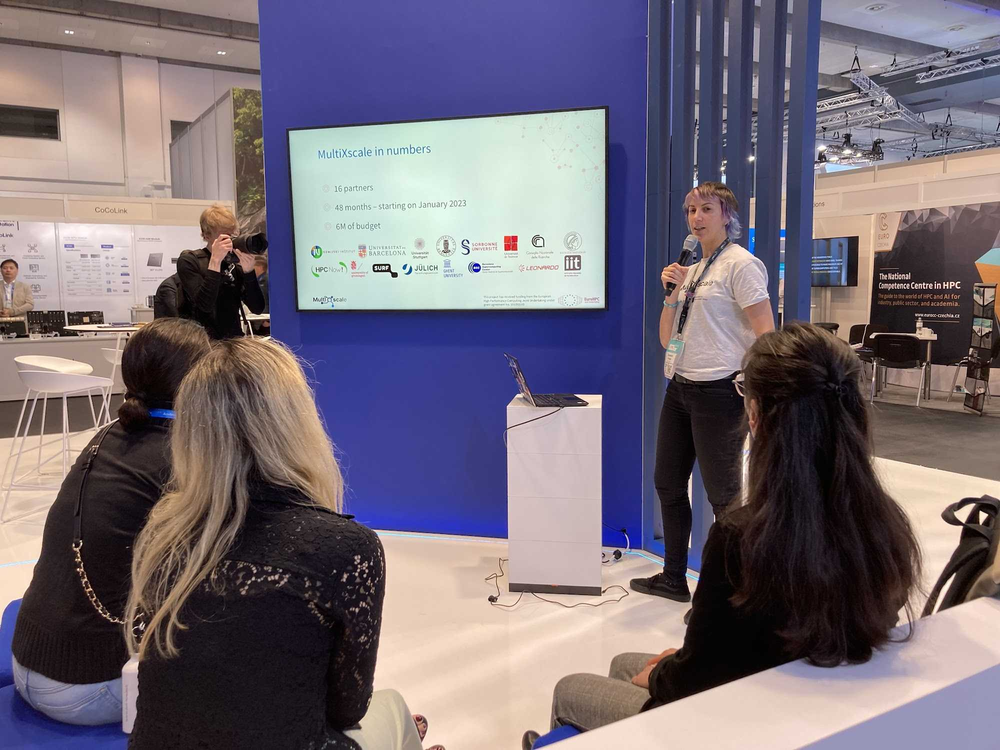
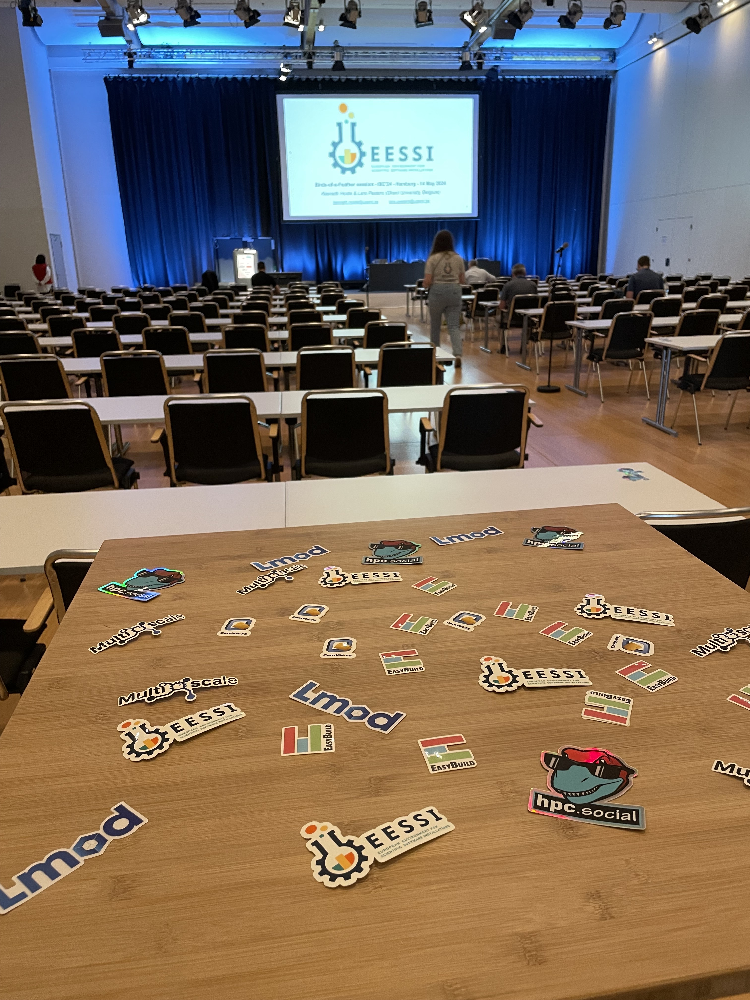

# EESSI promo tour @ ISC'24 (May 2024, Hamburg)

<figure markdown="span">
{width=70%}
</figure>

This week, we had the privilege of attending the [ISC'24](https://www.isc-hpc.com) conference in the beautiful city of Hamburg, Germany.
This was an excellent opportunity for us to showcase [EESSI](https://eessi.io), and gain valuable insights and feedback from the HPC community.

---

## BoF session on EESSI

The EESSI Birds-of-a-Feather (BoF) session on Tuesday morning, part of the official ISC'24 program, was the highlight of our activities in Hamburg.

It was well attended, with well **over 100** people joining us at 9am.

<figure markdown="span">
{width=90%}
</figure>

During this session, we introduced the EESSI project with a short presentation, followed by a well-received **live hands-on demo** of installing and using EESSI by spinning up an "empty"
Linux virtual machine instance in Amazon EC2 and getting optimized installations of popular scientific applications like GROMACS and TensorFlow running in a matter of minutes.

During the second part of the BoF session, we engaged with the audience
through an **interactive poll** and letting attendees ask questions.

The **presentation slides**, including the results of the interactive poll and questions that were raised by attendees, are **available [here](https://raw.githubusercontent.com/EESSI/meetings/main/other/isc24/EESSI-ISC24-BoF-with-poll-results-20240514.pdf)**.

---

## Workshops

During the last day of ISC'24, EESSI was present is no less than *three* different
workshops.

### RISC-V workshop

At the [*Fourth International workshop on RISC-V for HPC*](https://riscv.epcc.ed.ac.uk/community/isc24-workshop),
Julián Morillo ([BSC](https://www.bsc.es)) presented our paper
[**"Preparing to Hit the Ground Running: Adding RISC-V support to
EESSI"**](https://riscv.epcc.ed.ac.uk/community/isc24-workshop/#preparing-to-hit-the-ground-running-adding-risc-v-support-to-eessi)
(slides available [here](https://raw.githubusercontent.com/EESSI/meetings/main/other/isc24/EESSI-ISC24-RISC-V-workshop-20240517.pdf)).

<figure markdown="span">
{width=80%}
</figure>

Julián covered the initial work that was done in the scope of the [MultiXscale EuroHPC Centre-of-Excellence](https://www.multixscale.eu) to add support for RISC-V to EESSI, outlined the challenges we encountered, and shared the lessons we have learned along the way.

### AHUG workshop

During the [Arm HPC User Group (AHUG) workshop](https://arm-hpc-user-group.github.io/isc24-ahug-workshop), Kenneth Hoste
([HPC-UGent](https://www.ugent.be/hpc/en)) gave a
talk entitled *"Extending Arm’s Reach by Going EESSI"* (slides available [here](https://raw.githubusercontent.com/EESSI/meetings/main/other/isc24/EESSI-ISC24-AHUG-workshop-20240517.pdf)).

Next to a high-level introduction to EESSI, we briefly covered some
of the challenges we encountered when testing the optimized software installations
that we had built for the Arm Neoverse V1 microarchitecture, including
bugs in [OpenMPI](https://gitlab.com/eessi/support/-/issues/41) and [GROMACS](https://gitlab.com/gromacs/gromacs/-/issues/5057).

<figure markdown="span">
{width=80%}
</figure>

Kenneth gave a live demonstration of how to get access to EESSI and start running
the optimized software installations we provide through our CernVM-FS repository
on a fresh AWS Graviton 3 instance in a matter of minutes.

### POP workshop

In the afternoon on Thursday, Lara Peeters ([HPC-UGent](https://www.ugent.be/hpc/en)) presented [MultiXscale](https://www.multixscale.eu) during the [*Readiness of HPC Extreme-scale Applications* workshop](https://pop-coe.eu/news/events/readiness-of-HPC-extreme-scale-applications), which was organised by the [POP EuroHPC Centre-of-Excellence](https://pop-coe.eu)
(slides available [here](https://raw.githubusercontent.com/EESSI/meetings/main/other/isc24/EESSI-ISC24-POP-workshop-20240517.pdf)).

<figure markdown="span">
{width=80%}
</figure>

Lara outlined the pilot use cases on which MultiXscale focuses,
and explained how EESSI helps to achieve the goals of MultiXscale
in terms of Productivity, Performance, and Portability.

<figure markdown="span">
{width=80%}
</figure>

At the end of the workshop, a group picture was taken with both organisers
and speakers, which was a great way to wrap up a busy week in Hamburg!

---

## Talks and demos on EESSI at exhibit

Not only was EESSI part of the official ISC'24 program via a dedicated BoF session and various workshops: we were also prominently present on the exhibit floor.

### Microsoft Azure booth

**Microsoft Azure** invited us to give a **1-hour introductory presentation**
on EESSI on both Monday *and* Wednesday at their booth during the ISC'24 exhibit,
as well as to provide **live demonstrations** at the demo corner of their booth on Tuesday afternoon on how to get access to EESSI and the user experience it provides.

<figure markdown="span">
{width=80%}
</figure>

Exhibit attendees were welcome to pass by and ask questions, and did so throughout the full 4 hours we were present there.

<figure markdown="span">
{width=60%}
</figure>

Both Microsoft Azure and AWS have been graciously providing resources in their cloud infrastructure free-of-cost for developing, testing, and demonstrating EESSI for several years now.

### EuroHPC booth

The [MultiXscale EuroHPC Centre-of-Excellence](https://www.multixscale.eu) we
are actively involved in, and through which the development of EESSI is being funded since Jan'23,
was invited by the [EuroHPC JU](https://eurohpc-ju.europa.eu) to present the goals and
preliminary achievements at their booth.

<figure markdown="span">
{width=80%}
</figure>

Elisabeth Ortega ([HPCNow!](https://hpcnow.com)) did the honours to give
the last talk at the EuroHPC JU booth of the ISC'24 exhibit.

---

## Stickers!

Last but not least: we handed out a boatload free stickers with the logo of both [MultiXscale](https://www.multixscale.eu) and EESSI itself, as well as of various of the
open source software projects we leverage, including [EasyBuild](https://easybuild.io), [Lmod](http://lmod.readthedocs.org), and [CernVM-FS](https://cernvm.cern.ch/fs).

<figure markdown="span">
{width=60%}
</figure>

We have mostly exhausted our sticker collection during ISC'24, but don't worry: we will make sure we have more available
at upcoming events...
