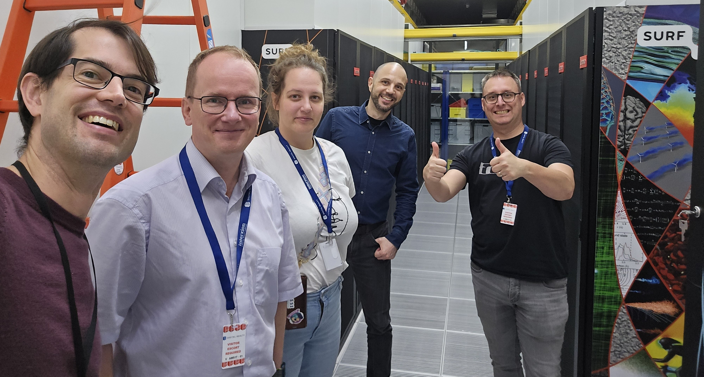
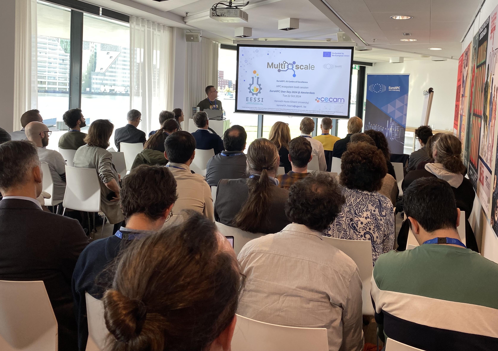
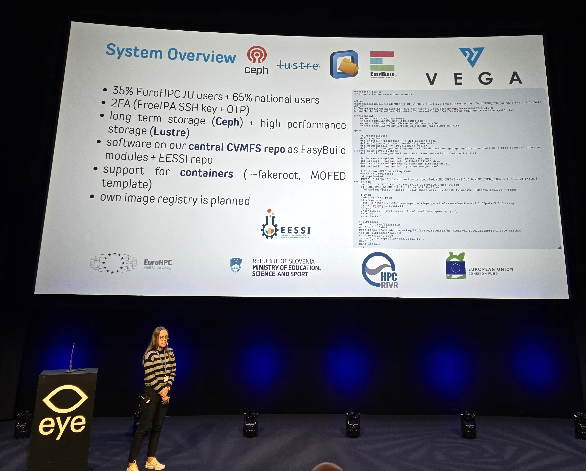
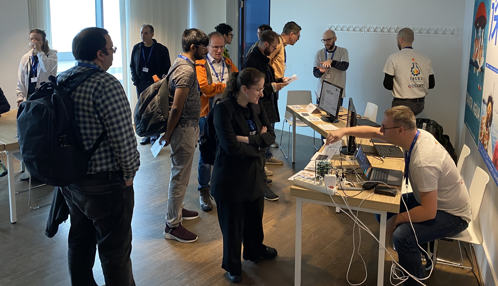
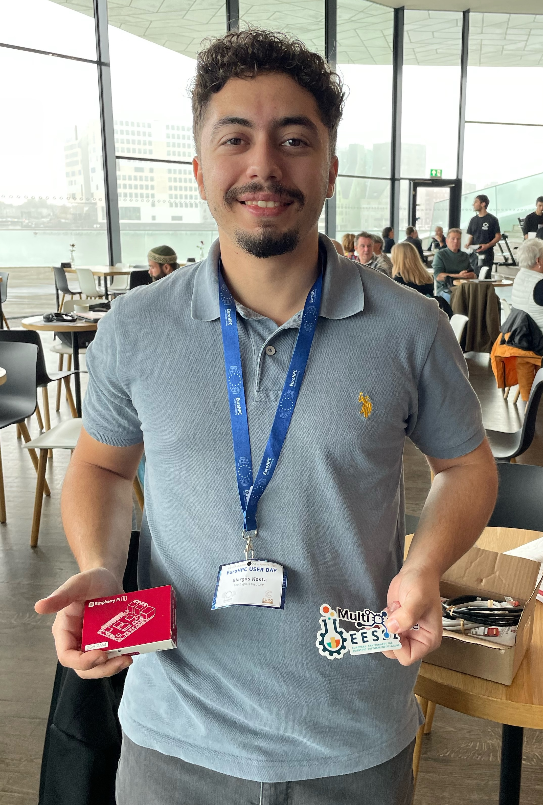
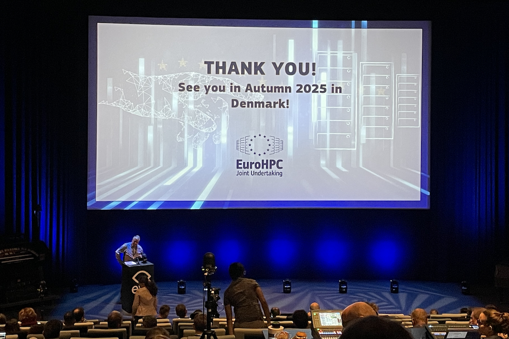

# EuroHPC User Day (22-23 Oct 2024, Amsterdam)

<figure markdown="span">
{width=30%}
</figure>

We had a great time at the [EuroHPC User Day 2024 in Amsterdam](https://eurohpc-ju.europa.eu/news-events/events/eurohpc-user-day-2024-2024-10-22_en) earlier this week.

Both [MultiXscale](https://multixscale.eu) and [EESSI](https://eessi.io) were strongly represented,
and the work we have been doing was clearly being appreciated.

<!-- more -->
---

## Visit to SURF & Snellius at Amsterdam Science Park

Most of us arrived in the afternoon the day before the event,
which gave us the chance to visit [SURF](https://www.surf.nl/en) on-site.

We had a short meeting there with the local team about how we could leverage [Snellius](https://www.surf.nl/en/services/snellius-the-national-supercomputer),
the Dutch national supercomputer, for building and testing software installations for EESSI.

<figure markdown="span">
{width=70%}
</figure>

We also got to visit the commercial datacenter at the [Amsterdam Science Park](https://www.amsterdamsciencepark.nl)
(which will soon also host a [European quantum computer](https://www.amsterdamsciencepark.nl/news/surf-to-host-european-quantum-computer-at-amsterdam-science-park/)!)
and see Snellius up close, where we took a nice selfie.

## Presentation on MultiXscale and EESSI

After the very interesting [first EuroHPC User Day](https://eurohpc-ju.europa.eu/news-events/events/eurohpc-user-day-2023-12-11_en) in Brussels in December 2023,
where MultiXscale and EESSI were [mentioned as "being well-aligned with the vision of EuroHPC JU"](https://twitter.com/kehoste/status/1734169825750966726),
we wanted to have a stronger presence at the second EuroHPC User Day in Amsterdam.

We submitted a paper entitled *"Portable test run of ESPResSo on EuroHPC systems via EESSI"*
which was based on an [earlier blog post we did in June 2024](../06/espresso-portable-test-run.md).
Our submission was accepted, and hence the paper will be included in the upcoming proceedings of the 2nd EuroHPC User Day.

As a result, we were invited to present MultiXscale and more specifically
the EESSI side of the project during one of the parallel sessions: *HPC ecosystem tools*.
The slides of this presentation are available [here](EuroHPC-User-Day-2024-20241022-MultiXscale-EESSI.pdf).

<figure markdown="span">
{width=70%}
</figure>

During the Q&A after our talk various attendees asked interesting questions about specific aspects of EESSI,
including:

* Where are both the central and mirror servers of EESSI hosted? (answer: currently at the University of Groningen,
and in AWS & Azure, respectively, but they can be easily relocated if there is a reason to);
* Are customized builds of software are possible on top of EESSI? (answer: yes, see also [here](../../../../using_eessi/building_on_eessi.md));
* What are the challenges with supporting NVIDIA GPUs? (answer: see [here](../../../../site_specific_config/gpu.md)).

Some attendees also provided some nice feedback on their initial experience with EESSI:

!!! quote "Quote by one of the attendees of the MultiXscale talk"

    It's very easy to install and configure CernVM-FS to provide access to EESSI
    based on the [available documentation](../../../../getting_access/native_installation.md).

    Any sysadmin can do it: it took me half a day, and that was mostly due to my own stupidity.

## Mentioning of MultiXscale and EESSI by other speakers

It was remarkable and satisfying to see that MultiXscale and EESSI were being mentioned several times through the event,
often by people and organisations who are not actively involved with either project.
Clearly the word is starting to spread on the work we are doing!

Valeriu Codreanu (head of High-Performance Computing and Visualization at SURF) had some nice comments
to share during his opening statement of the event about their involvement in MultiXscale and EESSI,
and why a well-designed shared stack of optimized software installations is really necessary.

When an attendee of one of the plenary sessions raised a question on a lack of a uniform software stack across EuroHPC systems,
Lilit Axner (Programme Manager Infrastructure at EuroHPC JU) answered that a federated platform for EuroHPC systems is currently in the works,
and that more news will be shared soon on this.

<figure markdown="span">
{width=70%}
</figure>

In the short presentation on the [EuroHPC JU system Vega](https://izum.si/en/vega-en) we got explicitly mentioned again,
alongside [CernVM-FS](https://cernvm.cern.ch/fs/) and [EasyBuild](https://easybuild.io) which are both used in the EESSI
project.

## Live demo of EESSI at walk-in networking session

On Wednesday, the MultiXscale project was part of the walk-in networking session *Application Support, Training and Skills*.

<figure markdown="span">
{width=70%}
</figure>

During this session we were running a live demonstration of a small
[Plane Poiseuille flow](https://en.wikipedia.org/wiki/Hagen%E2%80%93Poiseuille_equation#Plane_Poiseuille_flow)
simulation with [ESPResSo](https://github.com/espressomd/espresso).

The software was being provided via EESSI, and we were running the simulation on various hardware platforms,
including:

* An on-site cluster consisting of 4 Arm-based Raspberry Pi 3B+ boards;
* A RISC-V StarFive VisionFive 2 SBC;
* An Arm A64FX node of the EuroHPC system [Deucalion](https://rnca.fccn.pt/en/deucalion/);
* An A100 GPU in the EuroHPC system [Vega](https://izum.si/en/vega-en);

<figure markdown="span">
{width=70%}
</figure>

Attendees could participate in a contest to win a Raspberry Pi 5 starter kit
by filling out a form and answering a couple of questions related to MultiXscale.

At the end of the session we did a random draw among the participants who answered the questions correctly,
and Giorgos Kosta (CaSToRC - The Cyprus Institute) came out as the lucky winner!

<figure markdown="span">
{width=40%}
</figure>

## EuroHPC User Forum

Last but not least, the [EuroHPC User Forum](https://eurohpc-ju.europa.eu/user-forum-coordination-group-strengthen-ties-between-eurohpc-users-officially-established-2024-10-23_en)
was being presented during a plenary session.

Attendees were invited to connect with the EuroHPC User Forum representatives and each other
via the dedicated Slack that has been created for it.

{width=48%}
{width=48%}

Lara Peeters, who is also active in [MultiXscale EuroHPC Centre-of-Excellence](https://multixscale.eu),
is part of the EuroHPC User Forum, representing Digital Humanities.

## EuroHPC User Day 2025 in Denmark

We are already looking forward to engaging with the EuroHPC user community next year in Denmark!

<figure markdown="span">
{width=70%}
</figure>
