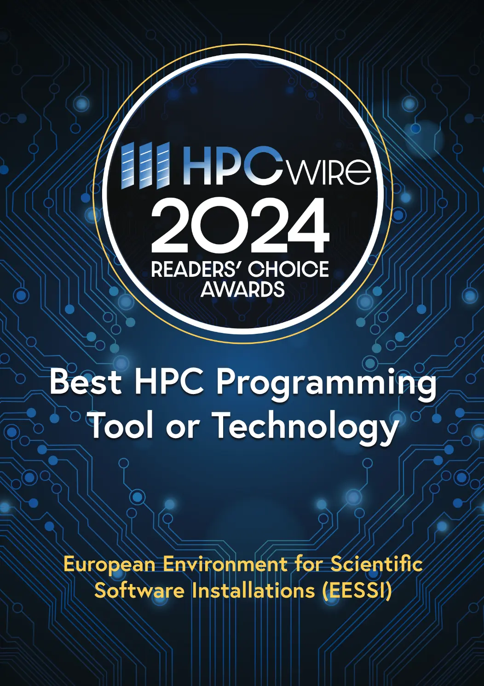
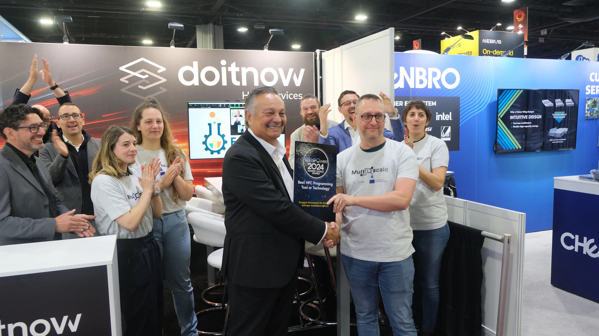
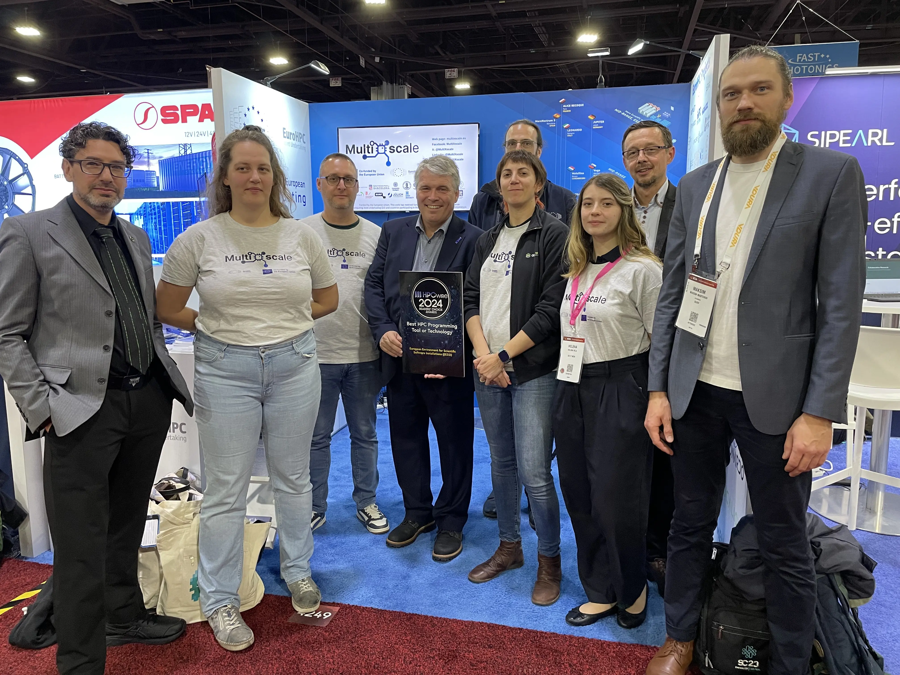

# EESSI won an HPCWire Reader's Choice Award!

We are thrilled to announce that **EESSI has won an HPCWire Reader's Choice Award**!

<figure markdown="span">
{width=50%}
</figure>

<!-- more -->

EESSI received the most votes from the HPC community in the *"Best HPC Programming Tool or Technology"* category,
despite the fierce competition of others projects that got nominated in this category.

This news was revealed at the [Supercomputing 2024 (SC'24) conference in Atlanta (US)](https://sc24.supercomputing.org).

**Thank you very much if you voted for us!**

## Award ceremony

<figure markdown="span">
{width=80%}
</figure>

A modest award ceremony was held at the [Do IT Now](https://www.doitnowgroup.com) booth on the SC'24 exhibit floor,
since [HPCNow!](https://hpcnow.com) (now also known as Do IT Now Spain)
is a partner in the [MultiXscale EuroHPC Centre-of-Excellence](https://www.multixscale.eu).

The handover of the award plaque was done by [Tom Tabor, CEO of Tabor Communications, Inc.](https://tomtabor.com/),
the publisher of [HPCWire](https://www.hpcwire.com).

## Picture at EuroHPC JU booth

[Anders Dam Jensen](https://www.linkedin.com/in/anders-dam-jensen-7a4900/), CEO of EuroHPC JU, and Daniel Opalka,
head of Research & Innovation at EuroHPC JU, were more than happy to take a commemorative picture at
the EuroHPC JU booth, together with representatives of some of the MultiXscale partners (Ghent University,
HPCNow!, and SURF).

<figure markdown="span">
{width=80%}
</figure>

It is important to highlight that the funding provided by the EuroHPC JU to the MultiXscale Centre-of-Excellence
has been a huge catalyst in the last couple of years for EESSI, which forms the technical pillar of MultiXscale.

## More info

For more information about EESSI, check out our website: [https://eessi.io](https:/eessi.io).
