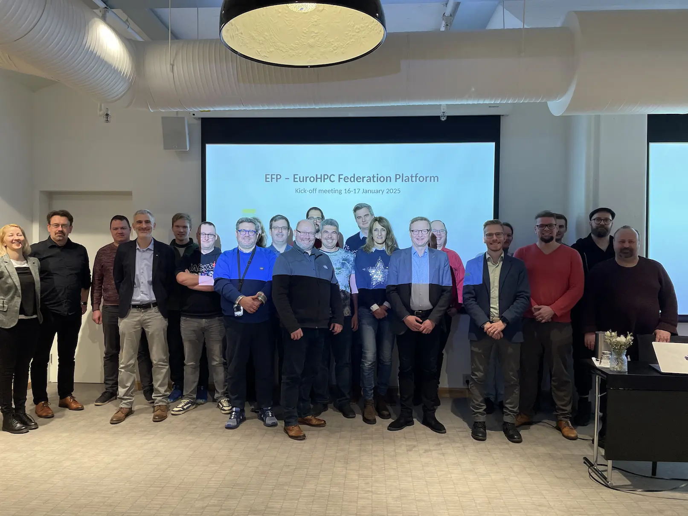
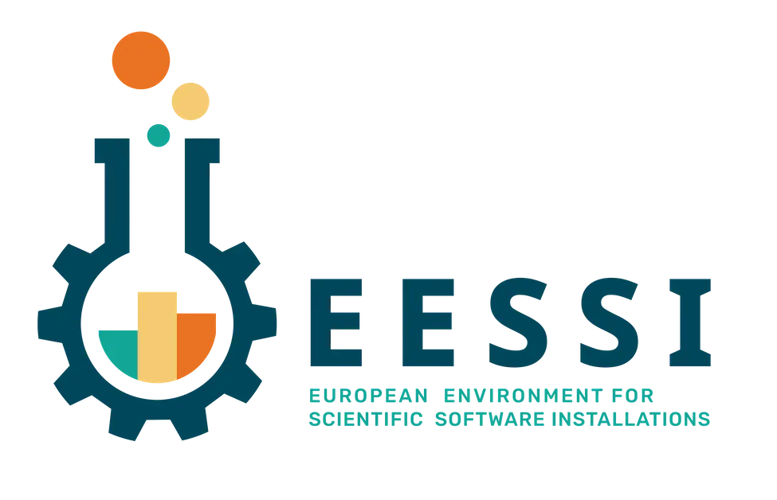

# Integration in the EuroHPC Federation Platform

A couple of weeks ago the EuroHPC Joint Undertaking (EuroHPC JU) [announced the consortium that will develop the
**EuroHPC Federation Platform (EFP)**](https://eurohpc-ju.europa.eu/paving-way-eurohpc-federation-platform-2024-12-19_en).

This ambitious effort will deliver a 'one-stop shop' for researchers using the EuroHPC supercomputers,
as well as the upcoming EuroHPC AI Factories and quantum computers, built with open source software.

<figure markdown="span">
{width=70%}
</figure>

Ghent University is part of this consortium to **integrate EESSI into the EuroHPC Federation Platform** as common software stack.

Henrik Nortamo (CSC), the technical lead of the EFP consortium, gave an excellent 20-minute talk on EFP
last weekend in the 10th *HPC, Big Data, and Data Science* devroom at FOSDEM'25 in Brussels.
**Slides and recording of the talk are available [here](https://fosdem.org/2025/schedule/event/fosdem-2025-6718-eurohpc-fp-a-federated-platform-for-hpc-infrastructure-in-europe-built-with-open-source-software/).**

<!-- more -->

## The EFP consortium

The consortium that will develop the EuroHPC Federation Platform consists of:

* [CSC](https://csc.fi/en) in Finland, the Hosting Entity for [LUMI](https://www.lumi-supercomputer.eu), as lead partner;
* [IT4Innovations](https://www.it4i.cz/en) in Czech Republic, the Hosting Entitory for [Karolina](https://www.it4i.cz/en/infrastructure/karolina);
* [Ghent University](https://www.ugent.be/en) in Belgium;
* [University of Tartu](https://ut.ee/en) in Estonia;
* [GÉANT](https://geant.org), the pan-European data network for the research and education community;
* [NORDUnet](https://www.nordu.net), a Nordic collaboration connecting national research and education network;

<figure markdown="span">
{width=100%}
</figure>

A productive kickoff meeting was held on 16+17 January 2025 in Helsinki, Finland.

Each of the components of the federated platform were presented by and to the consortium partners,
and practical aspects of executing the planned work in the coming months and years were discussed.

## Scope and timeline of EFP

The federated platform aims to facilitate access to and usage of the EuroHPC infrastructure.

It will provide:

* Federated Single-Sign-On, based on [MyAccessID](https://wiki.geant.org/display/MyAccessID);
* Direct access using (short-lived) SSH certificates;
* Web interface for interactive use, based on [Open OnDemand](https://openondemand.org);
* Common software stack, based on [EESSI](https://eessi.io);
* Resource allocation and management across systems, based on [Waldur](https://waldur.com);
* Advanced workflows and data transfer, based on [LEXIS](https://docs.lexis.tech/) and [HEAppE](https://heappe.eu/);

<figure markdown="span">
{width=100%}
</figure>

The development of the federated platform started just a couple of weeks ago (January 2025).
An initial production version of the platform with currently online EuroHPC JU systems integrated
is planned to be operational by March 2026.

The work is funded by the EuroHPC Joint Undertaking, who is providing a total budget of ~20 million Euro
to the EFP consortium for 2025-2029.

## Powered by open source software

<figure markdown="span">
{width=100%}
</figure>

!!! quote "Quote by Henrik Nortamo (CSC.fi), technical lead of EFP @ HPC devroom at FOSDEM'25"

    ***This would not be possible without open source.***

    *If you consider the scope of the functionality, and the implicit understanding
    the implemented technologies have of user requirements, starting from scratch and
    compiling that into something sensible would be an *extremely* large job.*

    *Federation requires of course a degree of trust that our stuff works.
    With open source, somebody else is running it, you can have a look at it, you can go and check it out.
    It's much easier than going "here's my binary blob, please install it so that stuff works".*

    *Also on the promised features: I've shown you a bunch of stuff, I'm promising you many things
    which can be done. If this was a closed-source solution, which wasn't used anywhere
    and you couldn't look into it, you would probably think that "he's trying to bullshit us, there's no way".
    But now you know: yes, that is an open source component, it works there, I understand why it works,
    this could also work.*

    [(see also slides + recording of Henrik's talk on EuroHPC Federation Platform)](https://fosdem.org/2025/schedule/event/fosdem-2025-6718-eurohpc-fp-a-federated-platform-for-hpc-infrastructure-in-europe-built-with-open-source-software/)

## EESSI as common software stack

<figure markdown="span">
{width=70%}
</figure>

[EESSI](https://eessi.io/docs) will be integrated in the EuroHPC Federation Platform as a part of
the *Federated Software Catalogue* component, a common software stack that will be available on the EuroHPC systems.

Researchers will be able to consult which software is available on the various EuroHPC systems through
the *Federated Software Listing* component of the federated platform.

## Current status of EESSI on EuroHPC JU systems

This work will foster a quick(er) and broad adoption of EESSI on EuroHPC infrastructure.

We expect that there will also be a "trickle-down" effect to national and local supercomputers
throughout Europe (and beyond) to also make EESSI available there in the short term.

Today, EESSI is already available on various EuroHPC JU supercomputers,
including Vega in Slovenia, Karolina in Czech Republic, and (the A64FX partition of) Deucalion in Portugal.

Discussions with various other EuroHPC JU systems to also make EESSI available there are ongoing, including
MeluXina in Luxembourg, MareNostrum 5 in Spain, LUMI in Finland, and JUPITER in Germany.

An up-to-date overview of systems where EESSI is known to be available is available in the EESSI documentation:
[https://eessi.io/docs/systems](https://www.eessi.io/docs/systems).
