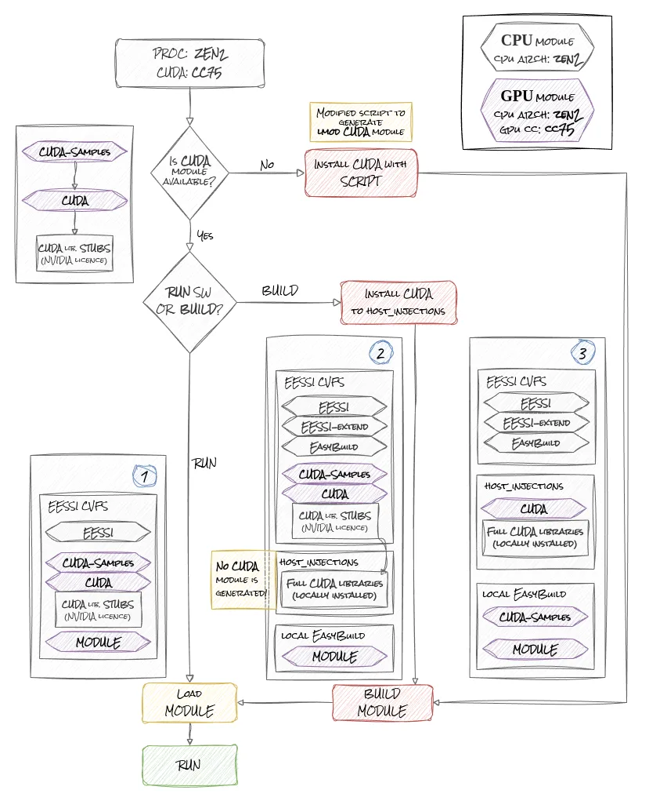
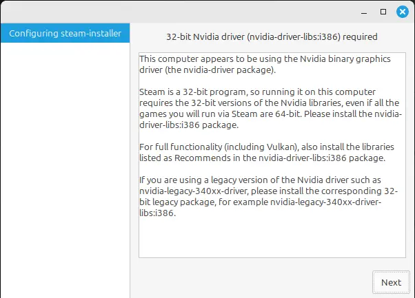

# GPU Support in EESSI: From Zero to Science in Seconds

"How long until I can run my simulation?" 

It's the question every computational scientist asks when setting up a new environment. With GPU-accelerated EESSI, the answer might surprise you: as little as 15 seconds from login to launching your first computation.

In the high-stakes world of scientific computing, every minute spent configuring software is a minute not spent on discovery. That's why we've developed a metric we call **Mean-Time-To-Science** – the total time from system access to running your first scientific computation. By optimizing this crucial metric, EESSI's GPU support transforms the traditional hours-long setup process into a seamless experience that keeps researchers focused on their science.

Although EESSI aims to provide pre-built software for all common HPC architectures, GPU support introduces multiplicative requirements for software builds. Each GPU compute capability (e.g., CC7.5, CC8.0, CC8.6) needs to be combined with each CPU architecture (zen2, zen3, generic x86_64), creating a large matrix of possible configurations. It's not viable to pre-build all software for all possible CPU/GPU combinations.

To address this challenge, we're developing additional documentation highlighting which CPU/GPU combinations are already built into EESSI. Additionally, we provide the tools and process for users to build any EasyBuild-enabled software on EESSI, allowing them to create architecture-specific builds for their particular needs when a specific combination isn't available in the standard distribution.

<!-- more -->

## Running GPU software - scenarios {: #scenarios }

<figure markdown="span">
{width=100%}
</figure>

There are 3 possible scenarios when you want to run GPU-enabled software via EESSI, as pictured in the image above.
Each scenario requires different amounts of time to execute. 
This leads us to establish a new metric: **Mean-Time-To-Science** - the time it takes from setting up your environment to running your first scientific computation.

Those following scenarios are simplified version and should serve as high overview and general example to follow.
Exact install script used in our tests is stated at the end of this blogpost.

### Scenario No.1 {: #scenario_1 }
Both CUDA and the required MODULE are already built for your CPU and GPU architecture.
In our example, we'll use GROMACS as the module.

You can load all the dependencies just by loading the GROMACS module.
We just need to ensure we load the correct module built with CUDA support.
We'll use `GROMACS/2023.3-foss-2023a-CUDA-12.1.1-PLUMED-2.9.0` as our example:

```
# Scenario 1
# Install EESSI
# https://github.com/EESSI/eessi-demo/blob/main/scripts/install_cvmfs_eessi.sh
./install_cvmfs_eessi.sh

# Load EESSI
source /cvmfs/software.eessi.io/versions/2023.06/init/lmod/bash

# Load GROMACS module
module load GROMACS/2023.3-foss-2023a-CUDA-12.1.1-PLUMED-2.9.0

# Run GROMACS
gmx mdrun -s ion_channel.tpr -maxh 0.50 -resethway -noconfout -nsteps 10000 -g logfile
```
**Mean-Time-To-Science** ~= ***15s***

### Scenario No.2 {: #scenario_2 }
CUDA module is provided by EESSI, 
but you need to build and run software which is not in EESSI CVFS.

In this case, you'll need to install CUDA libraries locally ([NVIDIA's licensing requirements](https://docs.nvidia.com/cuda/eula/index.html)) into the `host_injections` directory where the current CUDA module lib stubs point to.

Check the provided script in the docs: [full CUDA installation](https://www.eessi.io/docs/site_specific_config/gpu/#installing-full-cuda-sdk-optional)

We'll use `GROMACS/2023.3-foss-2023a-CUDA-12.1.1-PLUMED-2.9.0` again as our example.

!!! note "install_cuda_* WORK IN PROGRESS !"
    At the time of writing, there are currently 2 scripts used to install CUDA libraries to `host_injections`:
     
     - Older: `install_cuda_host_injections.sh` which installs only one selected CUDA version (CUDA-12.1.1 in our examples)
     
     - Newer: `install_cuda_and_libraries.sh` which uses Easystacks and will be the preferred method for installing CUDA to `host_injections`

!!! note "This blogpost example:"
    Since it is curently faster to run: `install_cuda_host_injections.sh`, 
    we are currently using it in our examples.
```
# Scenario 2
# Install EESSI
# https://github.com/EESSI/eessi-demo/blob/main/scripts/install_cvmfs_eessi.sh
./install_cvmfs_eessi.sh

# Load EESSI and EESSI-extend
source /cvmfs/software.eessi.io/versions/2023.06/init/lmod/bash
module load EESSI-extend

# Install CUDA to host_injections
/cvmfs/software.eessi.io/versions/${EESSI_VERSION}/scripts/gpu_support/nvidia/install_cuda_host_injections.sh --cuda-version 12.1.1 --temp-dir /tmp/$USER/EESSI --accept-cuda-eula

# Build GROMACS module from EasyBuild
cc=$(nvidia-smi --query-gpu=compute_cap --format=csv,noheader)
eb --force --robot GROMACS-2023.3-foss-2023a-CUDA-12.1.1-PLUMED-2.9.0.eb --cuda-compute-capabilities="$cc"

# Load GROMACS module
module load GROMACS/2023.3-foss-2023a-CUDA-12.1.1-PLUMED-2.9.0

# Run GROMACS
gmx mdrun -s ion_channel.tpr -maxh 0.50 -resethway -noconfout -nsteps 10000 -g logfile
```

**Mean-Time-To-Science** ~= ***10 minutes*** (CUDA Download + Installation)

**Mean-Time-To-Science (GROMACS)** ~= ***25 minutes*** (GROMACS Build wtihout Tests) 


### Scenario No.3 {: #scenario_3 }
CUDA module is missing - This is an unlikely scenario, but we're including it for completeness.

In this scenario, we need to install CUDA libraries and build the module ourselves. 
Then we need to build our scientific module.

This scenario is mostly similar to the second one, but we need to build the CUDA lmod module as an additional step.
This is also the most universal way to run EESSI modules. You can run anything which can be built by EasyBuild!

In this case, you'll need to install CUDA libraries and the lmod module locally (with a tweaked script).

We'll use `GROMACS/2023.3-foss-2023a-CUDA-12.1.1-PLUMED-2.9.0` again as our example.

!!! note "This blogpost example:"
    We're using a slightly modified version of `install_cuda_host_injections.sh` 
    in our examples for faster execution.

    This version doesn't discard the lmod .lua module
    but includes it to correct PATH which EESSI recognize. 
    (remove `--installpath-modules=${tmpdir}` in the script.)

```
# Scenario 3
# Install EESSI
# https://github.com/EESSI/eessi-demo/blob/main/scripts/install_cvmfs_eessi.sh
./install_cvmfs_eessi.sh

# Load EESSI and EESSI-extend
source /cvmfs/software.eessi.io/versions/2023.06/init/lmod/bash
module load EESSI-extend

# Install CUDA to host_injections
# /cvmfs/software.eessi.io/versions/${EESSI_VERSION}/scripts/gpu_support/nvidia/install_cuda_host_injections.sh
# We are using modified version of this script, which doesn't use `--installpath-modules=${tmpdir}`
./scripts/gpu_support/nvidia/install_cuda_host_injections.sh --cuda-version 12.1.1 --temp-dir /tmp/$USER/EESSI --accept-cuda-eula

# Build GROMACS module from EasyBuild
cc=$(nvidia-smi --query-gpu=compute_cap --format=csv,noheader)
eb --force --robot GROMACS-2023.3-foss-2023a-CUDA-12.1.1-PLUMED-2.9.0.eb --cuda-compute-capabilities="$cc"

# Load GROMACS module
module load GROMACS/2023.3-foss-2023a-CUDA-12.1.1-PLUMED-2.9.0

# Run GROMACS
gmx mdrun -s ion_channel.tpr -maxh 0.50 -resethway -noconfout -nsteps 10000 -g logfile
```

**Mean-Time-To-Science** ~= 10 minutes (CUDA Download + Installation)

**Mean-Time-To-Science (GROMACS)** ~= 25 minutes (GROMACS Build without Tests) 


## Bringing HPC to the Scientist's Desktop {: #desktop_ }
To demonstrate EESSI's flexibility, we developed and tested the installation process on consumer-grade gaming PCs 
equipped with NVIDIA RTX 2060 and NVIDIA RTX 3060 GPUs, running several operating systems. 

### Testing EESSI with NVIDIA RTX 2060 on Linux Mint

Our first test system was equipped with an NVIDIA RTX 2060 GPU running Linux Mint (Ubuntu-based). 

The [NVIDIA RTX 2060](https://www.nvidia.com/en-gb/geforce/graphics-cards/compare/?section=compare-20) 
features 1,920 CUDA cores, 6GB of GDDR6 memory and CUDA Compute Capability 7.5.
Despite being marketed for gaming, this GPU is capable of running many scientific workloads. 

For optimal performance with the NVIDIA RTX 2060, we installed NVIDIA driver version 550, which provides support for CUDA 12.x.
This driver is available through Ubuntu's standard package repositories:

```
sudo apt install nvidia-driver-550
```

The installation process followed the [native installation method](https://www.eessi.io/docs/getting_access/native_installation/) outlined in the EESSI documentation.
After installing the NVIDIA drivers, we used the EESSI-provided scripts to [link the driver libraries](../../../../site_specific_config/gpu.md#exposing-nvidia-gpu-drivers) properly.

As part of this initiative, we updated the NVIDIA library linking script - [link_nvidia_host_libraries.sh](https://github.com/EESSI/software-layer/blob/2023.06-software.eessi.io/scripts/gpu_support/nvidia/link_nvidia_host_libraries.sh) 
to better handle edge-cases and improve maintainability. The changes are available in this [Pull Request](https://github.com/EESSI/software-layer/pull/922).

One interesting edge-case we encountered was on Desktop Ubuntu-based systems where NVIDIA also installs i386 libraries for compatibility with certain games and frameworks. These i386 libraries caused errors in the linking script, so we implemented filtering to exclude them as they aren't needed for scientific computing. The updated script now properly identifies and links only the required x86_64 libraries. 

<figure markdown="span">
{width=100%}
</figure>

After that, we should be able to load and run GPU enabled software from EESSI.

When we [load the EESSI environment](https://www.eessi.io/docs/using_eessi/setting_up_environment/#loading-an-eessi-environment-module)
and show available modules, we found:

```
$ source /cvmfs/software.eessi.io/versions/2023.06/init/lmod/bash

EESSI/2023.06 loaded successfully

$ ml avail CUDA

No module(s) or extension(s) found!
```

Unfortunately, there are no CUDA modules for our CPU architecture
(*generic* *x86_64* CPU - Intel(R) Core(TM) i5-3550 CPU @ 3.30GHz) 
at the time of writing this blogpost.

For demonstration purposes, we've chosen **GROMACS** and **ESPResSo** to showcase GPU-enabled module speedup with properly compiled packages, but they are only available for CPU.

```
$ ml avail GROMACS

--- /cvmfs/software.eessi.io/versions/2023.06/software/linux/x86_64/generic/modules/all ---
   GROMACS/2024.1-foss-2023b
   GROMACS/2024.3-foss-2023b    
   GROMACS/2024.4-foss-2023b (D)

  Where:
   D:  Default Module

$ ml avail ESPResSo

--- /cvmfs/software.eessi.io/versions/2023.06/software/linux/x86_64/generic/modules/all ---
   ESPResSo/4.2.1-foss-2023a
   ESPResSo/4.2.2-foss-2023a
   ESPResSo/4.2.2-foss-2023b (D)
   QuantumESPRESSO/7.2-foss-2022b
   QuantumESPRESSO/7.3.1-foss-2023a (D)

  Where:
   D:  Default Module

```

This means we have to opt for Scenario 3 and build from source with GPU enabled, which is straightforward with the provided scripts and [EESSI-extend](https://www.eessi.io/docs/using_eessi/eessi-extend/).
To build GPU-enabled software, we first need a [full CUDA installation](https://www.eessi.io/docs/site_specific_config/gpu/#installing-full-cuda-sdk-optional).

```
$ ml load EESSI-extend

-- Using /tmp/$USER as a temporary working directory for installations, you can override this by setting the environment variable WORKING_DIR and reloading the module (e.g., /dev/shm is a common option)
Configuring for use of EESSI_USER_INSTALL under /home/darkless/eessi
-- To create installations for EESSI, you _must_ have write permissions to /home/darkless/eessi/versions/2023.06/software/linux/x86_64/generic
-- You may wish to configure a sources directory for EasyBuild (for example, via setting the environment variable EASYBUILD_SOURCEPATH) to allow you to reuse existing sources for packages.

$ ml

Currently Loaded Modules:
  1) EESSI/2023.06   2) EasyBuild/4.9.4   3) EESSI-extend/2023.06-easybuild

$ export EESSI_SKIP_REMOVED_MODULES_CHECK=1

$ ./scripts/gpu_support/nvidia/install_cuda_host_injections.sh --cuda-version 12.1.1 --temp-dir /tmp/$USER/EESSI --accept-cuda-eula
== Temporary log file in case of crash /tmp/eb-orctkvdy/easybuild-oui6mf4a.log
== found valid index for /cvmfs/software.eessi.io/versions/2023.06/software/linux/x86_64/generic/software/EasyBuild/4.9.4/easybuild/easyconfigs, so using it...
== processing EasyBuild easyconfig /cvmfs/software.eessi.io/versions/2023.06/software/linux/x86_64/generic/software/EasyBuild/4.9.4/easybuild/easyconfigs/c/CUDA/CUDA-12.1.1.eb
== building and installing CUDA/12.1.1...
  >> installation prefix: /cvmfs/software.eessi.io/host_injections/2023.06/software/linux/x86_64/generic/software/CUDA/12.1.1
== fetching files...
Downloading cuda_12.1.1_530.30.02_linux.run ━━━━━━━━━━━━━━━━━━━━━━━━━━━━━━╸━━━━━━━━━ 3.3/4.3 GB 10.5 MB/s 0:01:35
∙●∙ Installing CUDA/12.1.1: fetching files (0 out of 17 steps done) ━━━━━━━━━━━━━━━━━━━━━━━━━━━━━━━━━━━━━━━━ 0:05:14
... 
 --- rest of the output ---
...

CUDA installation at /cvmfs/software.eessi.io/host_injections/2023.06/software/linux/x86_64/generic/software/CUDA/12.1.1 succeeded!
```

The most straightforward way to check GPU-enabled module is `deviceQuery` from `CUDA-Samples`, which identifies present GPU hardware.

```
$ ml avail CUDA-Samples
No module(s) or extension(s) found!

$ cc=$(nvidia-smi --query-gpu=compute_cap --format=csv,noheader)
$ eb --force --robot CUDA-Samples-12.1-GCC-12.3.0-CUDA-12.1.1.eb --cuda-compute-capabilities="$cc"
== Temporary log file in case of crash ...
... 
 --- rest of the output ---
...
CUDA-Samples installation at /cvmfs/software.eessi.io/host_injections/2023.06/software/linux/x86_64/generic/software/CUDA-Samples/12.1-GCC-12.3.0-CUDA-12.1.1 succeeded!

$ ml load CUDA-Samples

$ deviceQuery

deviceQuery Starting...

 CUDA Device Query (Runtime API) version (CUDART static linking)

Detected 1 CUDA Capable device(s)

Device 0: "NVIDIA GeForce RTX 2060"
  CUDA Driver Version / Runtime Version          12.4 / 12.1
  CUDA Capability Major/Minor version number:    7.5
  Total amount of global memory:                 5917 MBytes (6204162048 bytes)
  (030) Multiprocessors, (064) CUDA Cores/MP:    1920 CUDA Cores
  GPU Max Clock rate:                            1710 MHz (1.71 GHz)
  Memory Clock rate:                             7001 Mhz
  Memory Bus Width:                              192-bit
  L2 Cache Size:                                 3145728 bytes
  Maximum Texture Dimension Size (x,y,z)         1D=(131072), 2D=(131072, 65536), 3D=(16384, 16384, 16384)
  Maximum Layered 1D Texture Size, (num) layers  1D=(32768), 2048 layers
  Maximum Layered 2D Texture Size, (num) layers  2D=(32768, 32768), 2048 layers
  Total amount of constant memory:               65536 bytes
  Total amount of shared memory per block:       49152 bytes
  Total shared memory per multiprocessor:        65536 bytes
  Total number of registers available per block: 65536
  Warp size:                                     32
  Maximum number of threads per multiprocessor:  1024
  Maximum number of threads per block:           1024
  Max dimension size of a thread block (x,y,z): (1024, 1024, 64)
  Max dimension size of a grid size    (x,y,z): (2147483647, 65535, 65535)
  Maximum memory pitch:                          2147483647 bytes
  Texture alignment:                             512 bytes
  Concurrent copy and kernel execution:          Yes with 3 copy engine(s)
  Run time limit on kernels:                     Yes
  Integrated GPU sharing Host Memory:            No
  Support host page-locked memory mapping:       Yes
  Alignment requirement for Surfaces:            Yes
  Device has ECC support:                        Disabled
  Device supports Unified Addressing (UVA):      Yes
  Device supports Managed Memory:                Yes
  Device supports Compute Preemption:            Yes
  Supports Cooperative Kernel Launch:            Yes
  Supports MultiDevice Co-op Kernel Launch:      Yes
  Device PCI Domain ID / Bus ID / location ID:   0 / 1 / 0
  Compute Mode:
     < Default (multiple host threads can use ::cudaSetDevice() with device simultaneously) >

deviceQuery, CUDA Driver = CUDART, CUDA Driver Version = 12.4, CUDA Runtime Version = 12.1, NumDevs = 1
Result = PASS


```

We're also going to build `GROMACS` and `ESPResSo` with GPU support. All of this can be done in a similar way as building CUDA above, with just EESSI-extend and EasyBuild.

```
cc=$(nvidia-smi --query-gpu=compute_cap --format=csv,noheader)

eb --force --robot GROMACS-2023.3-foss-2023a-CUDA-12.1.1-PLUMED-2.9.0.eb --cuda-compute-capabilities="$cc"

eb --force --robot ESPResSo-4.2.2-foss-2023a-CUDA-12.1.1.eb --cuda-compute-capabilities="$cc"

```

After this, we can run GROMACS and ESPResSo with GPU support enabled.

For testing and reproducibility, we created an installation script to provide a common approach for testing various systems. This script is described in detail below.

### Testing EESSI with Nvidia RTX 3060 on Fedora and Ubuntu

We conducted additional testing with the [NVIDIA RTX 3060](https://www.nvidia.com/en-gb/geforce/graphics-cards/30-series/rtx-3060-3060ti/) GPU (3,584 CUDA cores, 12GB GDDR6 memory, CUDA Compute Capability 8.6) on multiple operating systems: Ubuntu 24.04 and Fedora 41. This allowed us to identify and address additional distribution-specific installation challenges.

The basic native installation procedure was identical to the RTX 2060 setup, requiring NVIDIA driver 550 and the same EESSI configuration steps. However, we encountered several distribution-specific issues during testing.

On Ubuntu, we discovered that the nvidia-cuda-toolkit package created redundant CUDA libraries. For example, running `ldconfig -p | tr -s ' ' | cut -d ' ' -f4 | grep libOpenCL` showed multiple instances of the same library:

```
/usr/local/cuda/targets/x86_64-linux/lib/libOpenCL.so.1
/lib/x86_64-linux-gnu/libOpenCL.so.1
/usr/local/cuda/targets/x86_64-linux/lib/libOpenCL.so
```

This redundancy caused conflicts when the EESSI library linking script attempted to create symlinks. The script would fail because it couldn't determine which library version to use when multiple were present. We'll be updating the linking script in the future to handle this edge case.

We encountered different issues on Fedora 41.
When attempting a native EESSI installation, cvmfs failed to install with the error "nothing provides redhat-release >= 5 needed by cvmfs-release-4-1.noarch", which has been fixed by [PR #3774](https://github.com/cvmfs/cvmfs/pull/3774).

Container environments presented another set of challenges.
On Fedora, /tmp is mounted as a tmpfs with a limited size, which keeps everything in RAM. During the installation of CUDA, EasyBuild requires significant space in /tmp, which exceeded the default size limit of 8GB on the tested system. Increasing this size limit caused the machine to freeze due to RAM flooding with data from /tmp. After removing the tmpfs mount, EasyBuild could perform its build, but then the CUDA installer failed with a segfault. There was no output from the installer, and the log file at /var/log/cuda-installer.log provided no error messages. The only clue we had was a crash report from Fedora indicating that the CUDA installer failed in a function named getHomeDir.

These findings led to several improvements in our installation script and documentation, providing more robust cross-distribution support for EESSI with GPU capabilities.

The installation of EESSI and building the GPU-enabled software used the same approach as described in the previous section. Read more about this in the following section.

## Fast Deployment: Automating EESSI Installation with GPU Support on Azure

Although automating the installation process is not a primary objective of the EESSI project itself, it becomes crucial for our specific goal of deploying EESSI on Azure. Cloud services are billed by usage time, so minimizing the setup duration directly reduces costs. Being able to quickly spin up a machine and immediately begin processing scientific data represents a significant economic and practical benefit.

To address this need, we've developed a script that automates the essential installation process in a single operation. The script handles:

1. EESSI native installation (CernVM-FS setup)
2. GPU library linking for EESSI
3. Optional CUDA instalation, when required
4. Verification of GPU functionality using deviceQuery


We are not including `NVIDIA driver installation` step in this script!

We are using the Azure Nvidia VM image and GPU driver extension, so the Nvidia drivers are installed for us the first time we SSH into the VM. After that, we run our script `./install.sh`.

### install.sh

!!! note "EESSI_SKIP_REMOVED_MODULES_CHECK workaround."
    We need to set "export EESSI_SKIP_REMOVED_MODULES_CHECK=1" as a quick workaround 
    because GPU software has been moved to an accelerator-specific subdirectory recently. 

In the install script we presume that CUDA and CUDA-Samples modules are always build together.
This is the reason we only check for CUDA-Samples in the script:
`if module is-avail CUDA-Samples; then`


```bash
#!/usr/bin/env bash
set -e
umask 002

# Record start time
start_time=$(date +%s)

# Install EESSI
sudo mkdir -p /opt/eessi
sudo chmod 777 /opt/eessi
# Taken from: https://github.com/EESSI/eessi-demo/blob/main/scripts/install_cvmfs_eessi.sh
echo "Installing EESSI"
sudo ./scripts/install_cvmfs_eessi.sh

# Source EESSI
echo "Sourcing lmod"
source /cvmfs/software.eessi.io/versions/2023.06/init/lmod/bash
module load EESSI
export EESSI_SKIP_REMOVED_MODULES_CHECK=1

# Link DRIVER libraries
echo "Linking NVIDIA drivers to host_libraries"
# Once the changes are merged, use the line below from upstream.
# /cvmfs/software.eessi.io/versions/${EESSI_VERSION}/scripts/gpu_support/nvidia/link_nvidia_host_libraries.shi
./scripts/gpu_support/nvidia/link_nvidia_host_libraries.sh

# Check if CUDA-Samples module is available
echo "Checking availablity of CUDA-Samples"
module load EESSI-extend

if module is-avail CUDA-Samples; then
    echo "CUDA-Samples module available, no need to build it."
else
    echo "CUDA-Samples module not found. Need to build it from scratch."

    # Install CUDA to host_injections.
    echo "Installing CUDA 12.1.1 to host_injections"
    # Once the changes are merged, use the line below from upstream.
    # /cvmfs/software.eessi.io/versions/${EESSI_VERSION}/scripts/gpu_support/nvidia/install_cuda_host_injections.sh --cuda-version 12.1.1 --temp-dir /tmp/$USER/EESSI --accept-cuda-eula
    ./scripts/gpu_support/nvidia/install_cuda_host_injections.sh --cuda-version 12.1.1 --temp-dir /tmp/$USER/EESSI --accept-cuda-eula

    # Build CUDA-Samples from Easyconfig via EESSI-extend
    cc=$(nvidia-smi --query-gpu=compute_cap --format=csv,noheader)
    eb --force --robot CUDA-Samples-12.1-GCC-12.3.0-CUDA-12.1.1.eb --cuda-compute-capabilities="$cc"
fi

module load CUDA-Samples
deviceQuery

# Calculate and display execution time
end_time=$(date +%s)
execution_time=$((end_time - start_time))
echo "Time to Science: $execution_time seconds"
```

### run-demo.sh

We've also prepared a simple demonstration of running GROMACS and ESPResSo on both CPU and GPU 
to validate that we're indeed running the GPU-enabled versions of these packages.

The script is called `run-demo.sh`:

```bash
#!/usr/bin/env bash
set -e

# Record start time
start_time=$(date +%s)

# Source 
echo "Sourcing lmod"
source /cvmfs/software.eessi.io/versions/2023.06/init/lmod/bash
module load EESSI
module load EESSI-extend
export EESSI_SKIP_REMOVED_MODULES_CHECK=1

cc=$(nvidia-smi --query-gpu=compute_cap --format=csv,noheader)

echo "Checking availablity of ESPResSo/4.2.2-foss-2023a"
if module is-avail ESPResSo/4.2.2-foss-2023a ; then
    echo "ESPResSo/4.2.2-foss-2023a module available, no need to build it."
else
    echo "No ESPResSo/4.2.2-foss-2023a module found, building from scratch."
    eb --force --robot ESPResSo-4.2.2-foss-2023a.eb --skip-test-step
fi

echo "Checking availablity of ESPResSo/4.2.2-foss-2023a-CUDA-12.1.1"
if module is-avail ESPResSo/4.2.2-foss-2023a-CUDA-12.1.1 ; then
    echo "ESPResSo/4.2.2-foss-2023a-CUDA-12.1.1 module available, no need to build it."
else
    echo "No ESPResSo/4.2.2-foss-2023a-CUDA-12.1.1 module found, building from scratch."
    eb --force --robot ESPResSo-4.2.2-foss-2023a-CUDA-12.1.1.eb --cuda-compute-capabilities="$cc" --skip-test-step
fi

echo "Checking availablity of GROMACS/2024.4-foss-2023b"
if module is-avail GROMACS/2024.4-foss-2023b ; then
    echo "GROMACS/2024.4-foss-2023b module available, no need to build it."
else
    echo "No GROMACS/2024.4-foss-2023b module found, building from scratch."
    eb --force --robot GROMACS.2024.4-foss-2023b.eb --skip-test-step
fi

echo "Checking availablity of GROMACS/2023.3-foss-2023a-CUDA-12.1.1-PLUMED-2.9.0"
if module is-avail GROMACS/2023.3-foss-2023a-CUDA-12.1.1-PLUMED-2.9.0 ; then
    echo "GROMACS/2023.3-foss-2023a-CUDA-12.1.1-PLUMED-2.9.0 module available, no need to build it."
else
    echo "No GROMACS/2023.3-foss-2023a-CUDA-12.1.1-PLUMED-2.9.0 module found, building from scratch."
    eb --force --robot GROMACS-2023.3-foss-2023a-CUDA-12.1.1-PLUMED-2.9.0.eb --cuda-compute-capabilities="$cc" --skip-test-step
fi

# Calculate and display execution time
end_time=$(date +%s)
execution_time=$((end_time - start_time))
echo "Time to Science: $execution_time seconds"


echo "Running TESTS:"

cd GROMACS
echo "GROMACS CPU"
module load GROMACS/2024.4-foss-2023b
./run-cpu.sh || echo "ERROR!"
./run-cpu.sh || echo "ERROR!"
./run-cpu.sh || echo "ERROR!"
module unload GROMACS/2024.4-foss-2023b

echo "GROMACS GPU"
module load GROMACS/2023.3-foss-2023a-CUDA-12.1.1-PLUMED-2.9.0
./run-gpu.sh || echo "ERROR!"
./run-gpu.sh || echo "ERROR!"
./run-gpu.sh || echo "ERROR!"
module unload GROMACS/2023.3-foss-2023a-CUDA-12.1.1-PLUMED-2.9.0
cd ..

cd ESPResSo
echo "ESPResSo CPU"
module load ESPResSo/4.2.2-foss-2023a
module load matplotlib/3.7.2-gfbf-2023a
module load tqdm/4.66.1-GCCcore-12.3.0
module load mpl-ascii/0.10.0-gfbf-2023a
./run-cpu.sh || echo "ERROR!"
./run-cpu.sh || echo "ERROR!"
./run-cpu.sh || echo "ERROR!"
module unload ESPResSo/4.2.2-foss-2023a

echo "ESPResSo GPU"
module load ESPResSo/4.2.2-foss-2023a-CUDA-12.1.1
module load matplotlib/3.7.2-gfbf-2023a
module load tqdm/4.66.1-GCCcore-12.3.0
module load mpl-ascii/0.10.0-gfbf-2023a
./run-gpu.sh || echo "ERROR!"
./run-gpu.sh || echo "ERROR!"
./run-gpu.sh || echo "ERROR!"
module unload ESPResSo/4.2.2-foss-2023a-CUDA-12.1.1
cd ..
```

It will build the GROMACS and ESPResSo modules if necessary, then run the provided examples from the [EESSI-demo repository](https://github.com/EESSI/eessi-demo) three times on CPU and three times on GPU.

For convenience and practical purposes, all the scripts for installation and demo runs are available in a single package at the [EESSI GPU demo repository](https://github.com/EESSI/eessi-gpu-demo).

You can set up an Azure VM like this:
```
git clone https://github.com/EESSI/eessi-gpu-demo.git
cd eessi-gpu-demo
./install.sh
./run-demo.sh
```

## Reflection on Performance Metrics - Mean-Time-to-Science

We tracked the time from VM provisioning to running the first GPU-enabled package (CUDA-Samples). This "mean-time-to-science" measurement shows how quickly researchers can begin productive work using EESSI on cloud resources.

After provisioning a Nvidia-enabled VM in Azure, EESSI can be up and running in as little as 15 seconds.

However, it takes about 1-2 minutes for the VM to install the drivers, and another 9-10 minutes for the EESSI installation with full CUDA support, including support for building new GPU-enabled software if CUDA is not found in EESSI.

After CUDA installation, we needed to build the GPU-enabled version of GROMACS for our demo, which took about 25 minutes (without tests). The CPU-only version ran the demo in 5m46s, while the GPU-enabled version completed it in just 1m3s.

Sometimes the CPU-only version of GROMACS crashes with ERROR: `PME tuning was still active`, which has been documented in the [GROMACS paper](https://arxiv.org/pdf/2407.03148) section `4.5 Performance Counter Handling`.

We also performed an equivalent test using ESPResSo. The GPU-enabled version took about 6 minutes to build (without tests). The CPU-only version ran the demo in 2m3s, while the GPU-enabled version completed it in just 9s.

When the correct combination of CPU/GPU packages is pre-built on EESSI, the mean-time-to-science can be as fast as 15 seconds from SSH connection to running GPU-enabled software on Azure.

## Scaling to the Cloud: EESSI on Azure GPU Instances

Azure offers a wide range of GPU-accelerated virtual machines, making it an excellent platform for testing EESSI's cloud readiness. The table below highlights some of the common CPU/GPU combinations available:

| VM Series | CPU Type | CUDA Compute Capability | GPU Type | 
|-----------|----------|-------------------------|----------|
| NCv3-series | Broadwell | cc 7.0 | NVIDIA Tesla V100 |
| NCasT4_v3-series | Zen2 | cc 7.5 | NVIDIA Tesla T4 |
| NC A100 v4-series | Zen3 | cc 8.0 | NVIDIA A100 |
| NC H100 v5-series | Zen4 | cc 9.0 | NVIDIA H100 NVL |
| ND A100 v4-series | Zen2 | cc 8.0 | 8x NVIDIA A100 |
| ND H100 v5-series | Sapphire Rapids | cc 9.0 | 8x NVIDIA H100 |
| NVv3-series | Broadwell | cc 5.2 | NVIDIA Tesla M60 |
| NVv4-series | Zen2 | N/A | AMD Radeon Instinct MI25 |
| NVads A10 v5-series | Zen3 | cc 8.6 | NVIDIA A10 |
| NVads V710 v5-series | Zen4 | N/A | AMD Radeon Pro V710 |

The CUDA Compute Capability is particularly important as it determines which CUDA features and instructions are available to software. For example:
- Capability 7.0-7.5 (V100, T4): Supports Tensor Cores (for AI acceleration), independent thread scheduling
- Capability 8.0-8.6 (A100, A10): Adds third-generation Tensor Cores, Sparse Matrix operations, and faster FP16 computation
- Capability 9.0 (H100): Introduces fourth-generation Tensor Cores, Transformer Engine, and significantly improved FP8 performance

Among these combinations, we're focusing our build and optimization efforts on the configurations found in Azure and also in European HPC environments:

- AMD zen2 - cc 7.5, cc 8.0 (NCasT4_v3-series, ND A100 v4-series)
- AMD zen3 - cc 8.0, cc 8.6 (NC A100 v4-series, NVads A10 v5-series)
- AMD zen4 - cc 9.0 (NC H100 v5-series)
- Broadwell - cc 5.2, cc 7.0 (NVv3-series, NCv3-series)

These target combinations allow us to cover a significant portion of the hardware landscape with pre-built packages, ensuring that scientists can quickly deploy their workloads on Azure with minimal configuration time. Our goal is to include these combinations in the standard EESSI distribution, making GPU-accelerated scientific computing in the cloud as accessible as possible.

In the course of our testing, we encountered an issue where `nvidia-smi` was not available on certain A10 Graphics cards, which led us to use T4 GPUs instead for some of the testing. This is an important consideration when selecting Azure VM types for GPU computing with EESSI.

## Conclusion

The integration of GPU support in EESSI significantly enhances scientific computing capabilities while maintaining the project's core principles of compatibility and ease of use. By providing a structured approach to handling GPU dependencies and offering tools for custom builds, EESSI enables researchers to leverage GPU acceleration across a variety of environments—from desktop workstations to cloud infrastructure.

Our testing on consumer hardware and Azure VMs demonstrates the flexibility of this approach, while our automation scripts reduce the mean-time-to-science to just minutes. The performance improvements are substantial, with GPU-accelerated software running 5-10 times faster than CPU-only versions in our benchmarks.

As the EESSI project continues to evolve, we plan to expand our pre-built offerings for common CPU/GPU combinations and improve the tooling for custom builds. This will further reduce barriers to entry for GPU-accelerated scientific computing and enable researchers to focus on their science rather than software configuration.

References:

- [NVIDIA CUDA-Enabled GPUs](https://developer.nvidia.com/cuda-gpus)
- [Azure VM Sizes Overview](https://learn.microsoft.com/en-us/azure/virtual-machines/sizes/overview#gpu-accelerated)
- [EESSI Documentation](https://www.eessi.io/docs/)
- [NVIDIA CUDA EULA](https://docs.nvidia.com/cuda/eula/index.html)