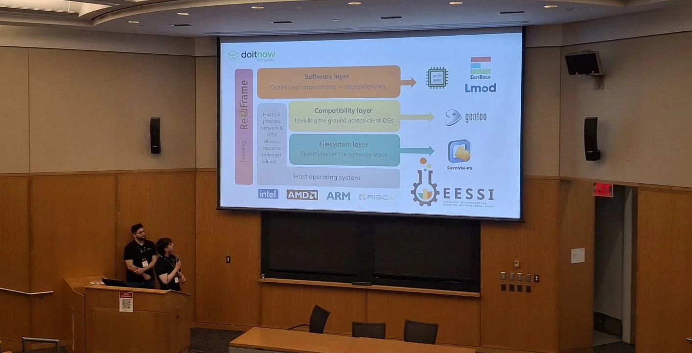

# Open OnDemand meets EESSI at Global Open OnDemand Conference (Boston)

On 18 March 2025 Christian Bustelo and Arturo Gimeno from Do IT Now showed to the attendees of the [GOOD conference](https://openondemand.org/good) what EESSI is about and their preliminary work in integrating it in Open OnDemand.

<figure markdown="span">
{width=100%}
</figure>

<!-- more -->

## Their solution

Christian and Arturo presented this implementation highlighting three potential use cases:

1. Training in using Open OnDemand
2. Deploying EESSI applications
3. Sharing software

For **training**, the proposed solution using the triad of Magic Castle for setting up the environment in the cloud, Ansible for deploying OOD, and EESSI for software, was well accepted by the attendees.

The **deployment** of new applications can be done in two different manners: by just adding a single application (see image below) or by offering the entire software stack allowing the users to select all the modules they need.

Last, they presented how EESSI is fitted to **share software** among different HPC centers.

## The takeaways

The audience received EESSI as a valuable tool to have to take into account. Should we think about the replacement of the first "E" in its name?

The video recording of the presentation should be available soon.

You can find the slides already [here](EESSI-GOOD-20250318.pdf).
