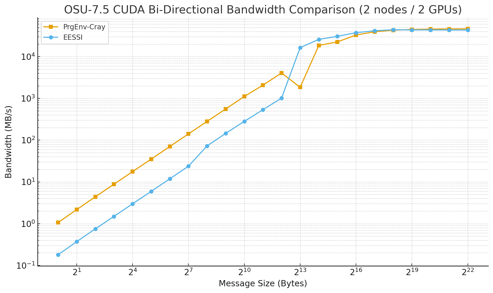
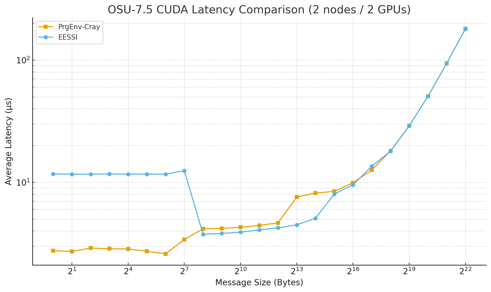

# MPI at Warp Speed: EESSI Meets Slingshot-11

High-performance computing environments are constantly evolving, and keeping pace with the latest interconnect technologies is crucial for maximising application performance. However, we cannot rebuild all the software in EESSI that depends on improvements to communication libraries. So how do we take advantage of new technological developments?

Specifically we look at taking benefit of the HPE/Cray Slingshot-11.
Slingshot-11 promises to offer a significant advancement in HPC networking, offering improved bandwidth, lower latency, and better scalability for exascale computing workloads ... so
this should be worth the effort!

In this blog post, we present the requirements for building OpenMPI 5.x with Slingshot-11 support on HPE/Cray systems and its integration with EESSI using the [host_injections](../../../../site_specific_config/host_injections.md)
mechanism of EESSI to inject custom-built OpenMPI libraries. This approach enables overriding EESSI’s default MPI library with an ABI-compatible, Slingshot-optimized version which should give us optimal performance.
<!-- more -->

## The Challenge

EESSI provides a comprehensive software stack, but specialized interconnect support like Slingshot-11 can sometimes require custom-built libraries that aren't yet available in the standard EESSI distribution. Our goal is to:

1. Build OpenMPI 5.x with native Slingshot-11 support
2. Create ABI-compatible replacements for EESSI's OpenMPI libraries
3. Place the libraries somewhere where EESSI automatically picks them up
4. Support both x86_64 AMD CPU partitions and NVIDIA Grace CPU partitions with Hopper accelerators

The main task is to build the required dependencies on top of EESSI, since many of the libraries needed for libfabric with CXI support are not yet available in the current EESSI stack.

### System Architecture

Our target system is [Olivia](https://documentation.sigma2.no/hpc_machines/olivia.html#olivia) which is based on HPE Cray EX platforms for compute and accelerator nodes, and HPE Cray ClusterStor for global storage, all
connected via HPE Slingshot high-speed interconnect.
It consists of two main distinct partitions:

- **Partition 1**: x86_64 AMD CPUs without accelerators
- **Partition 2**: NVIDIA Grace CPUs with Hopper accelerators

For the Grace/Hopper partition we also need to enable CUDA support in libfabric.

## Building the Dependency Chain

### Building Strategy

Rather than relying on Cray-provided system packages, we opted to build all dependencies from source [on top of EESSI](../../../../using_eessi/building_on_eessi.md). This approach provides several advantages:

- **Consistency**: All libraries built with the same compiler toolchain
- **Compatibility**: Ensures ABI compatibility with EESSI libraries
- **Control**: Full control over build configurations and optimizations

### Required Dependencies

To build OpenMPI 5.x with libfabric and CXI support, we needed the following missing dependencies:

1. **libuv** - Asynchronous I/O library
2. **libnl** - Netlink library for network configuration
3. **libconfig** - Library designed for processing structured configuration files
4. **libfuse** - Filesystem in Userspace library  
5. **libpdap** - Performance Data Access Protocol library
6. **shs-libcxi** - Slingshot CXI library
7. **lm-sensors** - Monitoring tools and drivers
8. **libfabric 2.x** - OpenFabrics Interfaces library with CXI provider
9. **OpenMPI 5.x** - The final MPI implementation

## EESSI Integration via `host_injections`

EESSI's `host_injections` mechanism allows us to override EESSI's MPI library with an ABI compatible host MPI while maintaining compatibility with the rest of the software stack. We just need to make sure that the libraries are in the right
location to be automatically picked up by the software shipped with EESSI. This location is EESSI-version specific, for `2023.06`, with the NVIDIA Grace architecture, that location is:
```
/cvmfs/software.eessi.io/host_injections/2023.06/software/linux/aarch64/nvidia/grace/rpath_overrides/OpenMPI/system/lib
```

**OpenMPI/5.0.7 on ARM nodes built with:** 
```
./configure --prefix=/cluster/installations/eessi/default/aarch64/software/OpenMPI/5.0.7-GCC-12.3.0 --with-cuda=${EBROOTCUDA} --with-cuda-libdir=${EBROOTCUDA}/lib64 --with-slurm --enable-mpi-ext=cuda --with-libfabric=${EBROOTLIBFABRIC} --with-ucx=${EBROOTUCX} --enable-mpirun-prefix-by-default  --enable-shared --with-hwloc=/cvmfs/software.eessi.io/versions/2023.06/software/linux/aarch64/nvidia/grace/software/hwloc/2.9.1-GCCcore-12.3.0  --with-libevent=/cvmfs/software.eessi.io/versions/2023.06/software/linux/aarch64/nvidia/grace/software/libevent/2.1.12-GCCcore-12.3.0  --with-pmix=/cvmfs/software.eessi.io/versions/2023.06/software/linux/aarch64/nvidia/grace/software/PMIx/4.2.4-GCCcore-12.3.0  --with-ucc=/cvmfs/software.eessi.io/versions/2023.06/software/linux/aarch64/nvidia/grace/software/UCC/1.2.0-GCCcore-12.3.0  --with-prrte=internal
```
### Testing

We plan to provide more comprehensive test results in the future. In this blog post we want to report that the approach works in principle, and that the EESSI stack can pick up and use the custom OpenMPI build and extract
performance from the host interconnect **without the need to rebuild any software packages**.

The following tests were conducted on Olivia accel partition (Grace nodes with Hopper GPUs), using two-node, two-GPU configuration with one MPI task per node. 

We evaluated two OSU Micro-Benchmark builds:

1- OSU-Micro-Benchmarks/7.5-gompi-2023b-CUDA-12.4.0 from EESSI

2- OSU-Micro-Benchmarks/7.5 compiled with PrgEnv-cray.

The following commands were used to run the benchmarks:

`mpirun -np 2 osu_bibw D D`

`mpirun -np 2 osu_latency D D`

   

<details>
<summary>See details</summary>

<b>Test using OSU-Micro-Benchmarks/7.5-gompi-2023b-CUDA-12.4.0 from EESSI</b>:
```
Environment set up to use EESSI (2023.06), have fun!

hostname:
x1000c4s4b1n0
x1000c5s3b0n0

CPU info:
Vendor ID:                            ARM

Currently Loaded Modules:
  1) GCCcore/13.2.0
  2) GCC/13.2.0
  3) numactl/2.0.16-GCCcore-13.2.0
  4) libxml2/2.11.5-GCCcore-13.2.0
  5) libpciaccess/0.17-GCCcore-13.2.0
  6) hwloc/2.9.2-GCCcore-13.2.0
  7) OpenSSL/1.1
  8) libevent/2.1.12-GCCcore-13.2.0
  9) UCX/1.15.0-GCCcore-13.2.0
 10) libfabric/1.19.0-GCCcore-13.2.0
 11) PMIx/4.2.6-GCCcore-13.2.0
 12) UCC/1.2.0-GCCcore-13.2.0
 13) OpenMPI/4.1.6-GCC-13.2.0
 14) gompi/2023b
 15) GDRCopy/2.4-GCCcore-13.2.0
 16) UCX-CUDA/1.15.0-GCCcore-13.2.0-CUDA-12.4.0       (g)
 17) NCCL/2.20.5-GCCcore-13.2.0-CUDA-12.4.0           (g)
 18) UCC-CUDA/1.2.0-GCCcore-13.2.0-CUDA-12.4.0        (g)
 19) OSU-Micro-Benchmarks/7.5-gompi-2023b-CUDA-12.4.0 (g)

  Where:
   g:  built for GPU

# OSU MPI-CUDA Bi-Directional Bandwidth Test v7.5
# Datatype: MPI_CHAR.
# Size      Bandwidth (MB/s)
1                       0.18
2                       0.37
4                       0.75
8                       1.49
16                      2.99
32                      5.93
64                     11.88
128                    23.76
256                    72.78
512                   145.45
1024                  282.03
2048                  535.46
4096                 1020.24
8192                16477.70
16384               25982.96
32768               30728.30
65536               37637.46
131072              41808.92
262144              44832.61
524288              45602.20
1048576             45873.58
2097152             45995.32
4194304             46061.86

# OSU MPI-CUDA Latency Test v7.5
# Datatype: MPI_CHAR.
# Size       Avg Latency(us)
1                      11.71
2                      11.66
4                      11.66
8                      11.71
16                     11.67
32                     11.68
64                     11.66
128                    12.45
256                     3.76
512                     3.82
1024                    3.91
2048                    4.08
4096                    4.25
8192                    4.49
16384                   5.09
32768                   8.02
65536                   9.56
131072                 13.52
262144                 17.96
524288                 28.94
1048576                50.50
2097152                93.98
4194304               180.14
```

<b>Test using OSU-Micro-Benchmarks/7.5 with PrgEnv-cray</b>:
```

hostname:
x1000c4s4b1n0
x1000c5s3b0n0

CPU info:
Vendor ID:                            ARM

Currently Loaded Modules:
  1) craype-arm-grace                      8) craype/2.7.34
  2) libfabric/1.22.0                      9) cray-dsmml/0.3.1
  3) craype-network-ofi                   10) cray-mpich/8.1.32
  4) perftools-base/25.03.0               11) cray-libsci/25.03.0
  5) xpmem/2.11.3-1.3_gdbda01a1eb3d       12) PrgEnv-cray/8.6.0
  6) cce/19.0.0                           13) cudatoolkit/24.11_12.6

# OSU MPI-CUDA Bi-Directional Bandwidth Test v7.5
# Datatype: MPI_CHAR.
# Size      Bandwidth (MB/s)
1                       1.06
2                       2.17
4                       4.40
8                       8.80
16                     17.64
32                     35.17
64                     70.55
128                   140.91
256                   281.22
512                   559.04
1024                 1114.45
2048                 2081.25
4096                 4068.64
8192                 1852.11
16384               18564.47
32768               22647.40
65536               33108.03
131072              39553.95
262144              43140.01
524288              44853.40
1048576             45761.69
2097152             46228.10
4194304             46470.29

# OSU MPI-CUDA Latency Test v7.5
# Datatype: MPI_CHAR.
# Size       Avg Latency(us)
1                       2.76
2                       2.72
4                       2.90
8                       2.86
16                      2.85
32                      2.73
64                      2.60
128                     3.41
256                     4.17
512                     4.19
1024                    4.29
2048                    4.44
4096                    4.66
8192                    7.59
16384                   8.17
32768                   8.44
65536                   9.92
131072                 12.59
262144                 18.07
524288                 29.00
1048576                50.64
2097152                94.06
4194304               180.44
```
</details>

## Conclusion
The approach demonstrates EESSI's flexibility in accommodating specialized hardware requirements while preserving the benefits of a standardized software stack! There is plenty of more testing to do, but the signs at this stage are very good!
