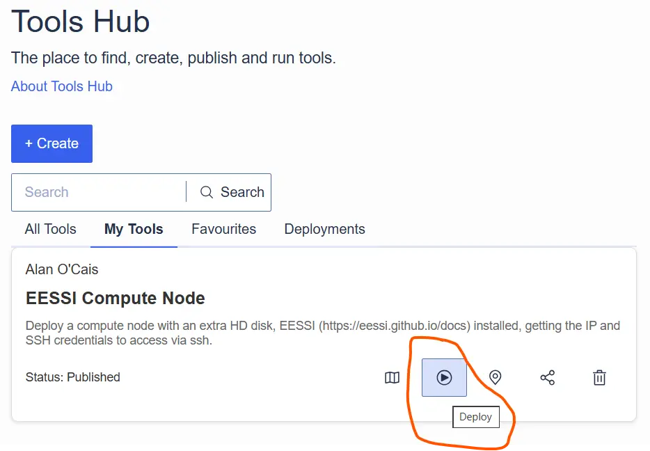
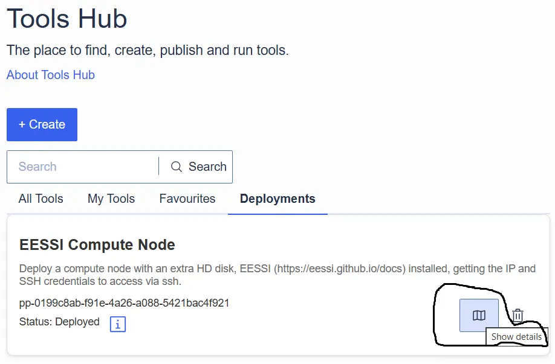
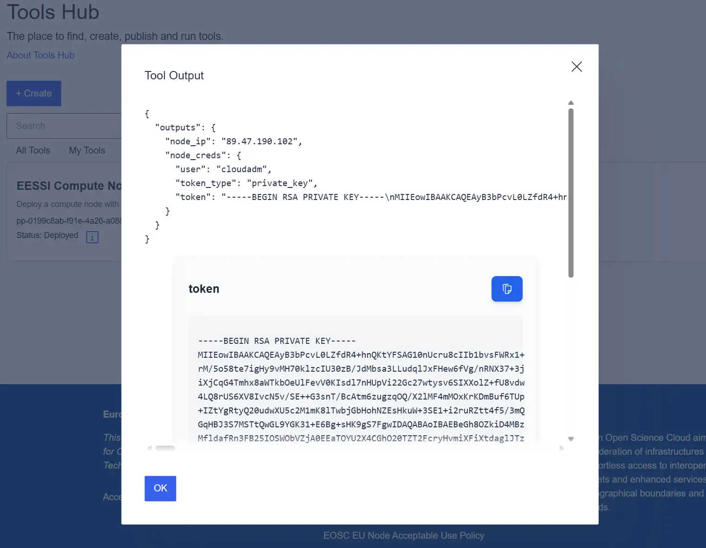

# EESSI available on EOSC EU Node

EESSI has recently been working together with the [European Open Science Cloud (EOSC)](https://research-and-innovation.ec.europa.eu/strategy/strategy-2020-2024/our-digital-future/open-science/european-open-science-cloud-eosc_en) to provide easy access to EESSI for those using EOSC compute resources.

A first implementation of EESSI support is now available as the [_EESSI Compute Node_ tool in the EOSC EU Node Tools Hub](https://open-science-cloud.ec.europa.eu/dashboard/tools-hub/tool-view?eo=MjEuMTExNjcvTnp2azVM).

<!-- more -->

## What is EOSC?

The objective of EOSC is to provide researchers and innovators in Europe with an open and trusted multi-disciplinary environment where they can publish, find and reuse data, tools and services for research and innovation. Through this environment, EOSC aims to mobilise, align and scale resources across Europe to accelerate open science, higher productivity and increased reproducibility and trust in research.

### What is EOSC EU Node?

[EOSC EU Node](https://open-science-cloud.ec.europa.eu/) is a platform that primarily supports multi-disciplinary and multi-national research promoting the use of [FAIR](https://www.nature.com/articles/sdata201618) (Findable, Accessible, Interoperable, Reusable) data and supplementary services in Europe and beyond. Within this environment researchers can find easy-to-use tools and the much-needed support to both individually and collectively, plan, execute, disseminate, and assess their typical research workflows and outcomes across the EOSC ecosystem.

The EOSC EU Node is designed to provide researchers with access to computing resources, data services, and collaboration tools. The [access policy](https://open-science-cloud.ec.europa.eu/about/access-policy) is structured to balance resource allocation with user needs, providing different levels of access based on institutional roles and research requirements.  For our purposes it is enough to know that any member of staff at an academic institution can access EOSC EU node resources, but the amount of resources/credits you have access to depends on the role you have in that institution.

### What is the Tools Hub?

The [EOSC EU Node Tools Hub](https://open-science-cloud.ec.europa.eu/dashboard/tools-hub) is a platform designed to facilitate access to and management of research tools within EOSC. The Tools Hub is intended to provide an intuitive interface to deploy existing tools, create your own, or efficiently manage resources.

## Adding EESSI to the Tools Hub

Most of the effort involved in creating the EESSI tool was in understanding a little about the TOSCA (Topology and Orchestration Specification for Cloud Applications) standard, since that is the underlying language used to describe a topology of cloud based web services, their components, relationships, and the processes that manage them. To make a tool you need to use TOSCA.

I didn't really do that myself though, I employed the services of an AI friend to help me navigate how to create/modify a template I got from the Tools Hub.

One good thing about the Tools Hub is that it is _very_ easy to start by cloning an existing tool and then customising it for your use case. For me, that meant starting from [Simple Compute Node](https://open-science-cloud.ec.europa.eu/dashboard/tools-hub/tool-view?eo=MjEuMTExNjcvNDVGeWEy) and then adding an initialisation step that installs EESSI on the node. You can see the most critical difference in the `diff` below.

```diff
<     simple_node:
---
>     eessi_node:
113,114c113,114
<           configure:
<             implementation: https://raw.githubusercontent.com/grycap/tosca/main/artifacts/dummy.yml
---
>           start:
>             implementation: https://gist.githubusercontent.com/ocaisa/8a2a99173888283ad601b28afb977631/raw/3ccc8076672cb6eb39af610b687f40bc4b08cfaf/eessi_eosc.yml
```

Basically this change means that when a node is started up a set of defined actions are run once the node is booted. For EESSI this the set of actions is pretty minimal:
```yaml
- hosts: all
  tasks:
    - name: Download and run EESSI CVMFS installer
      shell: |
        curl -sfL https://raw.githubusercontent.com/EESSI/eessi-demo/main/scripts/install_cvmfs_eessi.sh | bash

    - name: Set default shell to bash for all users
      shell: |
        NEW_SHELL="/bin/bash"
        awk -F: '($3 >= 1000) {print $1}' /etc/passwd | while read user; do
            chsh -s "$NEW_SHELL" "$user"
        done

    - name: Inject source command system-wide
      shell: |
        cat <<'EOF' > /etc/profile.d/eessi.sh
        source /cvmfs/software.eessi.io/versions/2023.06/init/lmod/bash
        # Disable broken lesspipe eval if it exists since it now points to the EESSI lesspipe
        if grep -q '^\s*\[ -x /usr/bin/lesspipe \]' ~/.bashrc; then
          sed -i 's|^\([[:space:]]*\[ -x /usr/bin/lesspipe \].*\)|# \1|' ~/.bashrc
        fi
        EOF
        chmod +x /etc/profile.d/eessi.sh
```
Most of the script is just to force a default `bash` shell for the users and remove some `lesspipe` output at login. The actual installation of EESSI (and CVMFS) is already handled via [an external script](https://github.com/EESSI/eessi-demo/blob/main/scripts/install_cvmfs_eessi.sh) that is (reasonably) OS-agnostic.

## Deploying EESSI via the Tools Hub

The first thing you need to do is convert some of your credits into quota you can use to deploy a virtual machine. This is done at [https://open-science-cloud.ec.europa.eu/dashboard/vms](https://open-science-cloud.ec.europa.eu/dashboard/vms). For my testing I used a _Small_ instance with only 2 vCPUs.

Once that is done, you will then be able to _deploy_ the EESSI Compute Node, for this step a picture is worth a thousand words

---



---

Once that is done, go have a cup of coffee :coffee: .

When you come back you should have a notification, and then you can go to the _Deployments_ tab under the Tools Hub. It is a little tricky to figure out how you access the deployed VM. Again here, two pictures are a thousand words

---



---



---

With the username `user`, IP `node_ip`, and RSA access key `token` from the deployment, you can then log in to the node. The first login will take quite a few seconds as the CVMFS cache gets populated, but after that things should be pretty fluid.

# Future work

There are a few things that could be improved. On our side, we can add GPU support to our initialisation steps. From the EOSC side, the performance/responsiveness of EESSI could be dramatically improved by having Stratum 1 servers available at each EOSC EU Node hosting location.
