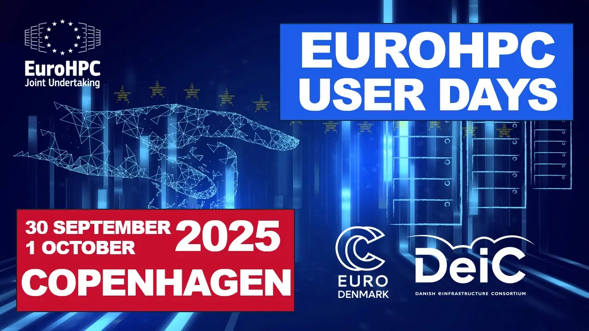
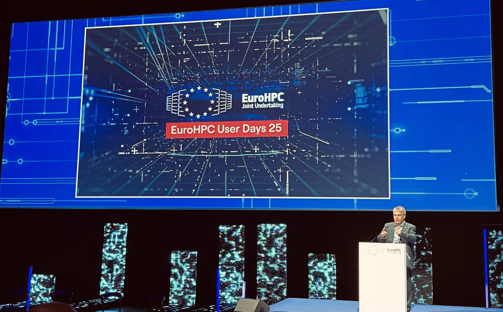
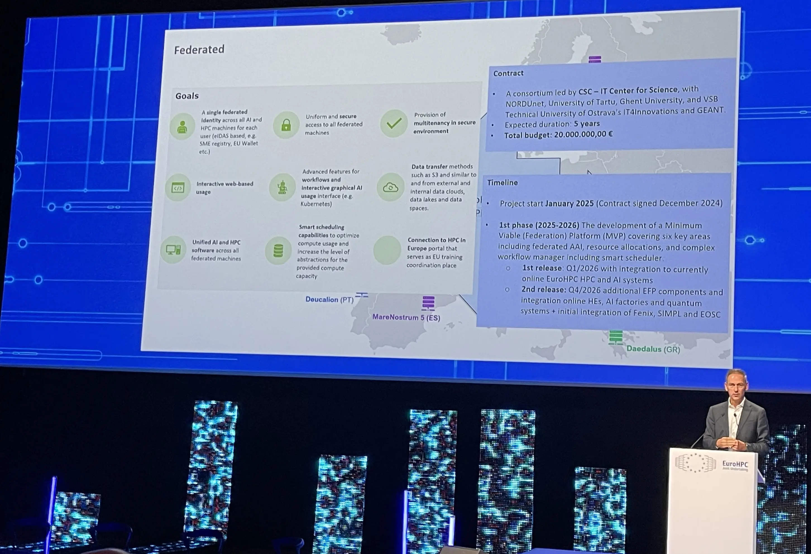
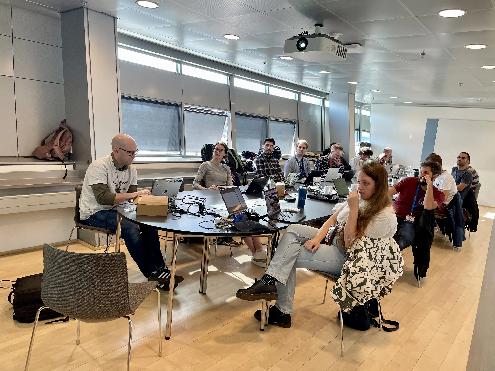
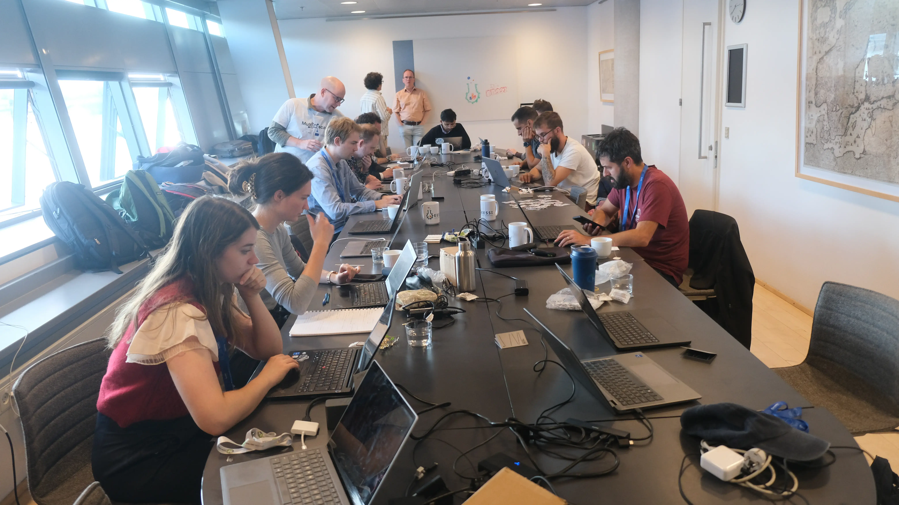
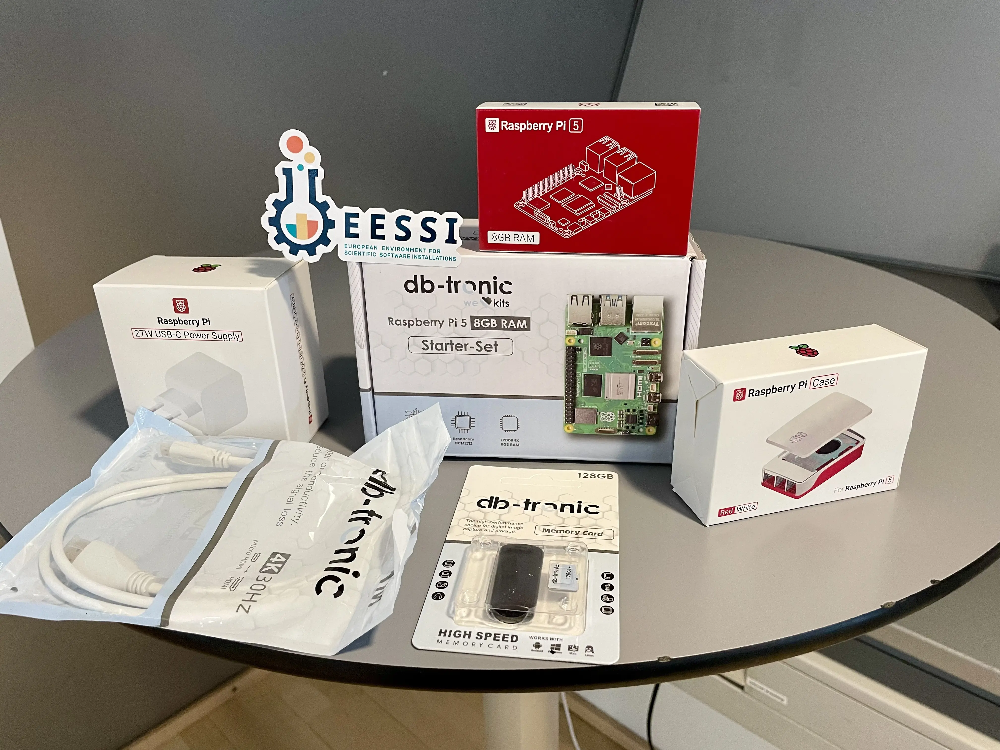
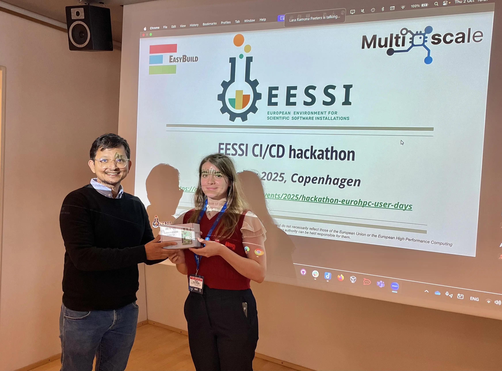

# EuroHPC User Days 2025 + CI/CD Hackathon

<figure markdown="span">
{width=50%}
</figure>

The [EuroHPC User Days 2025](https://www.eurohpc-ju.europa.eu/media-events/events/eurohpc-user-days-2025-2025-09-30_en),
which took place in Copenhagen (Denmark) was a great event to connect with the EuroHPC community.

Several members of the EESSI community participated, and we also organised an
[EESSI CI/CD hackathon](../../../../training-events/2025/hackathon-eurohpc-user-days.md) directly afterwards
on Thu 2 Oct 2025.

---

## EuroHPC User Days 2025

### Plenary sessions

The plenary sessions of the EuroHPC User Days 2025 featured representatives of both the
[EuroHPC Joint Undertaking (JU)](https://www.eurohpc-ju.europa.eu)
and the EuroHPC community talking about current and upcoming activities.

Recordings of the plenary sessions are available: [day 1](https://youtu.be/w8DNYR4tO3M?si=J_50JbR-DNmoCV-r), [day 2](https://youtu.be/HFhb3woFxGw).

<figure markdown="span">
{width=75%}
<figcaption>Anders Dam Jensen (CEO of EuroHPC JU) at the opening plenary</figcaption>
</figure>

The EuroHPC Federation Platform (EFP) was highlighted during the presentation
on the EuroHPC supercomputer infrastructure:

<figure markdown="span">
{width=75%}
</figure>

The first version of the EuroHPC Federation Platform will be available in March 2026,
and will include EESSI as the base for the Federated Software Catalogue (FSC) component.

See also our previous blog post on how [EESSI will be integrated in the EuroHPC Federation Platform](../02/eessi-integration-in-efp.md).

### Networking

The networking sessions were of particular interest to us,
since they allowed us to discuss EESSI and related topics with a various people from the EuroHPC Community.

Somewhat unexpectedly a stand was available during the Meet & Greet networking session
for EuroHPC Centre-of-Excellence (CoE) projects.
We took the opportunity as representatives of the [MultiXscale](https://www.multixscale.eu/)
to set up an improved info stand, where we also did live hands-on demos with EESSI.

<figure markdown="span">
{width=75%}
<figcaption>Group picture in front of MultiXscale info stand</figcaption>
</figure>

During the networking sessions we engaged with various EuroHPC Hosting Entities,
either about their experience with making EESSI available on the EuroHPC supercomputers they operate,
or about their ongoing efforts to make EESSI available soon.

<figure markdown="span">
{width=75%}
<figcaption>Discussion on making EESSI available on <a href="https://discoverer.bg/">Discoverer</a></figcaption>
</figure>

## EESSI CI/CD hackathon

Next to attending the two-day EuroHPC User Days event we also organised an EESSI CI/CD hackathon at the same venue the
day after, in collaboration with [MultiXscale](https://www.multixscale.eu/),
[CASTIEL2](https://www.eurohpc-ju.europa.eu/research-innovation/our-projects/castiel-2_en),
[NCC Denmark](https://hpc-portal.eu/nccs/ncc-denmark),
and the [Danish e-infrastructure Consortium (DeiC)](https://www.deic.dk/en).

Initially we were a bit unsure whether or not this would attract enough interest,
but in the end we filled all available seats for in-person attendees,
and also had a bunch of remote attendees who followed via Zoom.

The hackathon started with a presentation by Alan O'Cais outlining how EESSI can be leveraged for
Continunous Integration (CI) and Continuous Deployment (CD).

Presentation materials are available [here](../../../../training-events/2025/EESSI-CI-CD-hackathon-20251002.pdf).

<figure markdown="span">
{width=75%}
<figcaption>Hackathon participants paying attention during the presentation</figcaption>
</figure>

During the hands-on session participants could "pick their own adventure",
and decide for themselves whether they wanted to explore using EESSI in GitHub Actions
or take up another challenge. Several members of the EESSI core team were available to
answer questions and provide hands-on help to hackathon participants.

<figure markdown="span">
{width=75%}
<figcaption>Hackathon participants during hands-on session</figcaption>
</figure>

All in-person attendees received a free EESSI coffee mug as a token of appreciation
for their participation in the hackathon.

<figure markdown="span">
{width=75%}
<figcaption>Group picture at the EESSI CI/CD hackathon</figcaption>
</figure>

#### Raspberry Pi Starter Kit Prize

<figure markdown="span">
{width=75%}
</figure>

The hackathon featured a Raspberry Pi starter kit prize,
sponsored by [Do IT Now](https://www.doitnowgroup.com),
which was granted to the participant who made on the most impressive progress during the hackathon.

<figure markdown="span">
{width=75%}
<figcaption>Nitin Shukla (<a href="https://www.cineca.it/en">CINECA</a>) won the Raspberry Pi Start Kit prize</figcaption>
</figure>

---

More information on the EESSI CI/CD hackathon that was held in conjunction with the EuroHPC User Days 2025
is available [here](../../../../training-events/2025/hackathon-eurohpc-user-days.md).

We hope to organise more sessions like this in the future!
