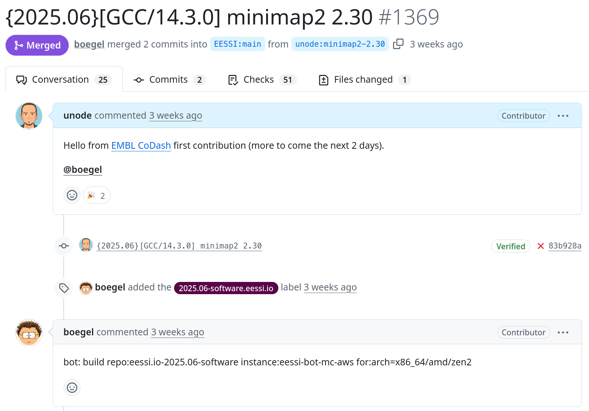

# Easy EESSI at EMBL

## Experiences from EMBL's CoDash hackathon on EESSI

Bringing EESSI and [EMBL](https://www.embl.org)'s computational community closer together during [EMBL's CoDash hackathon](https://grp-bio-it.embl-community.io/hackathons/).
Simultaneously working towards bringing a large repository of scientific software in-use at [EMBL's HPC cluster](https://www.embl.org/about/info/it-services/it-infrastructure/) to EESSI.

<!-- more -->

At [EMBL](https://www.embl.org) we have been using EasyBuild for close to a decade now.
In this time we accumulated multiple terabytes of software installations covering a wide range of bioinformatics software, built for several Linux OSs and optimized for multiple generations of CPUs.
As there is great desire among scientists for this software stack to be a "take out" item they can bring to their next workplace, migrating most of it to EESSI is a logical next step, facilitating also reproducibility and computational workflow portability goals.

With this in mind we took the opportunity of [the CoDash EMBL hackathon](https://grp-bio-it.embl-community.io/hackathons/) to get some focus time dedicated to this topic, as well as introduce more interested people to the underlying technology, how to approach it and how to work with it.
Our goal was for each of them to set up a private EasyBuild environment, where they could first build a piece of software that is already available in [easyconfigs repository](https://github.com/easybuilders/easybuild-easyconfigs/), then continue with building a piece of software from scratch and then repeat the exercise with EESSI as a base.
We also learned on how to submit an easyconfig for evaluation by EESSI and have it appear on CVMFS "overnight".

Additionally we started working on extending an existing internal CI pipeline to be also able to build on top of EESSI. 
The pipeline is implemented on an internal GitLab instance and builds all of our EasyBuild managed software.

We also started discussing options of how this same pipeline could also submit easyconfigs upstream and once they're available globally, delete local installations. So more fun to come, hopefully before next year's hackathon :)

The contributors at the hackathon,  
Anthony Fullam, Jure Pečar, Renato Alves, Stefano Marangoni, Thomas Weber
