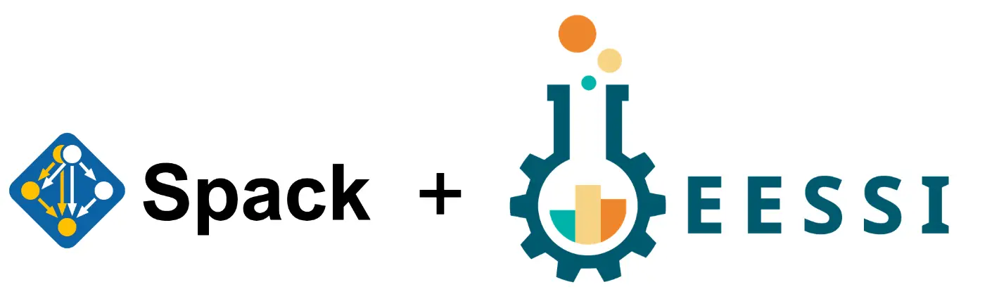
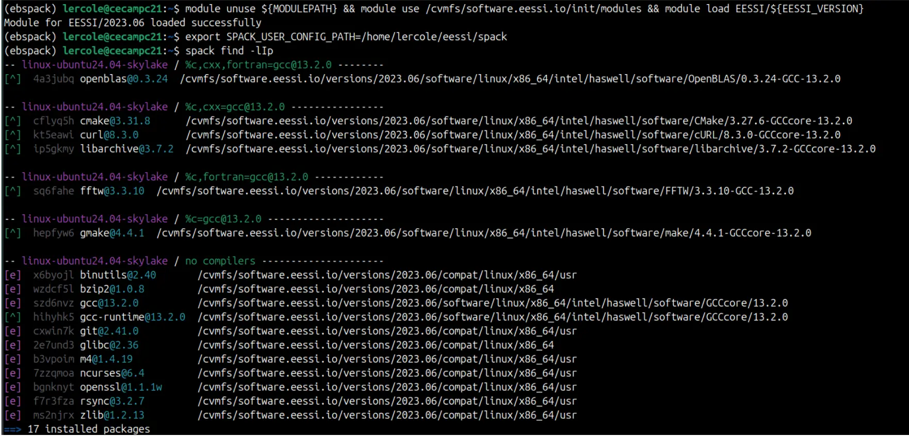

# Using Spack on top of EESSI: A Proof of Concept

<figure markdown="span">
{width=75%}
</figure>

EESSI provides a rich set of software installations, which were built and installed using
[EasyBuild](https://easybuild.io).

Can we convince [Spack](https://spack.io) to reuse software installed in EESSI,
and by doing so make EESSI more attractive to those of you who prefer using Spack over EasyBuild?

Several people have expressed interest in exposing the software installations provided by EESSI
to Spack, so they can be used as dependencies when building and installing software with Spack.

Recently, we have explored how this could be achieved through a proof-of-concept with [QuantumESPRESSO](https://www.quantum-espresso.org/).

The goal here is to build and install only QuantumESPRESSO with Spack,
and leveraging software installations from EESSI for all required dependencies, including the compiler and libraries for MPI, BLAS/LAPACK, FFTW, etc.

<!-- more -->

### Step 1: A Spack database for EESSI

To get started, we created an external ("upstream") *Spack database* using (a modded version of) the [`spack.database.Database` class](https://spack.readthedocs.io/en/latest/spack.html#module-spack.database)
that Spack provides, which exposes software installed in EESSI to Spack.

This was done through a Python script, and only for a small set of hand-picked software
installations: those that are build or runtime dependencies of QuantumESPRESSO.

Using `spack find`, we can check whether Spack is aware of these installations:

The `[^]` symbol indicates a package that is provided by our custom "upstream" database. Looks good so far...

### Step 2: Checking required dependencies for QuantumESPRESSO

Spack being aware of software installed in EESSI is not sufficient though.
We need to make sure those installations are also actually *used* by Spack to resolve required dependencies.

For this, we need to provide the necessary metadata for those installations,
including which [*variants*](https://spack.readthedocs.io/en/latest/packaging_guide_creation.html#variants) they provide.
When done correctly, we can see that all required dependencies are indeed resolved using `spack spec`:

Here, we use `@7.4.1` to specify the QuantumESPRESSO version we want to install,
and `~mpi` to disable MPI support, for the sake of this simple exercise.

### Step 3: Installing QuantumESPRESSO with Spack

The real test consist of actually trying to build and install QuantumESPRESSO using Spack,
by running `spack install quantum-espresso`:

That worked like charm!

### Step 4: Running QuantumESPRESSO

Finally, we try to actually *run* QuantumESPRESSO as it was installed with Spack.

We set up the environment with `spack load quantum-espresso`, and feed an input file into the main command `pw.x`:

This was just a simple single-core test, but it does seem to work as expected!

When we inspect the `pw.x` binary a bit more closely, we can see that it (only) links to libraries provided by EESSI:

It's clear that more work needs to be done to further validate the installation and check its performance,
but this is a nice first step...

### More information & updates

This work is being done in collaboration with members of the Spack development team,
including Todd Gamblin and Massimiliano Culpo.

The code and scripts developed for this proof-of-concept are available in the [Spood repository](https://github.com/lorisercole/spood). See "Approach #2 [legacy]" in the README for implementation details.

For updates, check the [dedicated support issue](https://gitlab.com/eessi/support/-/issues/170)
that was opened on using Spack on top of EESSI, or stay tuned for future blog posts!
