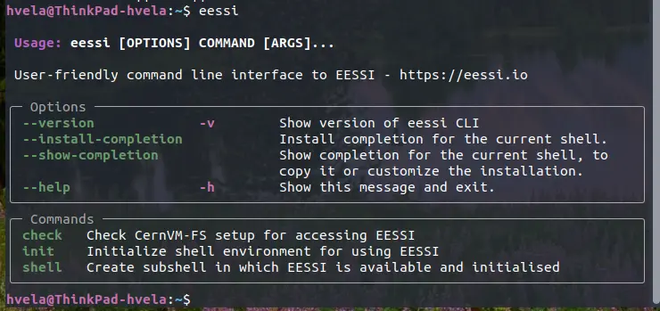
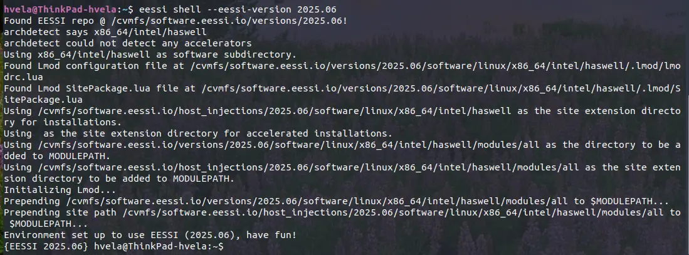
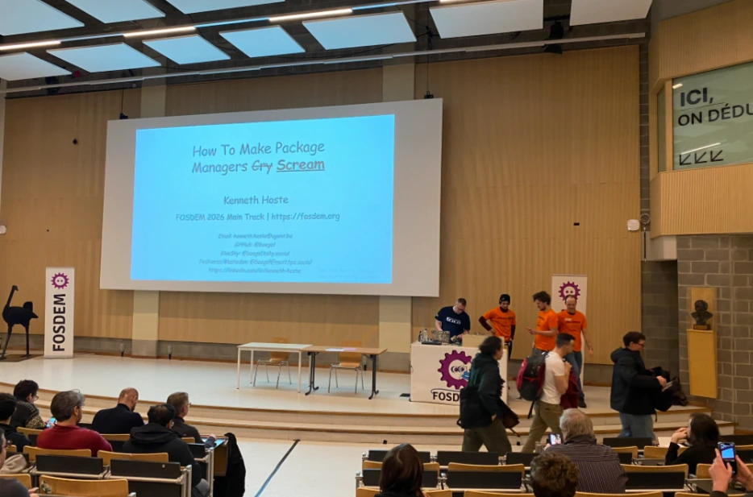

# EESSI at the FOSDEM'26

This year's FOSDEM exceeded all expectations a first-time attendee like me could have. Filled with interesting talks, wide range of diverse people and impactful projects, I bring back home a bag full of stickers, lovely memories and some belgian chocolates. 

## Pre-FOSDEM hackathon 

Members of the EasyBuild + EESSI community gathered the Thursday and Friday right before the FOSDEM to do an informal hackathon to do hands-on work on both projects. 

One of the main outcomes of this meet is the brainstorming and consecuently the first releases of the [EESSI python package](https://pypi.org/project/eessi/), a CLI to make the interaction with EESSI even easier!

It is still a WIP, but it already features options like `eessi shell` to start an EESSI shell with your version of choice: 

After all the pair-programming and hard work, we went to Le Corbeau, a 150-year old Belgian brewery where we could try local traditional dishes like the flemish carbonnades :) 

## Saturday dinner sponsored by HPSF

All speakers, volunteers and peers of the [HPC, Big Data & Data Science](https://fosdem.org/2026/schedule/track/hpc-big-data-data-science/) devroom enjoyed a dinner fully sponsored by the High Performance Software Foundation at an italian restaurant close to the FOSDEM venue. 

The starters consisted of italian finger food, focaccia and cured meats.  Followed by pizza and *cacio e pepe* for mains and a gigantic tiramisu as the cherry on top dessert, so it is safe to assume that nobody went hungry to sleep. Thank you HPSF!

## Sunday talks 

On Sunday, EESSI was featured in two devrooms talks. First one, by Kenneth Hoste in the Software Performance devroom titled "Keeping the P in HPC: the EESSI Way", you can see the recording [here](https://fosdem.org/2026/schedule/event/CHGEYH-keeping-the-p-in-hpc-the-eessi-way/). 

The HPC, Big Data & Data Science devroom was filled with people! 

    
Accepting some cookies (literally) to have energy for the afternoon!  
    

The second talk was given by Helena Vela at the HPC, Big Data & Data Science devroom, titled "Status update on EESSI, the European Environment for Scientific Software Installations", highlighting the developments made in EESSI during the last years. Further details and the recording are available in the [talk page](https://fosdem.org/2026/schedule/event/RQD9AD-status-update-eessi/). 

## Off-topic funny things 

Kenneth's talk in the Main Track titled "How to make package managers scream" is a must-watch! See the live recording [here](https://youtu.be/PBlDHlFnzGo). 

Our first ever word cloud of the available software in EESSI reveals that EasyBuild is the package we have the most versions of :)
    

