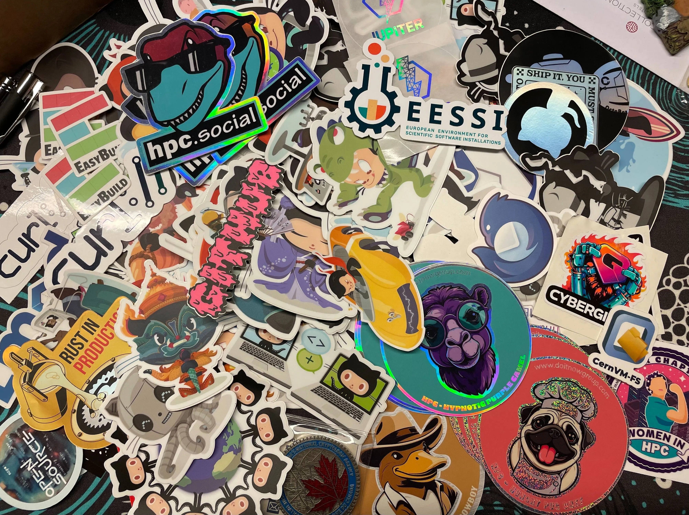
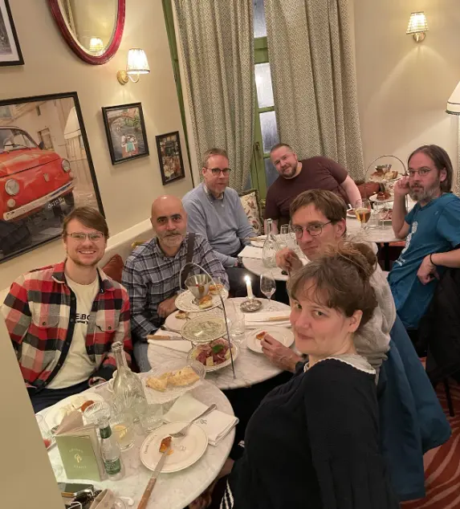
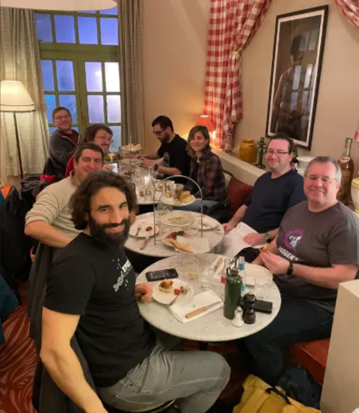
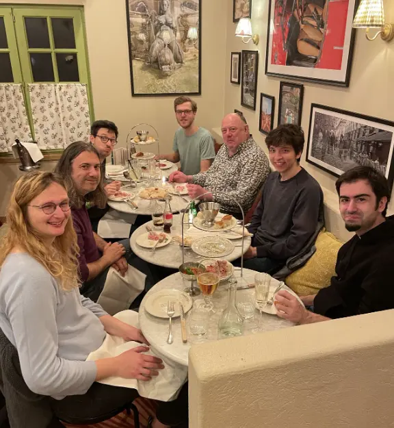
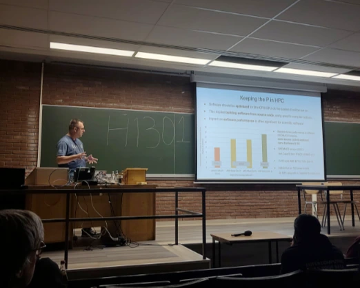
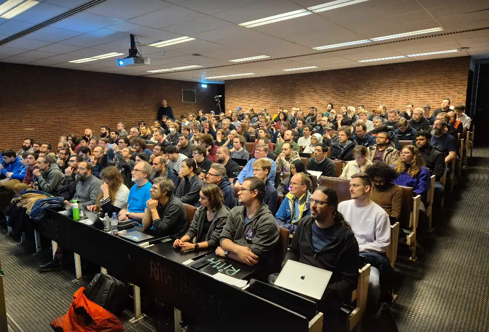
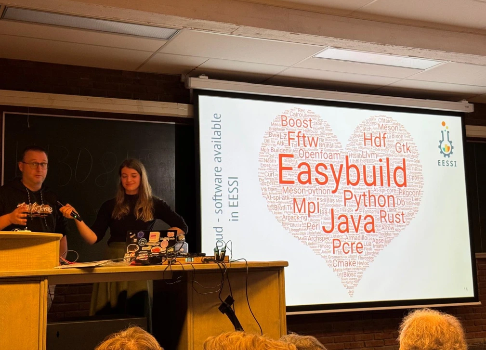

# EESSI at FOSDEM'26

This year's [FOSDEM](https://fosdem.org/2026/) exceeded all expectations a first-time attendee like me could have. Filled with interesting talks, wide range of diverse people and impactful projects, I bring back home a bag full of stickers, lovely memories and some Belgian chocolates. 

<figure markdown="span">
{width=70%}
</figure>

<!-- more -->


## Pre-FOSDEM hackathon (Thu + Fri)

Members of the EasyBuild + EESSI community gathered the Thursday and Friday right before the FOSDEM to do an informal hackathon to do hands-on work on both projects. 

### EESSI CLI tool

One of the main outcomes of this meet is the brainstorming and consequently the first releases of the [EESSI CLI tool](https://pypi.org/project/eessi/), a command-line tool to make the interaction with EESSI even easier!

It is still a work-in-progress, but it already features options like `eessi shell` to start an EESSI shell with your version of choice,
and `eessi check` to verify your [CernVM-FS](https://cernvm.cern.ch/fs/) setup for accessing EESSI.

Here's a quick demo:

<script src="https://asciinema.org/a/cBJ0V94PAGrHWKeD.js" id="asciicast-cBJ0V94PAGrHWKeD" async="true"></script>

To start playing with the `eessi` tool yourself, install it with:
```shell
pip install eessi
```

### Food

After all the pair-programming and hard work we went to Le Corbeau, a 150-year old Belgian brewery where we could try local traditional dishes like the Flemish carbonnades. :smile:

<figure markdown="span">
{width=50%}
</figure>

## FOSDEM'26 (Sat+Sun)

### CernVM-FS talk

EESSI was briefly featured as an example repository in the *"Multi-Petabyte Data Distribution in Industry & Science with CernVM File System"* talk.

<figure markdown="span">
{width=70%}
</figure>

For more information, including slides & recordings, see the [talk page](https://fosdem.org/2026/schedule/event/9YET9Y-cvmfs/).

### Group dinner

All speakers, volunteers and peers of the [HPC, Big Data & Data Science](https://fosdem.org/2026/schedule/track/hpc-big-data-data-science/) devroom enjoyed a dinner fully sponsored by the [High Performance Software Foundation](https://hpsf.io/) at an Italian restaurant close to the FOSDEM venue. 

<figure markdown="span">
{width=70%}
</figure>

The starters consisted of Italian finger food, focaccia and cured meats.  Followed by pizza and *cacio e pepe* for mains and a gigantic tiramisu as the cherry on top dessert, so it is safe to assume that nobody went hungry to sleep.

<figure markdown="span">
{width=50%}
</figure>

<figure markdown="span">
{width=70%}
</figure>


<figure markdown="span">
{width=70%}
</figure>

If you look closely, you may spot both a Spack developer *and* a Canadian in the picture above!

<figure markdown="span">
{width=50%}
</figure>

<figure markdown="span">
{width=70%}
</figure>

**Thank you [HPSF](https://hpsf.io) for sponsoring the HPC devroom dinner!**


### Sunday

On Sunday, EESSI was featured in not just one, but *two* devrooms talks.

#### EESSI talk in Software Performance devroom

First one, by Kenneth Hoste in the *Software Performance* devroom titled *"Keeping the P in HPC: the EESSI Way"*.

<figure markdown="span">

</figure>

Here's the recording of the talk:

<div align="center">
<iframe width="560" height="315" src="https://www.youtube.com/embed/1AZZqhvQIgo?si=D5zIS6zDCsS1xlcM" title="YouTube video player" frameborder="0" allow="accelerometer; autoplay; clipboard-write; encrypted-media; gyroscope; picture-in-picture; web-share" referrerpolicy="strict-origin-when-cross-origin" allowfullscreen></iframe>
</div>

Slides are available [here](https://fosdem.org/2026/events/attachments/CHGEYH-keeping-the-p-in-hpc-the-eessi-way/slides/266192/keeping-t_1sl3ny0.pdf).

#### HPC devroom

The HPC, Big Data & Data Science devroom was filled with people! 

<figure markdown="span">

</figure>

#### Cookies

Accepting some cookies (literally) to have energy for the afternoon!  

<figure markdown="span">

</figure>

#### EESSI talk in HPC devroom

The second talk was given by Helena Vela at the HPC, Big Data & Data Science devroom, titled *"Status update on EESSI, the European Environment for Scientific Software Installations"*, highlighting the developments made in EESSI during the last years.

<figure markdown="span">
{width=70%}
</figure>

Here's the recording of the talk:

<div align="center">
<iframe width="560" height="315" src="https://www.youtube.com/embed/2HKNcE6QZJY?si=Rk9VBEybzUWWZF0K" title="YouTube video player" frameborder="0" allow="accelerometer; autoplay; clipboard-write; encrypted-media; gyroscope; picture-in-picture; web-share" referrerpolicy="strict-origin-when-cross-origin" allowfullscreen></iframe>
</div>

Further details and slides are available in the [talk page](https://fosdem.org/2026/schedule/event/RQD9AD-status-update-eessi/). 


### Off-topic funny things 

#### How To Make Package Managers Scream

Kenneth's talk in the Main Track titled *"How To Make Package Managers Scream"* :scream: is a must-watch!

<figure markdown="span">
{width=40%}
</figure>

Check out the recording here:

<div align="center">
<iframe width="560" height="315" src="https://www.youtube.com/embed/PBlDHlFnzGo?si=2C6mOG8bKCg0jOgi" title="YouTube video player" frameborder="0" allow="accelerometer; autoplay; clipboard-write; encrypted-media; gyroscope; picture-in-picture; web-share" referrerpolicy="strict-origin-when-cross-origin" allowfullscreen></iframe>
</div>

#### Word cloud

Our first ever word cloud of the available software in EESSI reveals that EasyBuild is the package we have the most versions of :smile:

<figure markdown="span">
{width=70%}
</figure>
