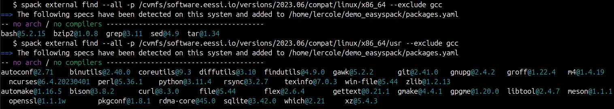
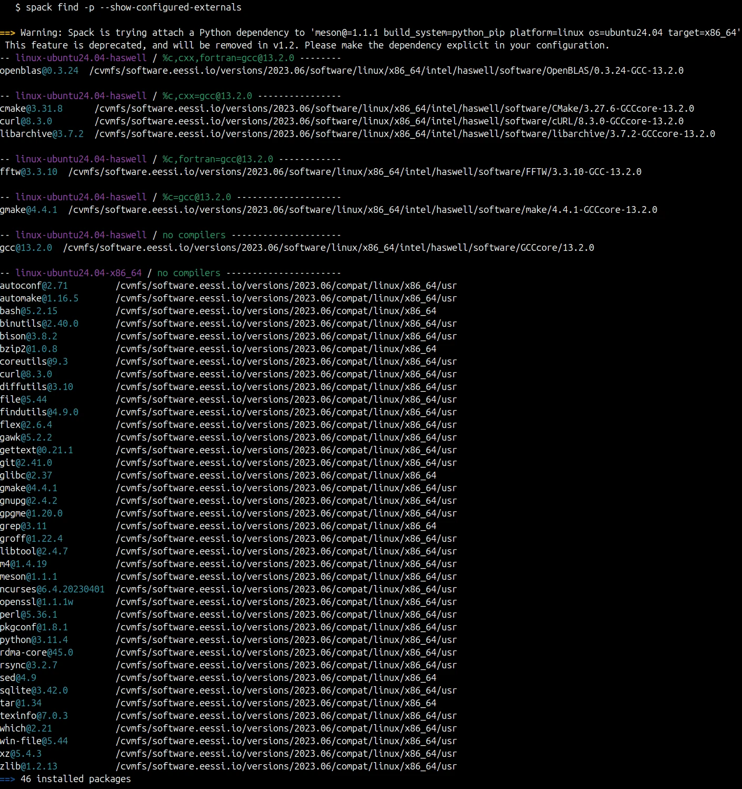
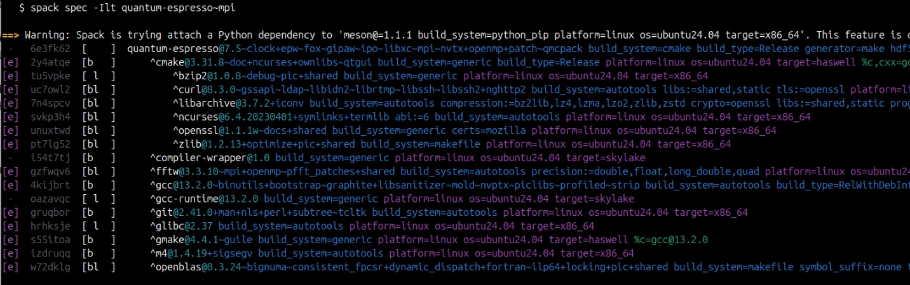
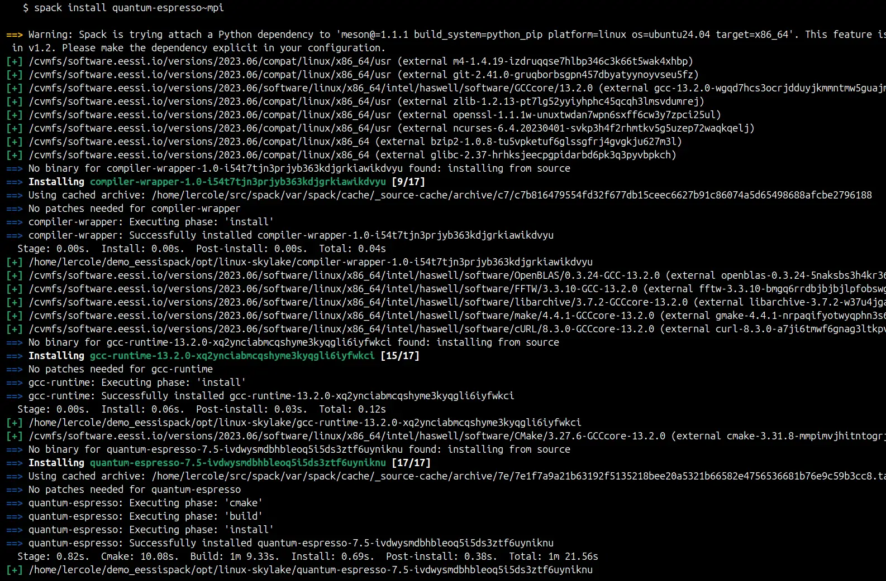
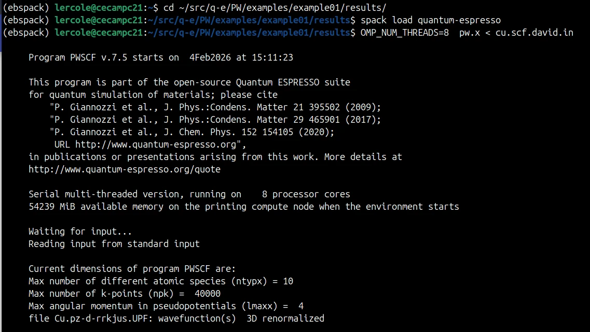

# Using Spack on Top of EESSI: Best of Both Worlds

<figure markdown="span">
{width=75%}
</figure>

The HPC software landscape offers powerful tools for managing scientific software, such as [EasyBuild](https://easybuild.io) and [Spack](https://spack.io).

[EESSI](https://www.eessi.io) provides a ready-to-use software stack with thousands of optimized software installations that were built with EasyBuild.

Imagine you are working on an HPC system with EESSI already available. You have access to a wealth of optimized installations for scientific software packages, libraries, tools, as well as compilers. But you need to install a new tool or a specific version of a package that's not in EESSI yet.

You can already extend EESSI with new software through the [EESSI-extend](../../../../using_eessi/building_on_eessi.md) module.
This utility provides you with a pre-configured EasyBuild installation that you can use to build packages from [easyconfig files](https://docs.easybuild.io/terminology/#easyconfig_files).

Like EasyBuild, [Spack](https://spack.io) is a flexible build tool that also offers a vast repository of build recipes maintained by a large and active community, making it a familiar tool for many HPC users.
By enabling Spack to leverage software installations already available in EESSI as dependencies, we can offer users the best of both worlds: the convenience of a pre-built, optimized software stack combined with the flexibility to quickly build new packages using tools they already know.

<!-- more -->


In a previous [blog post](../01/Spack-on-top-of-EESSI-PoC.md), we presented a first proof-of-concept implementation of this vision. 
We used a custom-built upstream database to make Spack aware of EESSI's software stack and managed to build a new Quantum ESPRESSO installation that reused dependencies from EESSI.

Thanks to recent updates to Spack (in particular, treating externals as concrete specs and allowing the definition of dependencies – see [this pull request in Spack](https://github.com/spack/spack/pull/51118)) and an active collaboration with its developers, it is now possible to connect Spack and EESSI in a *seamless* and *Spack-native* way.

## How it works

Spack 1.1+ introduces external packages treated as concrete specs (i.e. like any other spec), with dependency support, allowing us to expose software installed in EESSI as externals along with their dependencies.
This is the proper, *Spack-onic* way to achieve our goal, and it does not require any modification of Spack's source code, nor the creation of a custom database.

!!! note

    Currently we need to add a small patch to Spack to make sure its compiler wrapper works correctly
    with the unusual sysroot configuration of EESSI. This is a known
    [issue](https://github.com/spack/spack/issues/51582) that will be addressed in future Spack releases.

We implement the following workflow to connect Spack to EESSI, and build a new Quantum ESPRESSO with Spack reusing EESSI packages as dependencies.


### Step 1 – External packages for EESSI software layer

Declare software installations in EESSI software layer as [external packages](https://spack.readthedocs.io/en/latest/packages_yaml.html#external-packages) in a `packages.yaml` configuration file with [external dependencies](https://spack.readthedocs.io/en/latest/packages_yaml.html#specifying-dependencies-among-external-packages).

```yaml
# Example of packages.yaml file for EESSI software stack without compat-layer packages (to be added by detection tool)
# EESSI detected microarchitecture: haswell
packages:
  gcc:
    externals:
    - spec: gcc@13.2.0 languages:='c,c++,fortran' target=haswell
      prefix: /cvmfs/software.eessi.io/versions/2023.06/software/linux/x86_64/intel/haswell/software/GCCcore/13.2.0
      dependencies: []
      extra_attributes:
        compilers:
          c: /cvmfs/software.eessi.io/versions/2023.06/software/linux/x86_64/intel/haswell/software/GCCcore/13.2.0/bin/gcc
          cxx: /cvmfs/software.eessi.io/versions/2023.06/software/linux/x86_64/intel/haswell/software/GCCcore/13.2.0/bin/g++
          fortran: /cvmfs/software.eessi.io/versions/2023.06/software/linux/x86_64/intel/haswell/software/GCCcore/13.2.0/bin/gfortran
  gmake:
    externals:
    - spec: gmake@4.4.1 target=haswell
      prefix: /cvmfs/software.eessi.io/versions/2023.06/software/linux/x86_64/intel/haswell/software/make/4.4.1-GCCcore-13.2.0
      dependencies:
      - spec: gcc@13.2.0 target=haswell
  openblas:
    externals:
    - spec: openblas@0.3.24~ilp64 threads=openmp target=haswell
      prefix: /cvmfs/software.eessi.io/versions/2023.06/software/linux/x86_64/intel/haswell/software/OpenBLAS/0.3.24-GCC-13.2.0
      dependencies:
      - spec: gcc@13.2.0 target=haswell
  fftw:
    externals:
    - spec: fftw@3.3.10~mpi+openmp+shared precision=float,double,long_double,quad target=haswell
      prefix: /cvmfs/software.eessi.io/versions/2023.06/software/linux/x86_64/intel/haswell/software/FFTW/3.3.10-GCC-13.2.0
      dependencies:
      - spec: gcc@13.2.0 target=haswell
  curl:
    externals:
    - spec: curl@8.3.0+nghttp2 target=haswell
      prefix: /cvmfs/software.eessi.io/versions/2023.06/software/linux/x86_64/intel/haswell/software/cURL/8.3.0-GCCcore-13.2.0
      dependencies:
      - spec: gcc@13.2.0 target=haswell
      - spec: zlib@1.2.13  # compat
        deptypes:
        - link
      - spec: openssl@1.1.1w  # compat
        deptypes:
        - build
        - link
  libarchive:
    externals:
    - spec: libarchive@3.7.2 target=haswell
      prefix: /cvmfs/software.eessi.io/versions/2023.06/software/linux/x86_64/intel/haswell/software/libarchive/3.7.2-GCCcore-13.2.0
      dependencies:
      - spec: gcc@13.2.0 target=haswell
  cmake:
    externals:
    - spec: cmake@3.31.8 target=haswell
      prefix: /cvmfs/software.eessi.io/versions/2023.06/software/linux/x86_64/intel/haswell/software/CMake/3.27.6-GCCcore-13.2.0
      dependencies:
      - spec: gcc@13.2.0 target=haswell
      - spec: curl@8.3.0 target=haswell
        deptypes:
        - build
        - link
      - spec: ncurses@6.4.20230401  # compat
        deptypes:
        - build
        - link
      - spec: zlib@1.2.13  # compat
        deptypes:
        - build
        - link
      - spec: libarchive@3.7.2 target=haswell
        deptypes:
        - build
        - link
      - spec: bzip2@1.0.8  # compat
        deptypes:
        - link
      - spec: openssl@1.1.1w  # compat
        deptypes:
        - build
        - link

```

*Variants* (e.g. `~mpi+openmp`) should be specified to the best of our knowledge. By default, Spack will fill in the gaps with the package's default variants.

*Link* and *runtime dependencies* should be specified whenever possible. Pure build dependencies are not needed (the only exception being the *compiler*, since Spack can reuse this information). A dependency spec should unambiguously point to another declared external package. If an ambiguity exists, Spack will throw an error.

Many packages in EESSI depends on packages of the compatibility layer (e.g. `zlib`), that were filtered out during the build process. To detect these packages, see the [next step](#step-2-optional-suggested-eessi-compat-layer).

Since software installations in EESSI are always RPATH'ed to their dependencies, linking will likely work in most real-case scenarios even if you forget to declare some dependencies. 


### Step 2 – (optional, suggested) EESSI compatibility layer

It is possible to detect software installations available in the EESSI compatibility layer and configure Spack to use them as externals.
In EESSI, these are often dependencies of software installations in the software layer (see previous example), so it is suggested to include them.

This can be done automatically via `spack external find`:




### Step 3 – Show configured externals

Externals can then be listed via `spack find --show-configured-externals`.
These packages will get reused during Spack solves by default.




### Step 4 – Build a new Quantum ESPRESSO with Spack

We can now build new packages with Spack, reusing EESSI installations as dependencies!
Let's try this out by building a new Quantum ESPRESSO with Spack.

We first check what the concretizer comes up with, using `spack spec`:



Looks good! Spack is reusing EESSI packages as external dependencies. 
It only needs to build the new `quantum-espresso` itself and a few Spack-specific packages: `compiler-wrapper` that is Spack's compiler wrapper, and `gcc-runtime` that is a local copy of the GCC runtime libraries that are provided by EESSI's `gcc@13.2.0`.

Finally, we can proceed with the installation with `spack install quantum-espresso~mpi`:




### Step 5 – Verify and run Quantum ESPRESSO

Finally, we can verify that the new Quantum ESPRESSO installation works correctly by running it:



When we inspect the `pw.x` binary, we can see that it links to libraries provided by EESSI:


(the only exception being `libgomp`, `libgfortran`, `libgcc_s` which come from the `gcc-runtime` package that Spack installs).


## Demo code

A demonstrated implementation of the presented approach is now available in the [EasySpack repository](https://github.com/lorisercole/easyspack).

A simple [example script](https://github.com/lorisercole/easyspack/blob/develop/quick_start.sh) showcases the workflow.
It only requires a running EESSI environment and a patched Spack installation (see instructions in the [README](https://github.com/lorisercole/easyspack/blob/develop/README.md)).

<details>
<summary>Example output of `quick_start.sh`</summary>

<figure>
	
</figure>
<figure>
	
</figure>
<figure>
	
</figure>

</details>


## Conclusions and outlook

The workflow we presented is a simple demonstration of how Spack can be integrated with EESSI to leverage its optimized software stack.
More complex scenarios, like building MPI-enabled packages and pre-configured toolchains, are being actively explored.

A complete integration of Spack with EESSI will require building some automation around the generation of the `packages.yaml` files to keep them in sync with EESSI updates, as well as further testing and validation of various build scenarios.

Such an integration will open powerful workflows for HPC users and administrators, allowing new software to be built quickly on top of EESSI's stable, optimized base by leveraging either Spack or EasyBuild.

The future of HPC software management is not about choosing between distributions and package managers: it is about making them work together seamlessly.

---

### Learn more and get involved

We encourage you to join the discussion on the `#spack` channel of [EESSI Slack]({{ config.extra.slack_invite_url }}), as well as our weekly [EESSI Happy Hour sessions](https://www.eessi.io/docs/training-events/happy-hours-sessions/), and share your experiences and suggestions!

### Acknowledgements

This work was made possible thanks to the collaboration with the Spack development team, in particular [Todd Gamblin](https://github.com/tgamblin) and [Massimiliano Culpo](https://github.com/alalazo), as well as EESSI team members [Kenneth Hoste](https://github.com/boegel) and [Alan O'Cais](https://github.com/ocaisa).
