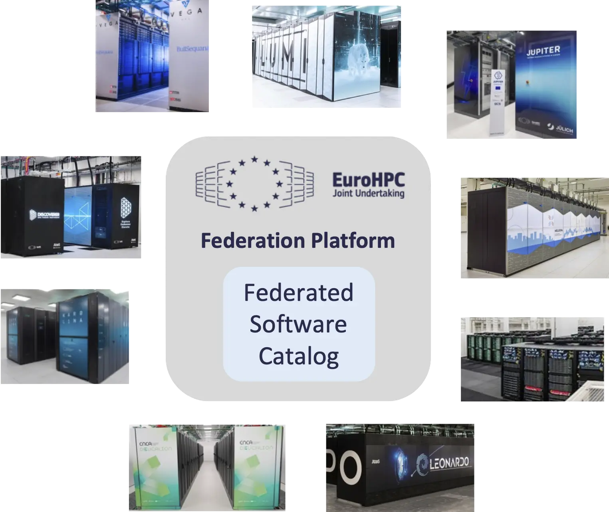
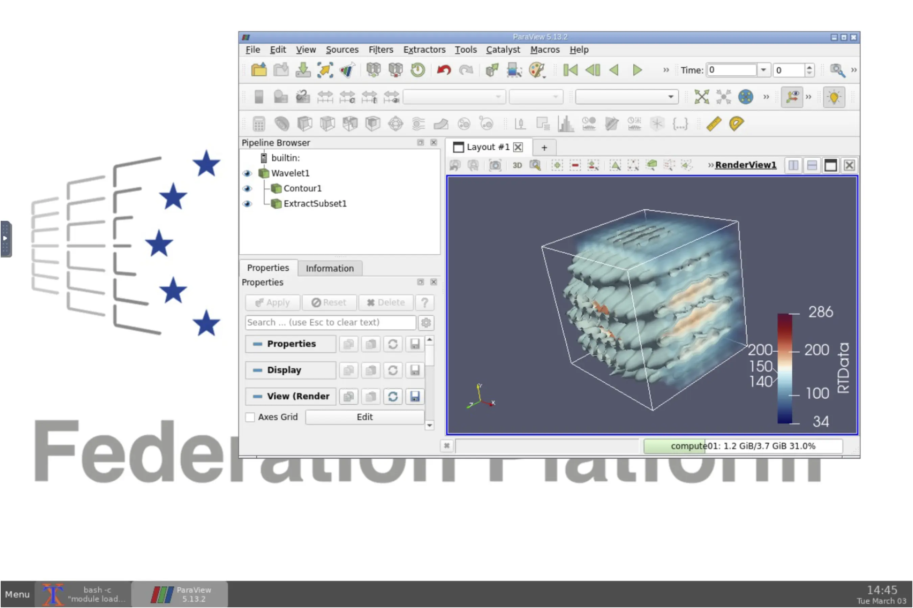

# Update on EESSI in EuroHPC Federation Platform

Since our [blog post in Feb'25](../../2025/02/eessi-integration-in-efp.md) announcing that EESSI will be integrated in the [EuroHPC Federation Platform (EFP)](https://my-eurohpc.eu), we have been working hard on making this a reality.

<figure markdown="span">
{width=70%}
</figure>

The **Federated Software Catalog** (FSC) component of EFP will use EESSI as a base. As a result, EESSI will soon be available on *all* [EuroHPC supercomputers](https://www.eurohpc-ju.europa.eu/supercomputers_en).

In fact, EESSI is *already* available on the majority of them today!

<!-- more -->

## EESSI as a base for the EFP Federated Software Catalog

The Federated Software Catalog component of EFP
aims to provide a **uniform software stack** for end users across all EuroHPC supercomputers, with a focus on
applications, tools, and libraries (not system software like Slurm, network or GPU drivers, etc.).

The goal is to alleviate some of the hurdles that researchers bump into when moving from one system to another,
by providing the exact same software environment everywhere.

Does this ring a bell? It should!

[EESSI](../../../../index.md), the European Environment for Scientific Software Installations,
is the perfect base for the EFP Federated Software Catalog.

Not only will EESSI be available on all EuroHPC supercomputers, it lowers the barrier to entry to these systems
because it is also available on [various other HPC systems](../../../../systems.md). This enables people to familiarize
themselves with the software environment that will be available to them when they switch to a EuroHPC system.

EESSI can also easily be installed in on-premise or commercial cloud environments.
In addition, it can be used in [CI environments like GitHub Actions](../../../../using_eessi/eessi_in_ci.md),
and on personal workstations running [Linux](../../../../getting_access/native_installation.md),
or even in [Windows](../../../../getting_access/eessi_wsl.md) or [macOS](../../../../getting_access/eessi_limactl.md)
by using a Linux virtual machine.

This is why [HPC team at Ghent University](https://www.ugent.be/hpc/en) was invited to join the EFP consortium,
which is led by [CSC - IT Center for Science](https://csc.fi/en/): to help with *integrating* EESSI into the EuroHPC Federation Platform.

## Deep integration in EFP

EESSI is the base for the EFP Federated Software Catalog, but it is also being deeply integrated into several other EFP components.

The *MyEFP user portal* will provide an overview of software that is available in the Federated Software Catalog,
specifically in the context of EuroHPC infrastructure. It will map the [CPU](../../../../software_layer/cpu_targets.md)
and [GPU](../../../../software_layer/gpu_targets.md) targets that EESSI supports to partitions of the EuroHPC supercomputers,
so that researchers can easily tell on which systems optimized installations of the software they would like to use are already available.

Additionally, the *EFP Interactive* component that consists of a federated instance of [Open OnDemand](https://www.openondemand.org)
managed by the EFP consortium will rely on EESSI for the various interactive apps it provides.
This includes for example Jupyter, RStudio, MLflow, and even a Linux desktop environment in which GUI applications like ParaView can be run.

<figure markdown="span">
{width=70%}
</figure>

EESSI will effectively enable researchers to write *portable* (Slurm) job scripts that work across EuroHPC supercomputers,
as well as efficiently run entire workflows via the *EFP Workflows* component that is based on [LEXIS](https://docs.lexis.tech/).
These workflows may be executed not just within a single system, but even across multiple systems.

Much of this is facilitated by the central internal API that is provided by the *EFP Allocations* component (based
on [Waldur](https://waldur.com/)), which allows other EFP components to query the contents of Federated Software Catalog
by exposing the publicly available [EESSI data files](https://www.eessi.io/api_data/data/).

## Current availability of EESSI on EuroHPC supercomputers

EESSI is already available on 7 out of 9 of current [EuroHPC supercomputers](https://www.eurohpc-ju.europa.eu/supercomputers/our-supercomputers_en).

This includes, in alphabetical order:

- [Deucalion](https://www.eurohpc-ju.europa.eu/supercomputers/our-supercomputers_en#deucalion) in Portugal, hosted by [FCT](https://www.fct.pt/en) and managed by [CNCA](https://www.incd.pt/);
- [Discoverer](https://www.eurohpc-ju.europa.eu/supercomputers/our-supercomputers_en#discoverer) in Bulgaria, hosted by [Sofia Tech Park](https://sofiatech.bg/en/);
- [Karolina](https://www.eurohpc-ju.europa.eu/supercomputers/our-supercomputers_en#karolina) in Czech Republic, hosted by [IT4Innovations (IT4I)](https://www.it4i.cz/en);
- [Leonardo](https://www.eurohpc-ju.europa.eu/supercomputers/our-supercomputers_en#leonardo) in Italy, hosted by [CINECA](https://www.cineca.it/en);
- [MareNostrum 5](https://www.eurohpc-ju.europa.eu/supercomputers/our-supercomputers_en#marenostrum-5) in Spain, hosted by [Barcelona Supercomputing Centre](http://bsc.es/);
- [MeluXina](https://www.eurohpc-ju.europa.eu/supercomputers/our-supercomputers_en#meluxina) in Luxembourg, hosted by [LuxProvide](https://luxprovide.lu/);
- [Vega](https://www.eurohpc-ju.europa.eu/supercomputers/our-supercomputers_en#vega) in Slovenia, hosted by [IZUM](https://www.izum.si/en/home/);

We are currently working closely together with [CSC – IT Center for Science](https://csc.fi/en/) to make EESSI available on
[LUMI](https://www.eurohpc-ju.europa.eu/supercomputers/our-supercomputers_en#lumi),
and with [Jülich Supercomputing Centre (JSC)](https://www.fz-juelich.de/en/jsc) to do the same on
[JUPITER](https://www.eurohpc-ju.europa.eu/supercomputers/our-supercomputers_en#jupiter).

## Webinars

A series of webinars introducing the EuroHPC Federation Platform have been organised recently, with more coming up soon; see [https://my-eurohpc.eu/training](https://my-eurohpc.eu/training).

The recordings of the first three webinars are embedded below, along with a link to the slides.

### Introduction to EFP

On 4 February 2026, a general introduction to the EuroHPC Federation Platform was presented by CSC.
It outlines the overall scope of the project, and briefly covers the role of each of its components.

<iframe id="kmsembed-0_lwh7am52" width="608" height="402" src="https://video.csc.fi/embed/secure/iframe/entryId/0_lwh7am52/uiConfId/14971191/st/0" class="kmsembed" allowfullscreen webkitallowfullscreen mozAllowFullScreen allow="autoplay *; fullscreen *; encrypted-media *" referrerPolicy="no-referrer-when-downgrade" sandbox="allow-downloads allow-forms allow-same-origin allow-scripts allow-top-navigation allow-pointer-lock allow-popups allow-modals allow-orientation-lock allow-popups-to-escape-sandbox allow-presentation allow-top-navigation-by-user-activation" frameborder="0" title="Webinar: Introduction to the EuroHPC Federation Platform"></iframe>

Over 250 people attended this webinar, confirming the broad interest from the EuroHPC community.

The slides for this webinar are available <a href="https://my-eurohpc.eu/pdf/2026-02-04_EFP-Intro-webinar.pdf" target="_blank">here</a>.

### EFP Federated Software Catalog

On 25 February 2026, we presented the Federated Software Catalog in the 2nd EFP webinar.

We covered the role of EESSI as its base, gave a quick introduction to EESSI itself,
and provided a high-level overview of the software installations that are already provided by EESSI.

A quick demo with running GROMACS using the exact same job script on the EuroHPC supercomputers Vega and Deucalion
helped to convey to attendees how this could positively impact their daily workflow.

<iframe id="kmsembed-0_f16elnet" width="608" height="402" src="https://video.csc.fi/embed/secure/iframe/entryId/0_f16elnet/uiConfId/14971191/st/0" class="kmsembed" allowfullscreen webkitallowfullscreen mozAllowFullScreen allow="autoplay ; fullscreen ; encrypted-media *" referrerPolicy="no-referrer-when-downgrade" sandbox="allow-downloads allow-forms allow-same-origin allow-scripts allow-top-navigation allow-pointer-lock allow-popups allow-modals allow-orientation-lock allow-popups-to-escape-sandbox allow-presentation allow-top-navigation-by-user-activation" frameborder="0" title="EuroHPC Federation Platform - Federated Software Catalog"></iframe>

The 100+ attendees of this webinar raised a variety of interesting questions, most of which were answered during the Q&A at the end.

The slides for this webinar are available <a href="https://my-eurohpc.eu/pdf/2026-02-25_EFP-FSC-webinar.pdf" target="_blank">here</a>.

### EFP Interactive

On 4 March 2026, the EFP Interactive component was covered in depth in a 3rd webinar.

It showed how the Federated Software Catalog based on EESSI powers various interactive apps,
and included a live demo of the main features of this federated Open OnDemand instance.

<iframe id="kmsembed-0_6lmbxc1u" width="608" height="402" src="https://video.csc.fi/embed/secure/iframe/entryId/0_6lmbxc1u/uiConfId/14971191/st/0" class="kmsembed" allowfullscreen webkitallowfullscreen mozAllowFullScreen allow="autoplay ; fullscreen ; encrypted-media *" referrerPolicy="no-referrer-when-downgrade" sandbox="allow-downloads allow-forms allow-same-origin allow-scripts allow-top-navigation allow-pointer-lock allow-popups allow-modals allow-orientation-lock allow-popups-to-escape-sandbox allow-presentation allow-top-navigation-by-user-activation" frameborder="0" title="EuroHPC Federation Platform - EFP Interactive"></iframe>

During Q&A, questions by the numerous (160+) attendees were answered.

The slides for this webinar are available <a href="https://my-eurohpc.eu/pdf/2026-03-04_EFP-Interactive-webinar.pdf" target="_blank">here</a>.

## Next steps

Over the next couple of weeks and months, we will keep collaborating with the EuroHPC Hosting Entities to stabilize
the deployments of EESSI on the EuroHPC supercomputers, and get EESSI onboarded on the upcoming systems,
like [Arrhenius](https://www.eurohpc-ju.europa.eu/supercomputers/our-supercomputers_en#arrhenius) in Sweden,
[DAEDALUS](https://www.eurohpc-ju.europa.eu/supercomputers/our-supercomputers_en#daedalus) in Greece,
and [Alice Recoque](https://www.eurohpc-ju.europa.eu/supercomputers/our-supercomputers_en#alice-recoque) in France.

In addition, we will provide concise but thorough documentation on the use of EESSI on the EuroHPC supercomputers,
and provide support to researchers who rely on it for their EuroHPC projects.

The first version of the EuroHPC Federation Platform will become available soon: it is planned to be production-ready
by end of March 2026. By then, EESSI should be available on all current EuroHPC supercomputers.

People who have questions related to the Federated Software Catalog of the EuroHPC Federation Platform
should contact the EFP Helpdesk via ``helpdesk (at) my-eurohpc.eu``.
