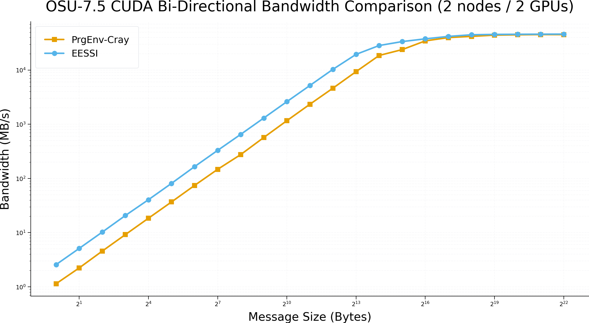
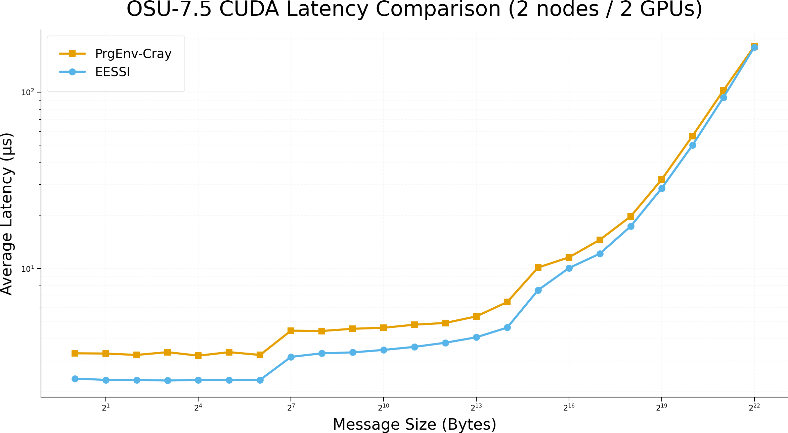

# MPI at Warp Speed: EESSI Meets Slingshot-11<sub><sup>(part2)</sup></sub>

Building on our initial HPE/Cray Slingshot‑11 results, we further refined MPI tuning and validated the setup using EESSI/2025.06. The outcome is a significant performance improvement, bringing EESSI MPI behavior much closer to vendor tuned Cray MPI environments.
In our previous blog post, [MPI at Warp Speed: EESSI Meets Slingshot‑11](https://www.eessi.io/docs/blog/2025/11/14/EESSI-on-Cray-Slingshot/), we demonstrated that EESSI could successfully leverage the HPE Cray Slingshot‑11 interconnect via the [host_injections](https://www.eessi.io/docs/site_specific_config/host_injections/) mechanism. Even as a proof‑of‑concept, the results were promising especially for GPU aware MPI communication on NVIDIA Grace Hopper systems.
We have continued to tune and refine MPI communication while using EESSI/2025.06 software stack. Through updates to several core components and improvements to library configuration, we significantly reduced latency overheads and improved bandwidth utilization across Slingshot‑11.
In this follow up blog post, we present the results using OSU-Micro-Benchmarks/7.5 and show how close EESSI can now get to native, vendor‑optimized MPI performance on Slingshot‑11 systems. 

### System Architecture

Our target system is [Olivia](https://documentation.sigma2.no/hpc_machines/olivia.html#olivia) which is based on HPE Cray EX platforms for compute and accelerator nodes, and HPE Cray ClusterStor for global storage, all
connected via HPE Slingshot high-speed interconnect.
It consists of two main distinct partitions:

- **Partition 1**: x86_64 AMD CPUs without accelerators
- **Partition 2**: NVIDIA Grace CPUs with Hopper accelerators

### Testing

The following tests were conducted on Olivia accel partition (Grace nodes with Hopper GPUs), using two-node, two-GPU configuration with one MPI task per node. 

We evaluated two OSU Micro-Benchmark builds:

1- OSU-Micro-Benchmarks/7.5-gompi-2024a-CUDA-12.6.0 from EESSI

2- OSU-Micro-Benchmarks/7.5 compiled with PrgEnv-cray.

The following commands were used to run the benchmarks:

`srun -N 2 --ntasks-per-node=1 osu_bibw -i 10 D D`

`srun -N 2 --ntasks-per-node=1 osu_latency -i 10 D D`

   

<details>
<summary>See details</summary>

<b>Test using OSU-Micro-Benchmarks/7.5-gompi-2024a-CUDA-12.6.0 from EESSI</b>:
```
Environment set up to use EESSI (2025.06), have fun!

hostname:
gpu-1-111
gpu-1-102

CPU info:
Vendor ID:                            ARM

Currently Loaded Modules:
  1) EESSI/2025.06                           12) PMIx/5.0.2-GCCcore-13.3.0
  2) GCCcore/13.3.0                          13) PRRTE/3.0.5-GCCcore-13.3.0
  3) GCC/13.3.0                              14) UCC/1.3.0-GCCcore-13.3.0
  4) numactl/2.0.18-GCCcore-13.3.0           15) OpenMPI/5.0.3-GCC-13.3.0
  5) libxml2/2.12.7-GCCcore-13.3.0           16) gompi/2024a
  6) libpciaccess/0.18.1-GCCcore-13.3.0      17) GDRCopy/2.4.1-GCCcore-13.3.0
  7) hwloc/2.10.0-GCCcore-13.3.0             18) UCX-CUDA/1.16.0-GCCcore-13.3.0-CUDA-12.6.0       (g)
  8) OpenSSL/3                               19) NCCL/2.22.3-GCCcore-13.3.0-CUDA-12.6.0           (g)
  9) libevent/2.1.12-GCCcore-13.3.0          20) UCC-CUDA/1.3.0-GCCcore-13.3.0-CUDA-12.6.0        (g)
 10) UCX/1.16.0-GCCcore-13.3.0               21) OSU-Micro-Benchmarks/7.5-gompi-2024a-CUDA-12.6.0 (g) 
 11) libfabric/1.21.0-GCCcore-13.3.0                

  Where:
   g:  built for GPU

# OSU MPI-CUDA Bi-Directional Bandwidth Test v7.5
# Datatype: MPI_CHAR.
# Size      Bandwidth (MB/s)
1                       2.57
2                       5.11
4                      10.22
8                      20.66
16                     40.44
32                     80.95
64                    165.02
128                   329.14
256                   650.10
512                  1301.93
1024                 2608.66
2048                 5189.90
4096                10332.67
8192                19474.04
16384               28342.00
32768               33507.82
65536               37659.55
131072              41730.65
262144              44740.60
524288              45448.67
1048576             45700.68
2097152             45895.85
4194304             46035.77

# OSU MPI-CUDA Latency Test v7.5
# Datatype: MPI_CHAR.
# Size       Avg Latency(us)
1                       2.38
2                       2.34
4                       2.34
8                       2.32
16                      2.34
32                      2.34
64                      2.34
128                     3.16
256                     3.31
512                     3.35
1024                    3.46
2048                    3.60
4096                    3.80
8192                    4.08
16384                   4.63
32768                   7.55
65536                  10.07
131072                 12.15
262144                 17.37
524288                 28.50
1048576                50.04
2097152                93.27
4194304               179.65
```

<b>Test using OSU-Micro-Benchmarks/7.5 with PrgEnv-cray</b>:
```

hostname:
gpu-1-111
gpu-1-102

CPU info:
Vendor ID:                            ARM

Currently Loaded Modules:
  1) craype-arm-grace                     7) cray-dsmml/0.3.0
  2) libfabric/2.3.1                      8) cray-mpich/9.1.0
  3) craype-network-ofi                   9) cray-libsci/26.03.0
  4) perftools-base/26.03.0               10) PrgEnv-cray/8.7.0
  5) xpmem/2.11.3-1.3_gdbda01a1eb3d       11) cuda/13.0
  6) cce/21.0.0                           12) CrayEnv
  7) craype/2.7.36
  
# OSU MPI-CUDA Bi-Directional Bandwidth Test v7.5
# Datatype: MPI_CHAR.
# Size      Bandwidth (MB/s)
1                       1.14
2                       2.23
4                       4.56
8                       9.18
16                     18.41
32                     36.77
64                     74.20
128                   147.12
256                   275.37
512                   569.29
1024                 1161.92
2048                 2339.97
4096                 4640.06
8192                 9350.01
16384               18583.90
32768               23840.66
65536               34521.83
131072              39704.04
262144              41814.18
524288              44072.94
1048576             44682.92
2097152             45122.15
4194304             45029.99

# OSU MPI-CUDA Latency Test v7.5
# Datatype: MPI_CHAR.
# Size       Avg Latency(us)
1                       3.31
2                       3.30
4                       3.24
8                       3.36
16                      3.21
32                      3.36
64                      3.24
128                     4.45
256                     4.43
512                     4.56
1024                    4.62
2048                    4.81
4096                    4.92
8192                    5.36
16384                   6.46
32768                  10.14
65536                  11.58
131072                 14.56
262144                 19.77
524288                 31.93
1048576                56.43
2097152               102.16
4194304               181.70
```
</details>

## Conclusion
There is a notable improvement in performance. While additional testing is still required, the current results are highly satisfactory.
