# EESSI activities at ISC'26

During the week of 22-26 June 2026, EESSI was part of the official program of the
[ISC'26 conference in Hamburg (Germany)](https://isc-hpc.com)
in various ways.

Next to the *Introduction to EESSI* half-day tutorial and a Birds-of-a-Feather (BoF) session we organized ourselves,
EESSI was also featured prominently in two other BoF sessions, including the one on the *EuroHPC Federation Platform*.

<figure markdown="span" style="display:flex; gap:0; justify-content:center;">
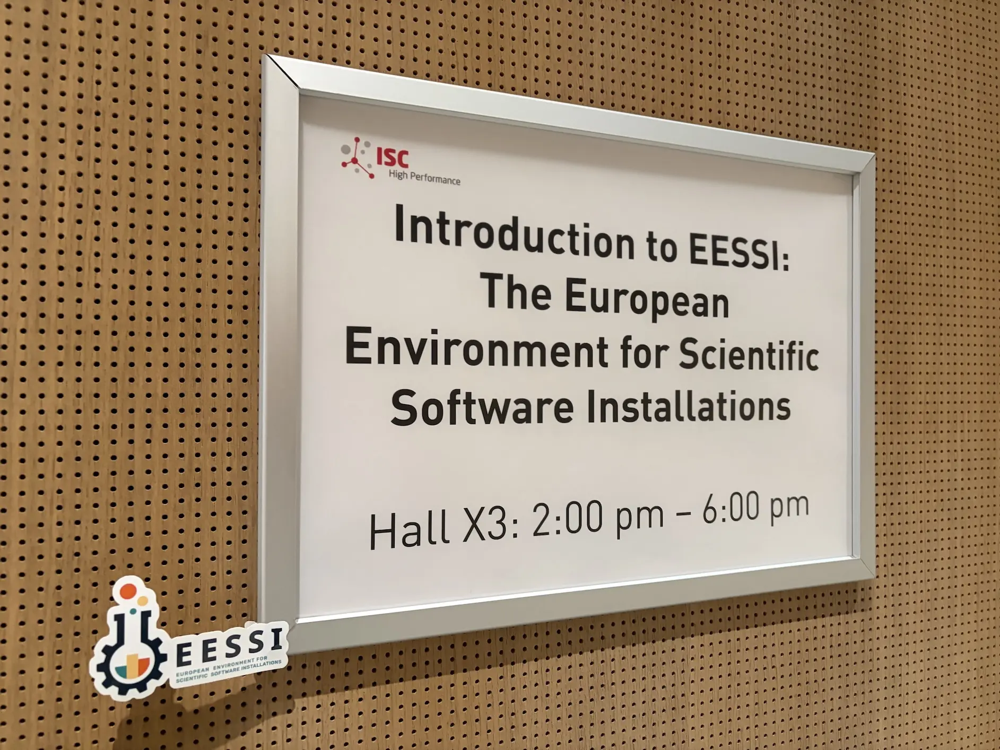{width=25%}
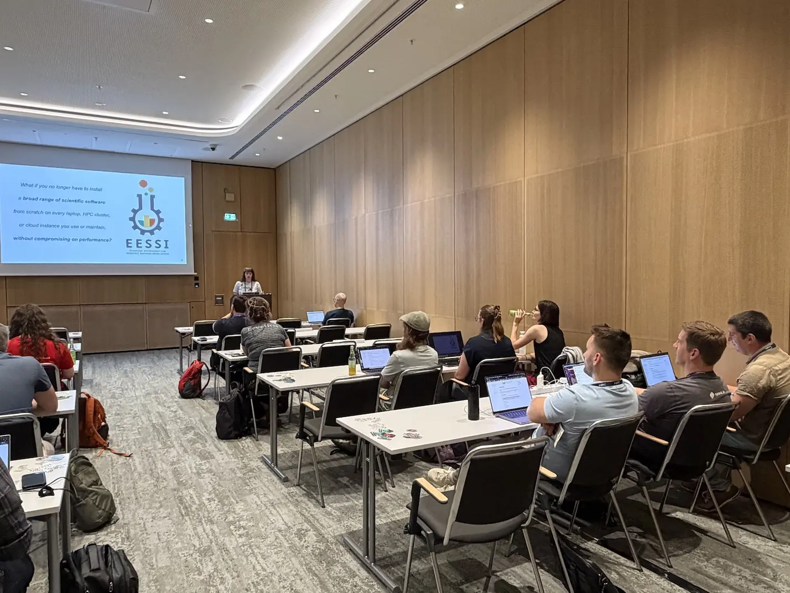{width=25%}
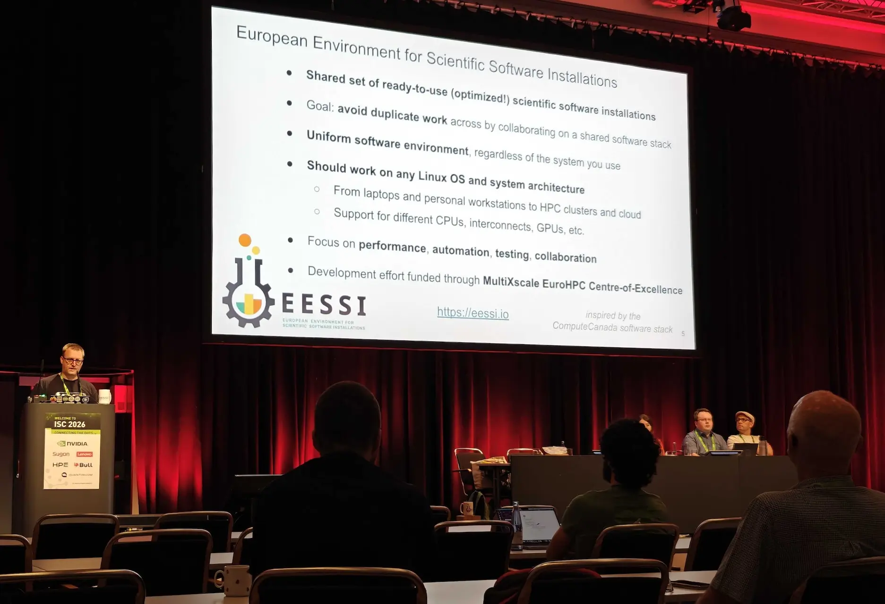{width=25%}
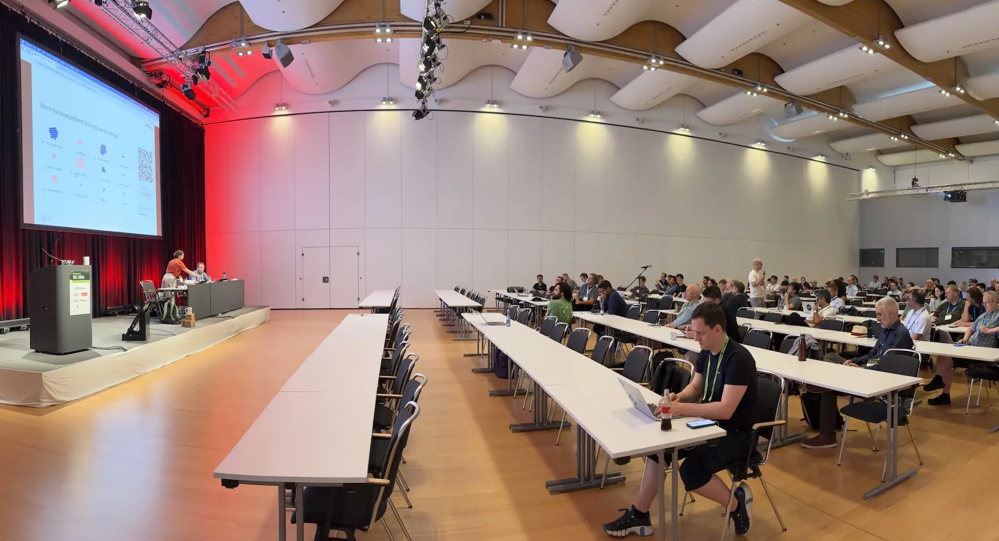{width=25%}
</figure>

In addition, we gave presentations in two workshops, witnessed how EESSI got mentioned by speakers
in other sessions, and had lots of interesting discussions with members of the HPC community at the ISC exhibit
or when bumping into people in the hallway track.

<!-- more -->

## EESSI tutorial

We kickstarted the week on Monday with the tutorials.
After looking over the fence a bit by attending the half-day [Spack](https://spack.io) tutorial in the morning,
we presented our own *Introduction to EESSI* half-day tutorial in the afternoon.

<figure markdown="span" style="display:flex; gap:0; justify-content:center;">
{width=50%}
{width=50%}
</figure>

About 20 attendees were introduced to EESSI, and learned how it works and how to use it.
They got to see EESSI in action during live demos, and were invited to experience it themselves
during the hands-on parts.

Everyone who attended the EESSI tutorial until the end got a free EESSI coffee mug.

<figure markdown="span">
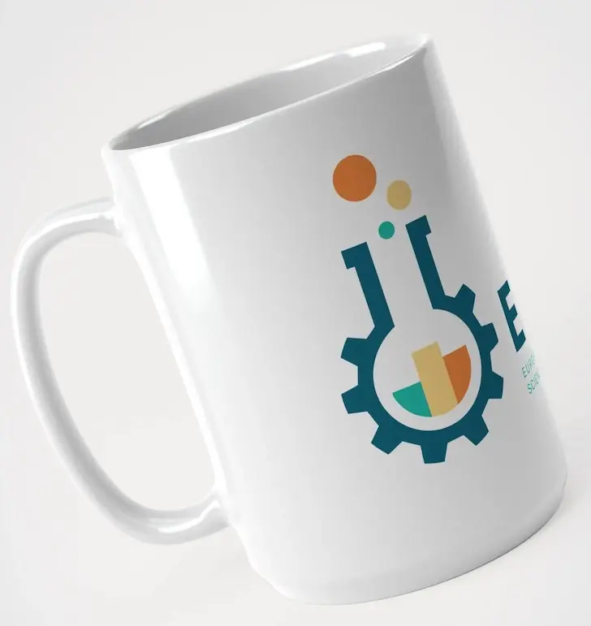{width=30%}
</figure>

Some of them left the session a bit flabbergasted by EESSI, and we had only just begun!

[Tutorial slides are available in PDF format](EESSI-tutorial-ISC26-20260622.pdf),
and the [tutorial website](https://eessi.io/isc26-tutorial/), with extensive guidance for hands-on parts of the tutorial,
will remain available as well.

## Open OnDemand

Before the start of the main event on Tuesday, we met up with Emily from [Open OnDemand](https://www.openondemand.org).

<figure markdown="span">
{width=20%}
</figure>

We brainstormed ideas on integrating EESSI with Open OnDemand, and discussed updates on the
Interactive component of the [EuroHPC Federation Platform](https://my-eurohpc.eu) that consists
of a *federated* Open OnDemand instance that leverages EESSI as the backend for several interactive apps.

Furthermore, we exchanged thoughts on using EESSI as a backend for interactive "community" apps
in Open Demand that could be shared with and easily used by sites using Open OnDemand, and how
EESSI fits in with the [Open OnDemand Appverse project](https://openondemand.connectci.org/appverse).

This was a continuation of a conservation that was already ongoing. We hope to show the fruits of this
collaboration, which started with a [proof-of-concept](../../2025/04/eessi-good.md), some time soon...

## Podcast interview

Also on Tuesday, Kenneth was interviewed by [Brendan Bouffler](https://www.linkedin.com/in/brendanbouffler/) for
a brand new podcast that will be launched soon.

They talked about what EESSI is and what it enables, and how it grew out of the [EasyBuild](https://easybuild.io) community.
Additional topics were also briefly touched, like the challenges that come maintaining open source software projects
like EasyBuild and EESSI, the recent collaboration with Spack, and the impact that LLMs will have on the development of scientific software.

<figure markdown="span">
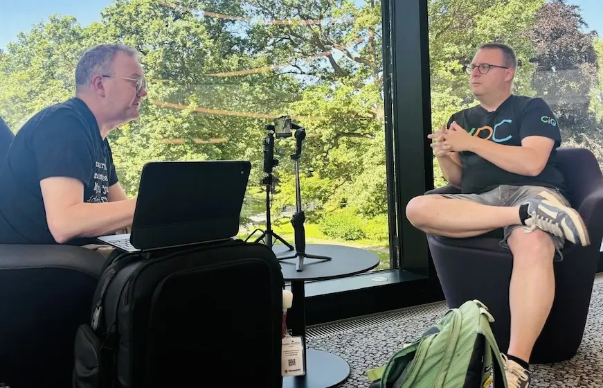{width=80%}
</figure>

Stay tuned for the interview, which is expected to be published in a couple of months!

## *Interoperable AI Infrastructure Access Portals Across Europe* BoF

At the end of the day on Tuesday, EESSI was presented by Alan at the *Interoperable AI Infrastructure Access Portals Across Europe*
Birds-of-a-Feather session.

<figure markdown="span">
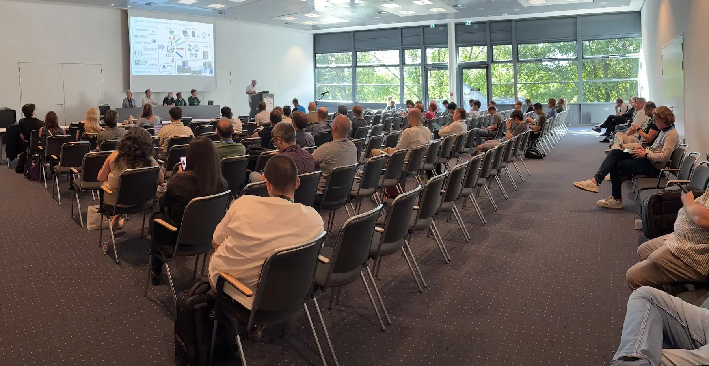{width=80%}
</figure>

During the session, different aspects of federating compute infrastructure were discussed. EESSI was pitched by Alan as a solution to provide
a uniform software stack across different infrastructures, which also clear from the short presentation showcasing the *EuroHPC Federation Platform*,
where EESSI is the base for the *Federated Software Catalog* component (see also our [previous blog post](../../2026/03/efp-webinar.md).

## EuroHPC Federation Platform BoF

On Wednesday morning, the Birds-of-a-Feather session on the [*EuroHPC Federation Platform (EFP)*](https://my-eurohpc.eu) was scheduled.

This session was very well attended, with over 200 people in the room.

<figure markdown="span">
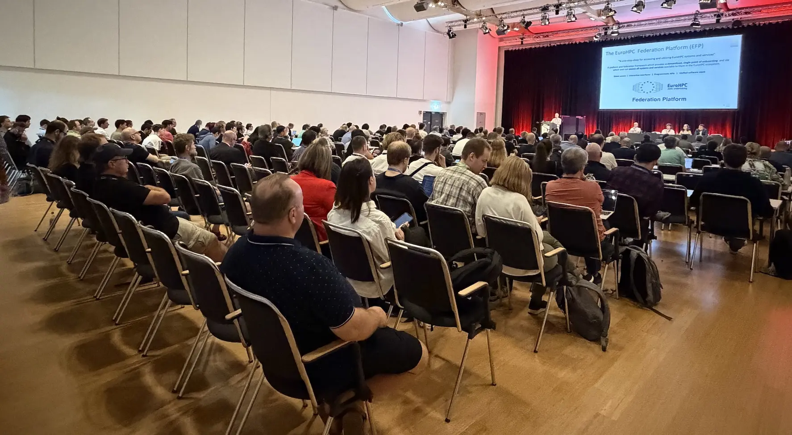{width=80%}
</figure>

It started with a short presentation by Henrik Nortamo from [CSC](https://csc.fi/en/), the technical lead of the EFP consortium,
introducing the platform and giving a status update.

Right after, Alan showed a quick live demo of using the EuroHPC Federation Platform, including the Single-Sign On login procedure,
a quick tour of the various features of EFP, and how easy it is to set up interactive sessions through the EFP Interactive component.
The latter is a federated Open OnDemand instance that is backed by the Federated Software Catalog, which is based on EESSI.

The remainder of the session consisted of an interactive poll to gather feedback from attendees,
and an open mic to let attendees ask questions.

<figure markdown="span">
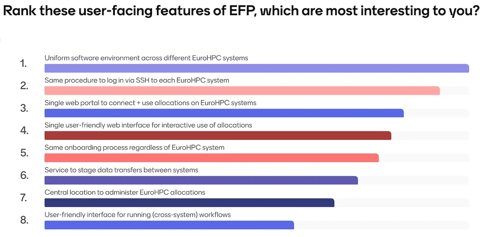{width=90%}
</figure>

The session was concluded by asking attendees to rank the user-facing features of EFP according to their interest.
The results showed that the *"Uniform software environment across different EuroHPC systems"*, i.e. the Federated Software
Catalog component of EFP which is based on EESSI, **came out on top as the most interesting feature**.

It is also worth highlighting that all features got a good overall score, which shows that the different aspects of EFP
will all be valuable to researchers.

## EESSI BoF

On Thursday we kickstarted the final day of the main ISC'26 program with our own Birds-of-a-Feather session for EESSI.

Close to 100 attendees were served a quick introduction to EESSI, along with a live demo that showed how quickly
it can be to get access to the extensive set of ready-to-use software installations that are provided by EESSI.

<figure markdown="span">
{width=80%}
</figure>

The largest part of the session consisted of interaction with the attendees.

We had an extensive interactive poll prepared, which was meant to trigger attendees to
join the discussion and raise questions.

<figure markdown="span">
{width=80%}
</figure>

It turned out that attendees were quite eager to ask questions, and we ended up running the
live poll while we were answering the questions that people raised.
The EESSI coffee mugs that we gave to everyone who raised a question, shared an insightful comment,
or provided an interesting suggestion no doubt helped in breaking the ice, despite the early start
of the session.

<figure markdown="span">
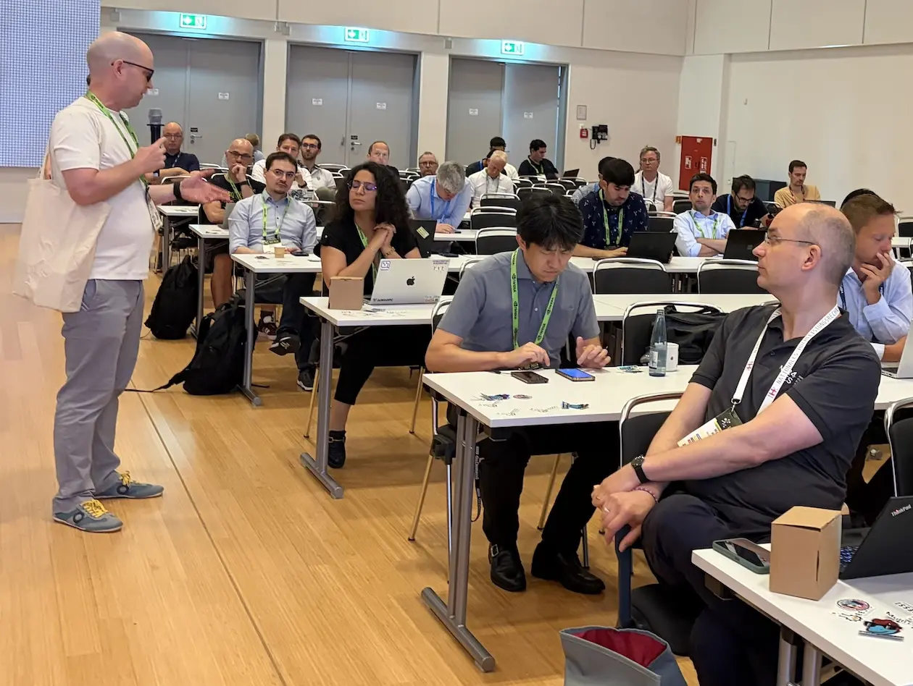{width=80%}
</figure>

The EESSI Birds-of-a-Feather session was evaluated highly by the attendeed, with an average 8.9 out of 10 overall score.

For more information, see the [slides of this session](EESSI-BoF-ISC26-20260625.pdf), which include the results of the live poll.

## Workshops

On Friday, we wrapped up the week by attending several of the ISC'26 workshops.

EESSI was featured in not just one but *two* different workshops this year.

At the [*1st Workshop in Sustainable Practices for Reproducibility in HPC (REPRO-HPC)*](https://repro-hpc.github.io/),
Helena presented an invited talk entitled *EESSI: Addressing HPC Reproducibility Hurdles Through a Unified Software Stack*.

Next to a whirlwind introduction to EESSI and the use cases it enables, Helena also did a live demonstration of the
user experience with EESSI.

<figure markdown="span">
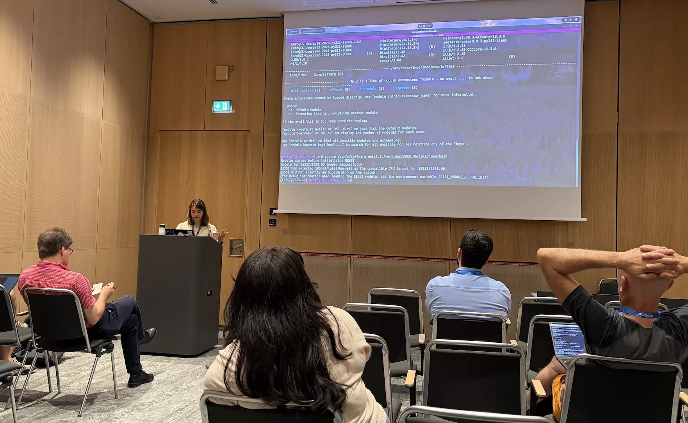{width=80%}
</figure>

In the afternoon, Lara gave a short presentation at the [*3rd International Workshop on Readiness of HPC Extreme-scaling Applications (RHEA)*](https://pop-coe.eu/news/events/readiness-of-hpc-extreme-scaling-applications-3rd-edition). She focused on the workflow for adding additional software to EESSI,
which triggered interest from both attendees and various of the other speakers at this workshop.
For more information, see the [slides for this presentation](EESSI-workshop-contributing-20260626.pdf).

<figure markdown="span">
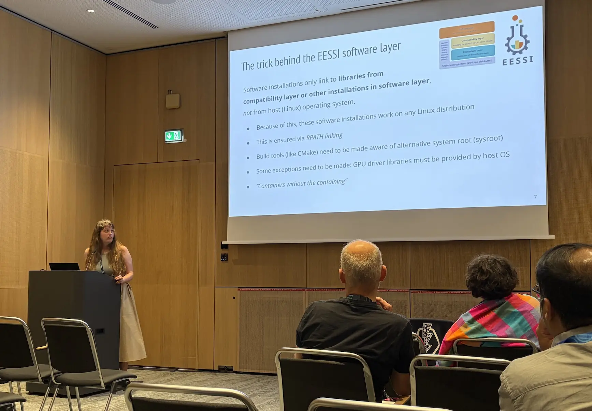{width=80%}
</figure>

Next to our own presentations on EESSI, we also witnessed it being prominently featured
in the presentation by Krishna Kant Singh at the [*12th Annual High Performance Containers Workshop (HPCW)*](https://container-in-hpc.org/isc/2026/hpcw/index.html).

Krishna talked about the challenges they face with the extensive software stack used in [the EBRAINS project](https://ebrains.eu),
and how EESSI is currently being explored to help alleviate the problems they have encountered with
getting their software installed on various systems.

<figure markdown="span">
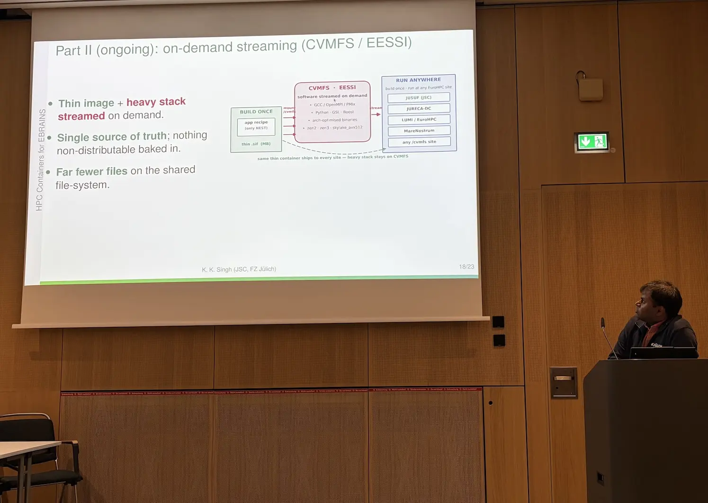{width=80%}
</figure>

## Final words

ISC'26 was a very interesting and rewarding event for us. We learned a lot, we got to know new people that we may be collaborating
with in the not-so-distant future, and we have spread the word further on EESSI, which is starting to make bigger and bigger waves
in the European HPC community, and beyond...

<figure markdown="span">
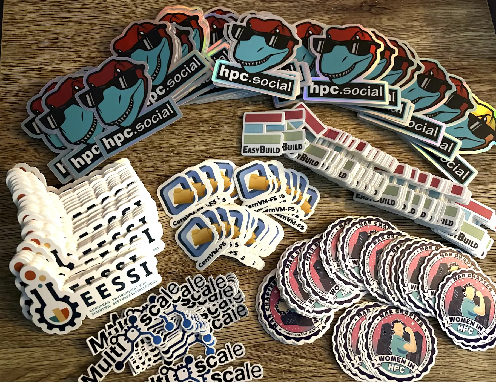{width=50%}
</figure>

And yes, of course we handed out a whole bunch of stickers!
