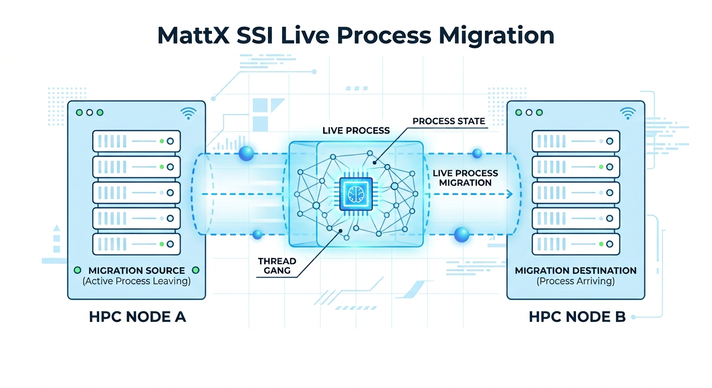

Almost 2 decades ago openMosix was the hottest open source Single System Image (SSI) cluster out there.
OpenMosix could migrate long running  processes across a cluster and thus effectively allowing HPC workloads to be spread 
across a cluster or migrated to a node with more resources, with no changes to the code. 
The project however never got a 2.6 kernel port and thus was EOL by early 2008.


Earlier this year Matt Rechenburg, one of the original openMosix community members released [MattX, the Modern SSI Cluster](https://mattx.de) , which brought 
back the openMosix vibes.    [MattX](https://github.com/brainmatt/mattx) lacked a test suite and thus I had a suite build.  Initially the [Mattx Test suite](https://github.com/KrisBuytaert/mattx-testsuite) just spun up a
number of VM's and migrated basic processes around to validate the new releases.  Working on that Test suite I wondered if it weren't a good idea to take let some  real HPC workloads migrate around, and 
where better to find them than in the [EESSI](https://github.com/EESSI/eessi-demo) demo project. 


   


The Test suite thus got expanded with default test targets for GROMACS,  and it actually helped us to find some bugs 
in MattX.  However  we eventually succeeded not only to migrate GROMACS to other nodes and back while it kept running.
We managed added a test scenario for GROMACS where we start it on node01,  migrate it to node02 , then migrate it back  node01.
And we can do this multiple times effectively migrating a process to different nodes during it's lifetime.


Our test suite first setup the GROMACS EESSI module, 
then does a full local test run to make sure it works before  starting a round trip migration from  almanode1 to almanode2 and back 

```
 ─────────────────────────────────────────────────────
  Starting migration of gmx mdrun [PID 92045]
    from : almanode1 (192.168.100.11)
    to   : almanode2   (192.168.100.12)  [node ID 378]
    command: echo 'migrate 92045 378' | sudo tee /proc/mattx/admin   (run on almanode1)
  ─────────────────────────────────────────────────────

  --- ps snapshot: immediately after outbound migration (almanode1 -> almanode2) (pattern: 'gmx mdrun') ---
  mattx@almanode1 (192.168.100.11)$ ps -eo pid,ppid,user,stat,%cpu,etime,cmd --no-headers | grep -iE -- 'gmx mdrun' | grep -v grep
        92045       1 mattx    Tl   81.7       00:20 gmx mdrun -s ion_channel.tpr -maxh 0.50 -resethway -noconfout -nsteps 20000 -g logfile_mig -ntmpi 1 -ntomp 2
  mattx@almanode2 (192.168.100.12)$ ps -eo pid,ppid,user,stat,%cpu,etime,cmd --no-headers | grep -iE -- 'gmx mdrun' | grep -v grep
        18204       2 mattx    Rl    121       00:08 gmx mdrun -s ion_channel.tpr -maxh 0.50 -resethway -noconfout -nsteps 20000 -g logfile_mig -ntmpi 1 -ntomp 2

  --- per-THREAD snapshot on almanode1 (pattern: 'gmx mdrun') -- one row per thread (tid), not one row per process like the snapshot above ---
  mattx@almanode1 (192.168.100.11)$ ps -eLo pid,tid,ppid,user,stat,%cpu,wchan:24,cmd --no-headers | grep -iE -- 'gmx mdrun' | grep -v grep
        92045   92045       1 mattx    Tl   54.2 do_signal_stop           gmx mdrun -s ion_channel.tpr -maxh 0.50 -resethway -noconfout -nsteps 20000 -g logfile_mig -ntmpi 1 -ntomp 2
        92045   92047       1 mattx    Tl   29.9 do_signal_stop           gmx mdrun -s ion_channel.tpr -maxh 0.50 -resethway -noconfout -nsteps 20000 -g logfile_mig -ntmpi 1 -ntomp 2

```


At this point GROMACS was started on almanode1 and has migrated to almanode2 .. where it keeps running till we tell it to move back.
We still see the original process on almanode1  , but the threads are stopped. 


Lets move it back
```
 ─────────────────────────────────────────────────────
  Starting migration of gmx mdrun [PID 92045]
    from : almanode2 (192.168.100.12)
    to   : almanode1   (192.168.100.11)  [node ID home]
    (admin command issued on almanode1, the home node -- not on almanode2, where the job actually is)
    command: echo 'migrate 92045 home' | sudo tee /proc/mattx/admin   (run on almanode1)
  ─────────────────────────────────────────────────────

  --- ps snapshot: immediately after return migration (almanode2 -> almanode1) (pattern: 'gmx mdrun') ---
  mattx@almanode1 (192.168.100.11)$ ps -eo pid,ppid,user,stat,%cpu,etime,cmd --no-headers | grep -iE -- 'gmx mdrun' | grep -v grep
        92045       1 mattx    Rl   60.2       00:46 gmx mdrun -s ion_channel.tpr -maxh 0.50 -resethway -noconfout -nsteps 20000 -g lo
gfile_mig -ntmpi 1 -ntomp 2
  mattx@almanode2 (192.168.100.12)$ ps -eo pid,ppid,user,stat,%cpu,etime,cmd --no-headers | grep -iE -- 'gmx mdrun' | grep -v grep
      (no process matching 'gmx mdrun' on almanode2)

  --- per-THREAD snapshot on almanode2 (pattern: 'gmx mdrun') -- one row per thread (tid), not one row per process like the snapshot a
bove ---
  mattx@almanode2 (192.168.100.12)$ ps -eLo pid,tid,ppid,user,stat,%cpu,wchan:24,cmd --no-headers | grep -iE -- 'gmx mdrun' | grep -v 
grep
      (no threads matching 'gmx mdrun' on almanode2)

```


As we can see this action  now cleanly moves the full process back to almanode1 where it continues running and is gone from almanode2 
and unlike in the initial migration it also doesn't leave anything behind. 

The test suite verifies if the output of GROMACS is as it expects, and also verifies if there's no errors in the logs so we could use those to report back to upstream if there really is a problem. 
This test scenario proves that  we are successfully leveraging the EESSI demo project to validate the MattX cluster functionality while we keep working on other tool setups provided by the EESSI demo project thus improving it's feature set.


Would an SSI style cluster be useful for you ?   What workloads to you want to migrate around ,  please let us know :) 

