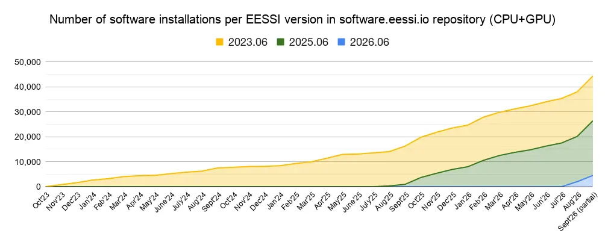
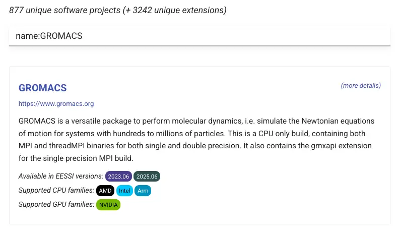
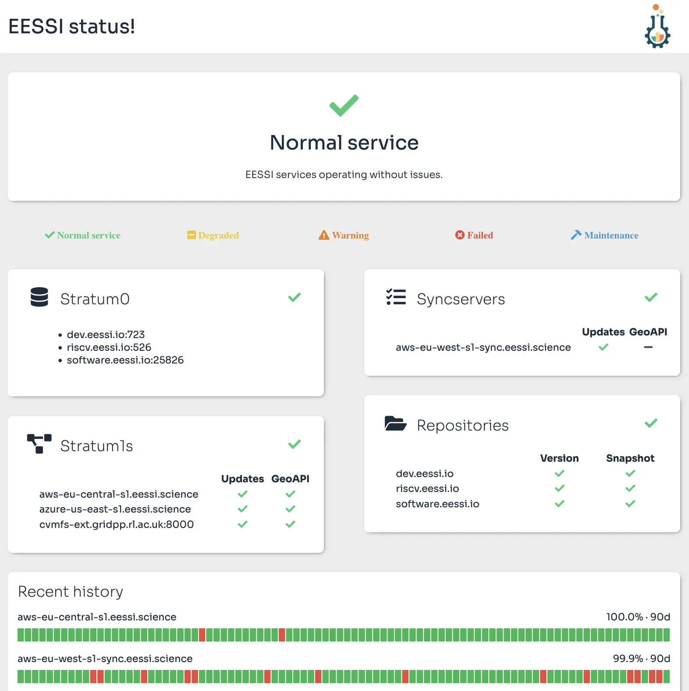

# Why you should vote for EESSI (again)

At the Supercomputing 2024 conference [EESSI won an HPCWire Readers' Choice Award](../../2024/11/hpcwire_award_2024.md).<br/>

On 14 September 2026, [**EESSI got nominated *again* for the HPCWire Readers' Choice Award**](hpcwire-readers-choice-awards-2026.md).

We have not been sitting still, EESSI has continued to evolve significantly since late 2024.

In this blog post we take a look at the progress that has been made, highlighting some of the recent developments, enhancements, and milestones.

Read on to see what has changed in EESSI since November 2024, and why we think that EESSI deserves your vote more than ever before... :smiling_face_with_3_hearts:


<!-- more -->

---


## MultiXscale as catalyst { #multixscale }

<figure markdown="span">
{width=30%}
</figure>

Before taking a deep dive into the progress that EESSI has made in the last two years,
we should highlight once again that the <a href="https://www.multixscale.eu/" target="_blank">MultiXscale EuroHPC Centre-of-Excellence</a>
has had a significant positive impact on EESSI since the project started in January 2023.
It has enabled us to mature EESSI from a proof-of-concept to a **production-ready** service.

The first iteration of the MultiXscale project will wrap up in December 2026.
A new EuroHPC Transversal Centre-of-Excellence, nicknamed *EESSIER*, will kick off in January 2027.
It will focus on increasing the adoption of EESSI, further developing the service,
and integrating EESSI with various existing well-established tools.

More on this later...

---


## Integration in the EuroHPC Federation Platform { #efp }

<figure markdown="span">
{width=40%}
</figure>

The work on integrating EESSI in the <a href="https://my-eurohpc.eu">EuroHPC Federation Platform (EFP)</a>
as the base for its *Federated Software Catalog* started in 2025. Although we knew that this effort was about
to start soon when the vote for the *HPCWire Readers' Choice Award 2024* was open, we could not talk about it yet back then.

The immediate impact of this effort is that EESSI will be available on *all current and future
<a href="https://www.eurohpc-ju.europa.eu/supercomputers/our-supercomputers_en" target="_blank">EuroHPC supercomputers</a>*.
In addition, it will also be made available on other EuroHPC infrastructure, including the
<a href="https://www.eurohpc-ju.europa.eu/quantum-technologies_en" target="_blank">EuroHPC Quantum Computers</a>
and <a href="https://www.eurohpc-ju.europa.eu/ai-factories_en" target="_blank">AI Factories</a>.

At the time of writing, EESSI was ready-to-use on 9 of the 10 currently online EuroHPC supercomputers: Arrhenius,
Deucalion, Discoverer,  Karolina, Leonardo, LUMI, MareNostrum 5, MeluXina, and Vega. We are working with the team
at Jülich Supercomputing Centre to also make EESSI available on JUPITER soon, taking into account
the system-specific aspects, such as the diskless worker nodes.

The ubiquity of EESSI on EuroHPC infrastructure will likely result in more interest from other HPC sites
beyond the EuroHPC Hosting Entities. An overview of systems that we know have EESSI available already can be
consulted on the [dedicated page](../../../../systems.md) in our documentation.

For more information on the integration of EESSI in the EuroHPC Federation Platform, see the dedicated
[blog post](../../2026/03/efp-webinar.md) we wrote back in March 2026, and the
<a href="https://docs.my-eurohpc.eu/software-catalog/overview/" target="_blank">*Federated Software Catalog*
section of the EFP documentation</a>.

!!! tip "Open position in HPC team at Ghent University"

    There is currently an <a href="https://jobs.ugent.be/job/Gent-HPC-Software-and-Support-Engineer-9000/1372536357" target="_blank">
    open position in the HPC team at Ghent University</a> for an *HPC Software and Support Engineer* person to help us out with this work.

    If you are interested or if you know someone who may be interested: applications are open until 11 October 2026!

---


## Expansion of `software.eessi.io` { #repo-expansion }

The main production CernVM-FS repository [`software.eessi.io`](../../../../repositories/software.eessi.io.md),
which was created mid 2023 in the context of [MultiXscale](#multixscale),
has grown significantly in the past 2 years.

Next to version `2023.06` which initially was the only EESSI version that was available,
two additional versions have been added: `2025.06` (which was kickstarted in June 2025),
and `2026.06` (June 2026).

``` { .no-copy }
$ ls /cvmfs/software.eessi.io/versions
2023.06  2025.06  2026.06
```

Each EESSI version comes with is own [compatibility layer](../../../../compatibility_layer.md)
(which includes a recent version of glibc), and provides a collection of software installations which were built
with a particular set of compiler toolchains. More details on the differences between EESSI versions
are available in the [EESSI documentation](../../../../repositories/versions.md).

Back in November 2024, EESSI provided about 8,000 software installations in total,
covering roughly 450 unique software projects (excluding extensions like Python packages,
R libraries, etc.) and targeting 9 different CPU microarchitectures.

Today EESSI provides *over 44,000 software installations*, across the three
current EESSI versions and all CPU/GPU targets, covering over 875 unique software projects (excl. extensions) in total.



That's more than a **5-fold increase** in the amount of available software installations,
and roughly *double* the number of unique software projects supported by EESSI,
compared to November 2024.

The number of [CPU microarchitectures](../../../../software_layer/cpu_targets.md)
for which EESSI provides optimized software installations also has *doubled* to 18 in total,
with the addition of the following CPU targets:

- Intel Ice Lake, Cascade Lake, and Sapphire Rapids;
- NVIDIA Grace;
- Arm A64FX;
- AMD Zen 5 (Turin) (since EESSI 2025.06);
- Intel Granite Rapids (only in EESSI 2026.06);
- AWS Graviton 4 (only in EESSI 2026.06);
- generic RISC-V (experimental in EESSI 2026.06);


While the vast majority of the software installations currently provided are CPU-only,
about 10% are installations that target one of the supported
[NVIDIA or AMD GPU targets](../../../../software_layer/gpu_targets.md).

---


## Overview of available software { #overview-software }

The [overview of available software installations](../../../../available_software/index.md)
in the EESSI documentation has been revamped.

Labels indicate in which EESSI version(s) the software is available,
and for which CPU and GPU targets installations are provided.

<figure markdown="span">
    [{width=100%}](../../../../available_software/index.md)
    <figcaption>Screenshot of overview of available software, showing GROMACS</figcaption>
</figure>

For each supported software project a page with more details is available,
see for example the [page for GROMACS](../../../../available_software/detail/GROMACS.md).

A [separate overview](../../../..//available_software_riscv/index.md) is available for software installations
targeting RISC-V CPUs.

---


## Development repository { #dev-repo }

The separate CernVM-FS repository [`dev.eessi.io`](../../../../repositories/dev.eessi.io.md)
can be used to deploy *pre-release* builds of selected software projects, for a subset of the CPU targets
that EESSI supports. This allows for recent developments in that software to be tested (at scale) more easily,
prior to a final release.

Usage of this repository is currently limited to partners in the MultiXscale project to deploy pre-release
versions of the <a href="https://www.multixscale.eu/software/" target="_blank">software</a> they develop
and the <a href="https://www.multixscale.eu/code-couplings/" target="_blank">code coupling</a> use cases
that MultiXscale focuses on.

For example, <a href="https://espressomd.org/wordpress/" target="_blank">ESPResSo</a> has made a pre-release
of ESPResSo v5.1 available for testing via `dev.eessi.io`; see the
<a href="https://lists.nongnu.org/archive/html/espressomd-users/2026-08/msg00000.html" target="_blank">
relevant thread on the `espressomd-users` mailing list thread</a>.

---


## Increased adoption by HPC community { #adoption }

EESSI has been more broadly adopted in the HPC community. The [list of known systems where
EESSI is available](../../../../systems.md) has been expanded with over 20 additional HPC and
private cloud systems, next to the [EuroHPC supercomputers](#efp) already mentioned, including:

- <a href="https://hps.pages.jsc.fz-juelich.de/documentation/user-documentation/jusuf/software-modules.html#european-environment-for-scientific-software-installations-eessi" target="_blank">JUSUF</a> at <a href="https://www.fz-juelich.de/en/jsc" target="_blank">Jülich Supercomputing Centre (JSC)</a>;
- <a href="https://docs.asc.ac.at/software/eessi.html" target="_blank">MUSICA</a> at <a href="https://asc.ac.at/" target="_blank">Austrian Scientific Computing (ASC)</a>;
- <a href="https://documentation.sigma2.no/software/eessi.html" target="_blank">Olivia in Norway</a>;
- <a href="https://servicedesk.surf.nl/wiki/spaces/WIKI/pages/96207409/Available+technologies#Availabletechnologies-EESSIEnvironmentModules" target="_blank">the Experimental Technologies Platform (ETP)</a> at <a href="https://www.surf.nl/en/services/compute" target="_blank">SURF</a>;
- <a href="https://supercomputing.tue.nl/documentation/steps/software/?h=eessi#umbrella2026-new-build-software-work-in-progress" target="_blank">Umbrella at TU Eindhoven</a>;
- <a href="https://docs.scicore.unibas.ch/HPC%20Cluster/software/#module-system" target="_blank">sciCORE at University of Basel</a>;
- <a href="https://docs.hpc.dkf.hu/software/eessi.html" target="_blank">Komondor in Hungary</a>;
- <a href="https://www.opencadc.org/canfar/latest/platform/cvmfs/#pointers-for-advanced-readers" target="_blank">the Canadian Advanced Network for Astronomy Research (CANFAR)</a>;
- <a href="https://docs.icer.msu.edu/" target="_blank">HPCC at ICER (Michigan State University, US)</a>

A detailed [blog post](../../2026/04/eessi-musica.md) was published last April on why MUSICA choose EESSI as the base for their software stack.

Since October 2025, an additional public Stratum 1 mirror server for EESSI (`ral-uk-s1.eessi.science`) is hosted by the
<a href="https://www.ukri.org/who-we-are/stfc/facilities/rutherford-appleton-laboratory/" target="_blank">Rutherford Appleton Laboratory (RAL)</a> in the UK.

---


## Improved user experience { #improved-ux }

Next to the [revamped overview of available software](../../../../available_software/index.md),
additional efforts were made to improve the overall user experience of EESSI.

### Module-based initialisation { #module-init }

A [module-based way to initialise EESSI](../../../../using_eessi/setting_up_environment.md)
has been implemented, which quickly became the recommended way to set up your shell environment to start using EESSI.

An `EESSI` module that corresponds to the EESSI version gets loaded, which allows both for easily *swapping*
between EESSI versions, and for *resetting* the shell environment by unloading the module:

``` { .shell .no-copy}
# initialise shell environment for EESSI version 2023.06
$ source /cvmfs/software.eessi.io/versions/2023.06/init/lmod/bash
Module for EESSI/2023.06 loaded successfully
EESSI has selected aarch64/neoverse_n1 as the compatible CPU target for EESSI/2023.06
EESSI did not identify an accelerator on the system
(for debug information when loading the EESSI module, set the environment variable EESSI_MODULE_DEBUG_INIT)

$ module list

Currently Loaded Modules:
  1) EESSI/2023.06

# check which GROMACS modules are provided by EESSI 2023.06
$ module avail gromacs

---- /cvmfs/software.eessi.io/versions/2023.06/software/linux/aarch64/neoverse_n1/modules/all ----
   GROMACS/2024.1-foss-2023b                 GROMACS/2024.3-foss-2023b
   GROMACS/2024.3-foss-2023b-PLUMED-2.9.2    GROMACS/2024.4-foss-2023b (D)

  Where:
   D:  Default Module
...

# see which other EESSI versions are available
$ module avail eessi/

--------------------------- /cvmfs/software.eessi.io/init/modules ---------------------------
   EESSI/2023.06 (L,D)    EESSI/2025.06    EESSI/2026.06

  Where:
   L:  Module is loaded
   D:  Default Module
...

# swap to EESSI 2025.06, see
$ module swap EESSI/2025.06

Module for EESSI/2025.06 loaded successfully

The following have been reloaded with a version change:
  1) EESSI/2023.06 => EESSI/2025.06

# check which GROMACS modules are provided by EESSI 2025.06
$ module avail gromacs

---- /cvmfs/software.eessi.io/versions/2025.06/software/linux/aarch64/neoverse_n1/modules/all ----
   GROMACS/2025.2-foss-2025a    GROMACS/2025.4-foss-2025b    GROMACS/2026.2-foss-2025b (D)

  Where:
   D:  Default Module
...
```


### EESSI CLI tool { #cli-tool }

A <a href="https://github.com/EESSI/eessi-cli" target="_blank">custom command-line tool for EESSI</a>
was created during the [pre-FOSDEM hackathon](../02/FOSDEM-2026.md) last February.

Start by installing it from <a href="https://pypi.org/project/eessi" target="_blank">PyPI</a>:

```.shell
# install EESSI CLI tool in a Python venv
python3 -m venv venv-eessi-cli
source venv-eessi-cli/bin/activate
pip install eessi click
```

It facilitates the use of EESSI by providing an intuitive `eessi` shell command:

``` { .shell .no-copy}
$ eessi --version
eessi version 0.1.1

# show available subcommands
$ eessi --help

 Usage: eessi [OPTIONS] COMMAND [ARGS]...

 User-friendly command line interface to EESSI - https://eessi.io

╭─ Options ──────────────────────────────────────────────────────────────────────────────────╮
│ --help                -h        Show this message and exit.                                │
│ --version             -v        Show version of eessi CLI.                                 │
│ --install-completion            Install completion for the current shell.                  │
│ --show-completion               Show completion for the current shell, to copy it or       │
│                                 customize the installation.                                │
╰────────────────────────────────────────────────────────────────────────────────────────────╯
╭─ Commands ─────────────────────────────────────────────────────────────────────────────────╮
│ check  Check CernVM-FS setup for accessing EESSI                                           │
│ init   Initialize shell environment for using EESSI                                        │
│ shell  Create subshell in which EESSI is available and initialised                         │
╰────────────────────────────────────────────────────────────────────────────────────────────╯

# check status of EESSI repositories
$ eessi check
📦 Checking for EESSI repositories...
    ✅ OK /cvmfs/dev.eessi.io is available
    ✅ OK /cvmfs/riscv.eessi.io is available
    ✅ OK /cvmfs/software.eessi.io is available

🔎 Inspecting EESSI repository software.eessi.io...
...

# start a new subshell in which EESSI 2025.06 is ready to use
$ eessi shell --eessi-version 2025.06
Found EESSI repo @ /cvmfs/software.eessi.io/versions/2025.06!
archdetect says aarch64/neoverse_n1
archdetect could not detect any accelerators
Using aarch64/neoverse_n1 as software subdirectory.
...
Environment set up to use EESSI (2025.06), have fun!
```

For more information, see the <a href="https://github.com/EESSI/eessi-cli/tree/main/README.md" target="_blank">README</a>.

!!! note "Work in progress"

    The EESSI CLI tool is very much a work in progress, but we think even this initial version is already promising.

---


## Tooling & infrastructure { #tooling-infra }

The tools and infrastructure we use to make EESSI available and maintain it efficiently
have been significantly enhanced compared to November 2024.

### CernVM-FS { #cvmfs }

The [CernVM-FS servers](../../../../filesystem_layer.md) have been kept up-to-date to
benefit from the various improvements and bug fixes that are developed by the CernVM-FS team.

The disk space that is required to store a full copy of all EESSI CernVM-FS repositories
(`software.eessi.io`, `dev.eessi.io`, and `riscv.eessi.io`) has steadily grown to ~1.3TB.

The growth rate in terms of disk space which was about 1 GB per day in November 2024 has
increased to roughly 2 GB per day.

Our feature request to support partial replication of CernVM-FS repositories has been
implemented by the CernVM-FS team in CernVM-FS 2.14; see the
<a href="https://cvmfs.readthedocs.io/en/stable/cpt-partial-replication" target="_blank">CernVM-FS documentation</a>
for more documentation. This allows for significantly reducing the disk space that is required
for hosting a (private) Stratum 1 mirror server, for example by excluding all software installations
for Arm CPUs.


### EasyBuild { #easybuild }

Significant enhancements and various bug fixes were implemented in <a href="https://easybuild.io" target="_blank">EasyBuild</a>,
which is used to build and install software in the EESSI [software layer](../../../../software_layer.md).
While most of these efforts were done by the EasyBuild community, a non-trivial part was done in the context of EESSI.

<a href="https://docs.easybuild.io/easybuild-v5" target="_blank">EasyBuild v5.0.0</a> was released in March 2025.
It provides support for easily creating an <a href="https://docs.easybuild.io/interactive-debugging-failing-shell-commands">interactive
debug shell for failing shell commands</a>, and includes several changes that were motivated by EESSI,
like <a href="https://docs.easybuild.io/easybuild-v5/changes/#rpath" target="_blank">enabling RPATH linking by default</a>.

Other noteworthy improvements that got developed in EasyBuild since November 2024 include support for installing
*over 850 (!) additional* software projects, three updates to the
<a href="https://docs.easybuild.io/common-toolchains" target="_blank">common toolchains</a> (`2025a`, `2025b`, and `2026.1`),
a CUDA device code sanity check, support for installing AMD ROCm components, significantly faster installations due to limiting
the number of `module` commands being run when setting up the build environment, and toolchains based on LLVM, NVHPC, ROCm and/or MPICH.
All this alongside a broad spectrum of software updates and many more small changes.

Highlights per EasyBuild release can be consulted in the <a href="https://github.com/easybuilders/easybuild/releases" target="_blank">
GitHub releases page</a>, and all details can be found through the <a href="https://docs.easybuild.io/release-notes" target="_blank">
EasyBuild release notes</a>.


### EESSI build-and-deploy bot { #bot }

The [EESSI build-and-deploy bot](../../../../bot.md), which builds *all* software installations included
in the EESSI software layer, was continuously improved.
<a href="https://github.com/EESSI/eessi-bot-software-layer/releases/" target="_blank">6 additional releases</a>
of the bot were made since November 2024.

Major enhancements include the support for GPU builds, signing and verifying of tarballs with software installations,
and bundling of staging PRs resulting in a more efficient human-in-the-loop ingestion procedure.
In addition, support for using the bot not only with GitHub but also GitLab is being actively developed.

Additional bot instances were spun up at various sites, including at Jülich Supercomputing Centre for Grace Hopper,
at Barcelona Supercomputing Centre for RISC-V CPUs, and NVIDIA GPU build bots at SURF, Ghent University,
and University of Groningen.

The main build cluster in AWS, which covers 12 of the 18 [CPU targets](../../../../software_layer/cpu_targets.md)
EESSI currently supports, has executed over 11,000 build jobs to date.


### Retired pilot repository { #pilot-repo }

The original [EESSI pilot CernVM-FS repository (`pilot.eessi-hpc.org`)](../../../../repositories/pilot.md)
was fully retired in July 2025.

It has served well as a proof-of-concept for EESSI since mid 2020, but was no longer actively
maintained since the inception of the `software.eessi.io` production CernVM-FS repository in 2023.


### Splitting off the `software-layer-script` GitHub repository { #repo-split }

In June 2025, the scripts used for building, maintaining, and using the EESSI software layer
were split off from the <a href="https://github.com/EESSI/software-layer" target="_blank">`software-layer` GitHub repository</a>
into a separate <a href="https://github.com/EESSI/software-layer-scripts/" target="_blank">`software-layer-scripts` repository</a>.

This was done to make it easier for contributors by having less content in the `software-layer` repository,
which is most frequently targeted when opening pull requests (PRs) to [add more software to EESSI](../../../../adding_software/overview.md).
In addition, this makes it easier for EESSI maintainers to review contributions, since most of those PRs will be "innocent" in the sense
that they can not involve any changes to the scripts that are used to build and install additional software.

Since November 2024, about 800 PRs have been merged into the `software-layer` repository.
Roughly 90% of those only touched the <a href="https://docs.easybuild.io/easystack-files/" target="_blank">easystack files</a>
which are used to build and manage the set of software that is available in the `software.eessi.io` CernVM-FS repository.

In the `software-layer-scripts` repository, over 220 PRs were merged since its inception in June 2025,
which finetuned the scripts or added additional logic to the <a href="https://docs.easybuild.io/hooks/" target="_blank">hooks</a>
we use to customize EasyBuild when it is being used to build software for EESSI.


### EESSI test suite { #test-suite }

The [EESSI test suite](../../../../test-suite/index.md) was further developed, resulting in
<a href="https://github.com/EESSI/test-suite/releases" target="_blank">10 additional releases</a>.

[More *portable* tests](../../../../test-suite/available-tests.md) were added, including for BLAS, LAMMPS, lbmpy,
LPC3D, MetalWalls, numpy, OpenFOAM, and waLBerla.

In July 2026, <a href="https://github.com/EESSI/test-suite/releases/tag/v1.0.0" target="_blank">version 1.0.0</a>
of the EESSI test suite was released, after the transition of the existing
tests to an easier to maintain implementation based on the `EESSI_Mixin` class was completed.

Through the <a href="https://dashboard.eessi.io" target="_blank">EESSI dashboard</a>, you can consult the 
results of the periodic runs of this test suite that we perform across various systems.

For more information on the EESSI test suite, see <a href="https://zenodo.org/records/17257083" target="_blank">MultiXscale
deliverable D1.5 *Portable test suite for shared software stack*</a>.


### Status page { #status-page }

The <a href="https://status.eessi.io">EESSI status page</a> was further enhanced to provide more information,
including a historicial overview of uptime of the Stratum-0 and Stratum-1 CernVM-FS servers over the last 90 days.

<figure markdown="span">
    <a href="https://status.eessi.io" target="_blank">{width=100%}</a>
    <figcaption>Screenshot of EESSI status page *(26 September 2026)*</figcaption>
</figure>

---


## Integrations with other tools & infrastructure { #integrations }

EESSI has been integrated with various tools and infrastructure, including:

- <a href="https://github.com/aws-samples/aws-hpc-recipes/tree/main/recipes/env/eessi" target="_blank">AWS ParallelCluster</a>;
- <a href="https://azure.github.io/az-hop/" target="_blank">Azure HPC OnDemand Platform</a>;
- the <a href="https://docs.lexis.tech/user_interfaces/usecase_mpi.html" target="_blank">LEXIS Platform</a>;
- the <a href="https://research-and-innovation.ec.europa.eu/strategy/strategy-research-and-innovation/our-digital-future/open-science/european-open-science-cloud-eosc_en" target="_blank">European Open Science Cloud (EOSC)</a> (see [blog post](../../2025/10/eessi-eosc.md));
- <a href="https://kubernetes.io" target="_blank">Kubernetes</a> (see [blog post](../../2025/12/eessi-k8.md));
- <a href="https://spack.io" target="_blank">Spack</a> (see [blog post](../../2026/02/Spack-on-top-of-EESSI-best-of-both-worlds.md));

In addition, we have experimented with EESSI on systems with a Cray Slingshot interconnect,
see also our recent [blog post](../../2026/05/eessi-cray-slingshot11-part2.md).

---


## Governance and roadmap { #governance-roadmap }

Fueled by the guidelines of the <a href="https://hpsf.io/" target="_blank">High Performance Software Foundation (HPSF)</a>,
we have instigated proper governance for EESSI.

An interim EESSI Steering Committee first met in January 2025.
Its main task was to formalize and document the governance of the EESSI project,
and to establish a Steering Committee that would be able to
represent to EESSI community going forward.

The governance was finalized in August 2025, after requesting
feedback from the EESSI community. It consists of a series of documents:

- [Charter](../../../../governance/charter.md)
- [Governance](../../../../governance/governance.md)
- [Policies](../../../../governance/policies.md)
- [Code of Conduct](../../../../governance/code_of_conduct.md)
- [Terms of Use](../../../../governance/terms_of_use.md)
- [Current Steering Committee](../../../../governance/steering_committee.md)

In May 2026, the first [roadmap](../../../../roadmap.md) for EESSI was published,
which was composed and agreed upon by the EESSI Steering Committee.
The intention is to revise and amend it regularly.

---


## Webinars, events, and more { #webinars-events }

Throughout all this, we kept the EESSI community and others who may be interested
in our work informed about our progress.

Next to this [**EESSI blog**](../../../../blog/index.md), we have organised
bi-monthly online <a href="https://github.com/EESSI/meetings/wiki" target="_blank">**EESSI update meetings**</a>,
and held regular online [**EESSI Happy Hour**](../../../../training-events/happy-hours-sessions.md) sessions
from August 2025 through June 2026 (which we plan to resume on a monthly basis soon).

The **EESSI webinars**, for example the most recent series in [spring 2026](../../../../training/2026/webinar-series-2026Q2.md),
should help people who are new to EESSI to quickly get up to speed on what its all about.
Similar webinars were presented in collaboration with <a href="https://epicure-hpc.eu/" target="_blank">EPICURE</a>, see
<a href="https://epicure-hpc.eu/2024/10/17/webinar-streaming-optimised-scientific-software-an-introduction-to-eessi/" target="_blank">
*Streaming Optimised Scientific Software: an Introduction to EESSI (Nov'24)*</a>
and <a href="https://epicure-hpc.eu/2024/11/29/webinar-building-software-with-ease-an-introduction-to-easybuild/" target="_blank">*Building Software With Ease: an Introduction to EasyBuild (Dec'24)*</a>,
which also covered building software on top of EESSi with EasyBuild.

At the recent editions of the **EasyBuild User Meeting** (EUM), one day out of three was focused on EESSI.
See the agenda of <a href="https://easybuild.io/eum25" target="_blank">EUM'25 in Jülich (Germany)</a>
and <a href="https://easybuild.io/eum26" target="_blank">EUM'26 in Guimarães (Portugal)</a> for slides and recordings,
and the extensive report of day 3 of EUM'26 in <a href="https://blog.easybuild.io/2026/04/23/eum26-day3/" target="_blank">this EasyBuild blog post</a>.

We have held **Birds-of-a-Feather** sessions on EESSI at both the <a href="https://isc-hpc.com" target="_blank">ISC</a> and
<a href="https://supercomputing.org" target="_blank">Supercomputing</a> conferences. At ISC'26 (June 2026), we had a **half-day tutorial**
on EESSI as a part of the official program, for which a dedicated <a href="https://www.eessi.io/isc26-tutorial/" target="_blank">tutorial website</a> was set up.
See the [blog post](../../2026/06/eessi-at-isc26.md) on our activities at ISC'26 for more details.

Several people have presented EESSI at a wide variety of events, including:

- the <a href="https://raw.githubusercontent.com/EESSI/docs/main/talks/20241212_SURF-ACUD2024/EESSI_SURF_ACUD_2024.pdf" target="_blank">SURF Advanced Computing User Day 2024 in Utrecht (Netherlands)</a>;
- the <a href="https://www.hipeac.net/2025/barcelona" target="_blank">HiPEAC 2025 conference in Barcelona (Spain)</a>;
- <a href="https://conference2025.openondemand.org/" target="_blank">Global Open OnDemand conference (GOOD) 2025 at Harvard University (US)</a>;
- the <a href="https://www.kuleuven.be/rdm/en/training/events/rse-day-2025/research-software-engineering-day-2025" target="_blank">Belgian RSE Day 2025 in Leuven (Belgium)</a>;

There was an *Easy EESSI at EMBL* project at the <a href="https://grp-bio-it.embl-community.io/hackathons" target="_blank">EMBL hackathon</a> (Jan'26), see [the blog post](../../2026/01/EESSI-at-EMBL.md).
In May 2026, there was a <a href="https://max-centre.eu/hands-on-hackathon-on-easybuild-eessi-and-spack/" target="_blank">EasyBuild, EESSI, Spack hackathon</a> at CINECA in Bologna (Italy).

In addition, we have actively participated in various **<a href="https://www.eurohpc-ju.europa.eu/" target="_blank">EuroHPC</a> events**,
see for example our blog post covering our activities at the [EuroHPC User Days 2025](../../2025/10/eurohpc-user-day-2025.md).
EESSI was part of a webinar series on the <a href="https://my-eurohpc.eu" target="_blank">EuroHPC Federation Platform</a>,
see in particular the dedicated <a href="https://docs.my-eurohpc.eu/training/#webinar-2-of-5-efp-federated-software-catalogue" target="_blank">webinar on the Federated Software Catalog (Feb'26)</a>.

We have also been featured in other places, for example as a
<a href="https://www.eurohpc-ju.europa.eu/eessi-does-it-award-winning-software-story-2025-04-07_en" target="_blank">**EuroHPC Success Story**</a> (April 2025),
and *twice* in the ***Supercomputing in Europe* podcast**:
in <a href="https://open.spotify.com/episode/2bLu96i1ZPPYgPhDtW4IOg" target="_blank">April 2025</a>
and in <a href="https://open.spotify.com/episode/0eYCo5VLyuujIIlrfAFP9o" target="_blank">March 2026</a>.

Last but not least, EESSI had a strong presence at the most recent editions of the <a href="https://fosdem.org" target="_blank">**FOSDEM**</a>
free and open source software meetup in Brussels:

- <a href="https://archive.fosdem.org/2025/schedule/event/fosdem-2025-6225-making-data-fun-again-extending-eessi-to-improve-research-data-management/" target="_blank">*Making Data Fun Again: Extending EESSI to improve Research Data Management* presentation in the HPC devroom @ FOSDEM'25</a>
- <a href="https://archive.fosdem.org/2026/schedule/event/CHGEYH-keeping-the-p-in-hpc-the-eessi-way/" target="_blank">*Keeping the P in HPC: the EESSI Way* in the Software Performance devroom @ FOSDEM'26</a>
- <a href="https://archive.fosdem.org/2026/schedule/event/RQD9AD-status-update-eessi/" target="_blank">*Status update on EESSI* in the HPC devroom @ FOSDEM'26</a>

See also our [blog post on FOSDEM 2026](../../2026/02/FOSDEM-2026.md).

---

## We need your vote! { #vote }

We hope that all of the above makes it clear that we have made *a lot* of progress since November 2024,
and that we fully intend to further develop and mature EESSI, as well as foster further adoption.

Please consider giving your vote to EESSI in the <a href="https://www.hpcwire.com/2026-hpcwire-readers-choice-awards-voting-is-open/" target="_blank">
HPCWire Readers' Choice Award 2026</a>.

See our [dedicated blog post](hpcwire-readers-choice-awards-2026.md) for specific guidelines.
