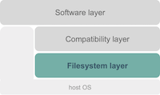
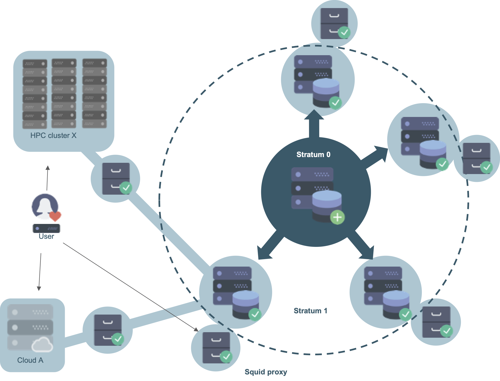

# Filesystem layer

The bottom layer of the EESSI project is the **filesystem layer**,
which is responsible for distributing the software stack.

For this, we rely on [CernVM-FS](https://cernvm.cern.ch/portal/filesystem) (or CVMFS for short), a the network file system used to distribute the software to the clients in a fast, reliable and scalable way.

CVMFS was created over 10 years ago specifically for the purpose of globally distributing a large software stack. For the experiments at the Large Hadron Collider, it hosts several hundred million files and directories that are distributed to the order of hundred thousand client computers.

The hierarchical structure with multiple caching layers (Stratum-0, Stratum-1's located at partner sites and local caching proxies) ensures good performance with limited resources. Redundancy is provided by using multiple Stratum-1's at various sites. Since CVMFS is based on the HTTP protocol, the ubiquitous [Squid caching proxy](http://www.squid-cache.org/) can be leveraged to reduce server loads and improve performance at large installations (such as HPC clusters). Clients can easily mount the file system (read-only) via a [FUSE](https://en.wikipedia.org/wiki/Filesystem_in_Userspace) (Filesystem in Userspace) module.

For a (basic) introduction to CernVM-FS, see [this presentation](https://www.youtube.com/watch?v=MyYx-xaL36k).

Detailed information about how we configure CVMFS is available at
[https://github.com/EESSI/cvmfs-layer](https://github.com/EESSI/cvmfs-layer) .
