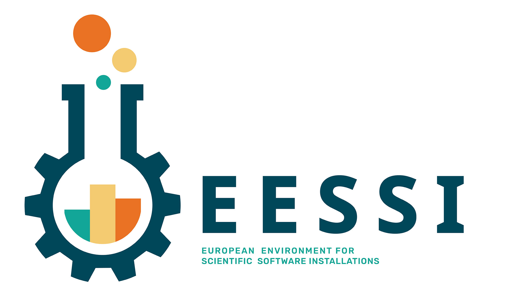

!!! warning
    *(May 7th 2020)* 
    **This is very much a work in progress!** 
    Many pages are still empty, that will hopefully change soon...

# Welcome to the EESSI project documentation!

!!! quote
    What if there was a way to avoid having to install a broad range of scientific software from scratch on every HPC cluster or cloud instance you use or maintain, without compromising on performance?

The **European Environment for Scientific Software Installations** (EESSI, pronounced as "easy") is a collaboration between different European partners in HPC community.

The goal of this project is to build a common stack of scientific software installations for HPC systems and beyond, including laptops,
personal workstations and cloud infrastructure.

More details about the project are available in the different subsections:

* [Project overview](overview.md)
* [Filesystem layer](filesystem_layer.md)
* [Compatibility layer](compatibility_layer.md)
* [Software layer](software_layer.md)
* [Project partners](partners.md)
* [Contact info](contact.md)
