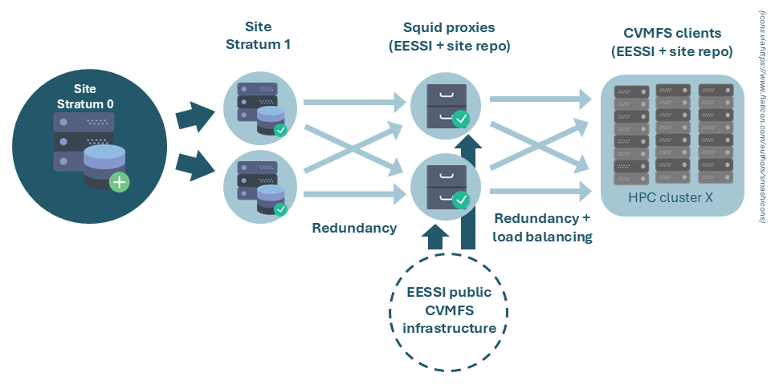

# Leverage EESSI's build procedure for site builds
In this approach, you use the EESSI build bot (`EESSI/eessi-bot-software-layer`), together with the EESSI build scripts (`EESSI/software-layer-scripts`) to build and deploy software into a CernVM-FS repository of your own. This way, your build workflow is virtually identical to how it is done for upstream EESSI - with the only major difference being the target CernVM-FS repository.

## Requirements
In order to have an EESSI-like build workflow, we need:

- Infrastructure for a site-specific CVMFS repository (Stratum 0, Stratum 1, proxies, client configuration)
- An instance of the EESSI build bot
- A bucket in an AWS S3-compatible object store (though you could work around this)
- A GitHub organization on which you can install GitHub Apps
- A GitHub repository within that organization which will be used to list the software you want to build
- Optionally: an automated procedure to ingest tarballs

This documentation will go through the steps to set each of these up, in order. Since many of these individual steps are documented elsewhere, we will often reference that (and only list a very short summary here).

## Site-specific CVMFS infrastructure
The recommended CVMFS setup for a site-specific CVMFS repository is:

- A Stratum 0 server
- Two (or more) Stratum 1 servers
- Two (or more) proxies

Main reason here is:

- Having two Stratum 1's provides redundancy: if one dies, proxies seamlessly failover to the other one.
- Having two proxies provides both redundancy _and_ load balancing. If one proxy dies, clients failover to the other one. If clients are configured to use the proxies in a [proxy group](https://cvmfs.readthedocs.io/en/2.8/cpt-configure.html#proxy-lists), each client selects a proxy randomly, thus providing load balancing.

The CVMFS setup requires a fair amount of machines: 1x Stratum 0, 2x Stratum 1, 2x proxy for local site, and likely you already have 2x proxy for upstream EESSI - a total of 7 machines. If this is more than you can afford, there are some tricks you can pull.

1. **Recommended**: Reuse the same proxies you set up to proxy upstream EESSI to also proxy your local site-specific CVMFS repository. This approach is more efficient in terms of required hardware and maintenance, and there is little to no downside (you may want to increase the size of the caches on your proxies). This would reduce the required machines to 5 (1x Stratum 0, 2x Stratum 1, 2x EESSI+site proxy).
2. Deploy your site-specific Stratum 1's on the same machines that proxy upstream EESSI. Don't configure the proxies to proxy your site-specific CVMFS repository, but simply have your clients contact your site-specific Stratum 1's directly (without proxy). In this scenario, you can achieve load-balancing by configuring half your clients with `CVMFS_SERVER_URL="<instance_1>;<instance_2>"` and half with `CVMFS_SERVER_URL="<instance_2>;<instance_1>"`, where `instance_1` and `instance_2` are the IPs of your Stratum 1's. This would reduce the required machines to 3 (1x Stratum 0, 2x combined Stratum 1 + EESSI proxy).
3. You can even use the Stratum 0 instead of a second Stratum 1 (even in addition to (1) or (2)). Note that this has security implications, as it means your Stratum 0 needs to be directly accessible to your clients. This is a potential concern: if there are vulnerabilities in the Stratum 0 software, end-users may be able to push (malicious) software in there. This would reduce the required machines to 2 (1x Stratum 0 + EESSI proxy, 1x Stratum 1 + EESSI proxy).

{ align=left, loading=lazy }
/// caption
Site CVMFS setup, using the (recommended) option 1 above
///

An extensive [tutorial](https://cvmfs-contrib.github.io/cvmfs-tutorial-2021/) is available that teaches how to setup each of these machines, and how to configure the clients to use the relevant Stratum 1's and proxies. Below, we will summarize some of the key steps, and point out things that are specifically relevant for the site-specific CVMFS setup.

### Setting up your Stratum 0

The documentation below provides you with the minimal steps required to set up a working Stratum 0 and is specifically aimed at setting up a Stratum 0 for hosting a site software stack on top of EESSI. However, there is a vast amount of things you can configure for a CVMFS Stratum 0, and nothing beats the detail of the extensive [upstream documentation](https://cvmfs.readthedocs.io/en/stable/cpt-repo.html). The [CVMFS tutorial](https://cvmfs-contrib.github.io/cvmfs-tutorial-2021/02_stratum0_client/#21-setting-up-the-stratum-0) may also be helpful.

**1. Setting up your environment**

Define a repository name in the environment CVMFS Stratum 0 machine, for later use. Typically you pick something like `software.<name_of_the_site>.tld`

``` { .bash .copy }
repo_name=name.sitename.tld
```
Note that while this looks like a URL, it is not: it is simply a name for the CVMFS repository. If you set up any DNS though, it is conventional to use the same domain structure, to avoid confusion.

**2. Install the `cvmfs` and `cvmfs-server` packages**

Typically:
``` { .bash .copy }
wget https://cvmrepo.s3.cern.ch/cvmrepo/apt/cvmfs-release-latest_all.deb
sudo dpkg -i cvmfs-release-latest_all.deb
rm -f cvmfs-release-latest_all.deb
sudo apt-get -y update
sudo apt-get -y install cvmfs cvmfs-server
```

**3. Make `software.eessi.io` available on your Stratum 0**

To facilitate ingestion later on, we make sure that the `software.eessi.io` repository is available on our Stratum 0 machine as well. This allows us to leverage e.g. the Lmod installation provided by EESSI to (re)build the Lmod cache. Because the `cvmfs-server` cannot perform certain actions when `autofs` is enabled (which is usually how CVMFS repositories are mounted), we have to mount `software.eessi.io` manually. We also mount the `cvmfs-config.cern.ch` repository, as that provides the configuration for `software.eessi.io`

``` { .bash .copy }
sudo mkdir -p /cvmfs/{cvmfs-config.cern.ch,software.eessi.io}
sudo bash -c "echo 'CVMFS_CLIENT_PROFILE="single"' > /etc/cvmfs/default.local"
sudo bash -c "echo 'CVMFS_QUOTA_LIMIT=10000' >> /etc/cvmfs/default.local"
sudo bash -c "echo 'cvmfs-config.cern.ch /cvmfs/cvmfs-config.cern.ch cvmfs defaults 0 0' >> /etc/fstab"
sudo bash -c "echo 'software.eessi.io /cvmfs/software.eessi.io cvmfs defaults 0 0' >> /etc/fstab"
sudo systemctl daemon-reload
sudo mount -a
```

You should now be able to see the `cvmfs-config.cern.ch` and `software.eessi.io` repositories:
``` { .bash .copy }
ls -al /cvmfs/cvmfs-config.cern.ch
ls -al /cvmfs/software.eessi.io
```

**4. (Optional) Change location to store Stratum 0 data**

By default, CVMFS will store data for repositories in `/srv/cvmfs`. If you want to store this elsewhere, create a link `/srv/cvmfs` that points to where you want to store the repository data.

``` { .bash .copy }
sudo ln -s /my/desired/data/prefix /srv/cvmfs
```

**5. Create a new CVMFS repository**

Before creating a new CVMFS repository, we must stop and disable `autofs`.

``` { .bash .copy }
sudo systemctl stop autofs
sudo systemctl disable autofs
```

To create a new CVMFS repository on the Stratum 0, run

``` { .bash .copy }
sudo cvmfs_server mkfs -o root $repo_name
```

The `-o root` tells CVMFS that this repository should be owned by root.

!!! note

    The reason we configure `root` to be the owner of the CVMFS repository is that EasyBuild, when configured through `EESSI-extend`, by default creates read-only installations. This causes issues if CVMFS has to put catalog files (`.cvmfscatalog`) files in these directories. CVMFS catalog files are metadata files that CVMFS uses to list the files/directories present in the repository. While it is technically possible to use a regular user, this would require making all directories in which CVMFS would create a `.cvmfscatalog` file writeable in a transaction, then create the catalog files, then remove the write permissions again. The same approach would need to be taken to reinstall software that was already installed. We consider this unnecessarily complex, and instead prefer to have the repository owned by root.

**6. Configure CVMFS catalog creation**

Here, we have two options. 

**Option 1**

We create a `.cvmfsdirtab` file in the root of the repository. This will tell CVMFS at which directory levels to create [catalog files](https://cvmfs.readthedocs.io/en/stable/cpt-details.html#nested-catalogs). We advise that you simply use the latest `.cvmfsdirtab` that is used for the upstream EESSI repository as well. You can get it from [the EESSI/filesystem-layer repository](https://github.com/EESSI/filesystem-layer/blob/main/roles/create_cvmfs_content_structure/files/.cvmfsdirtab) or simply copy it from `/cvmfs/software.eessi.io/.cvmfsdirtab` on a system where `EESSI` is available.

!!! note
    The upside of this option is that it creates catalogue files at the root of each EasyBuild installation prefix. This causes files that are typically accessed together (namely: that belong to the same software installation) to be indexed within the same catalog, which is typically good for performance. The downside is that if installations are extremely big, the catalog may exceed the largest size that CVMFS recommends (upto 200k files/dirs per catalog).

**Option 2**

You can configure your CVMFS server to do [automatic catalog creation](https://cvmfs.readthedocs.io/en/stable/cpt-repo.html#automatic-management-of-nested-catalogs) by setting `CVMFS_AUTOCATALOGS=true` in the server configuration file (`/etc/cvmfs/repositories.d/$repo_name/server.conf`).

!!! note
    The upside of Option 2 is that it will ensure that the number of files per catalog stays within the recommended limits, even when you have an installation with an excessive amount of files. The downside is that CVMFS does not know which files are commonly accessed together (e.g. because they belong to the same software installation) and might spread them over multiple catalogues - even when that's not strictly needed in terms of catalog size.

Here, we follow **Option 1**.

To get the `.cvmfsdirtab` in your repository, you have to open a transaction, move the file into the repository, and publish the transaction. In the same transaction, we can immediately remove the `new_repository` file that is present by default in any newly created repository

``` { .bash .copy }
sudo cvmfs_server transaction $repo_name
# Essentially copy the .cvmfsdirtab from EESSI, but strip every pattern related to the compatibility layer 
sudo bash -c "cat /cvmfs/software.eessi.io/.cvmfsdirtab | grep -v '^/versions/\*/compat' > /cvmfs/$repo_name/.cvmfsdirtab"
sudo rm /cvmfs/$repo_name/new_repository
sudo cvmfs_server publish -m "Add .cvfmsdirtab file and remove new_repository file"
```

As you now have a `.cvmfsdirtab` file in place, you should see CVMFS going through the logic of creating catalogs as soon as you run the `cvmfs_server publish` command. No catalogs will be created at this point, as none of the directory structures listed in the `.cvmfsdirtab` file match existing directories in your repository (since it is still empty). CVMFS will warn you about the patterns that don't have any match ('WARNING: cannot apply pathspec') - these warnings are harmless and only serve as an indication that not all pathspecs in your `.cvmfsdirtab` file seem to actually exit (yet) in your repository.

**7. Setup automatic whitelist resigning**

Each CVMFS repository has a whitelist (`.cvmfswhitelist`) with fingerprints of certificates that are allowed to sign a repository manifest (`.cvmfspublished`) (see [signature details](https://cvmfs.readthedocs.io/en/stable/apx-security.html#signature-details)). This whitelist has to be resigned with the repository master key every 30 days (or every 7 days if using a smartcard, like a Yubikey, to store the master key) (see [master keys](https://cvmfs.readthedocs.io/en/stable/cpt-repo.html#master-keys)). You can check the current validity of the signature using

``` { .bash .copy }
sudo cvmfs_server info $repo_name
```

Which will print something like:

```
Whitelist is valid for another X days
```

We recommend that you set up automatic resigning in a daily cronjob, e.g.

``` { .bash .copy }
sudo bash -c "echo '0 11 * * * root /usr/bin/cvmfs_server resign $repo_name' > /etc/cron.d/cvmfs_resign"
```

**Scripted summary of steps**

For convenience, we list all the commands from the prior steps together:

``` { .bash .copy }
# Define CVMFS repository name
repo_name=name.sitename.tld
echo "Defined CVMFS repository name as $repo_name"

# Install cvmfs client and cvmfs-server packages
echo "Installing cvmfs and cvmfs-server packages"
wget https://cvmrepo.s3.cern.ch/cvmrepo/apt/cvmfs-release-latest_all.deb
sudo dpkg -i cvmfs-release-latest_all.deb
rm -f cvmfs-release-latest_all.deb
sudo apt-get -y update
sudo apt-get -y install cvmfs cvmfs-server

# Manually mount cvmfs-config.cern.ch and software.eessi.io repositories
echo "Manually mounting cvmfs-config.cern.ch and software.eessi.io repositories"
sudo mkdir -p /cvmfs/{cvmfs-config.cern.ch,software.eessi.io}
# Creating minimal client config
sudo bash -c "echo 'CVMFS_CLIENT_PROFILE="single"' > /etc/cvmfs/default.local"
sudo bash -c "echo 'CVMFS_QUOTA_LIMIT=10000' >> /etc/cvmfs/default.local"
# Adding the cvmfs mounts to fstab
sudo bash -c "echo 'cvmfs-config.cern.ch /cvmfs/cvmfs-config.cern.ch cvmfs defaults 0 0' >> /etc/fstab"
sudo bash -c "echo 'software.eessi.io /cvmfs/software.eessi.io cvmfs defaults 0 0' >> /etc/fstab"
# Rerun the fstab generator to create the .mount files
sudo systemctl daemon-reload
# Actually trigger mounting the cvmfs filesystems
sudo mount -a

# Check that manually mounted repositories are available
echo "Check that we can access manually mounted cvmfs-config.cern.ch"
ls -al /cvmfs/cvmfs-config.cern.ch/
echo "Check that we can access manually mounted software.eessi.io"
ls -al /cvmfs/software.eessi.io/

# Stop and disable autofs
sudo systemctl stop autofs
sudo systemctl disable autofs

# Create the cvmfs repository, owned by root
echo "Creating new CVMFS repository $repo_name"
sudo cvmfs_server mkfs -o root $repo_name

# Create the .cvmfsdirtab file in the root of the repository
echo "Opening transaction, adding .cvmfsdirtab file to the root of $repo_name, and then publish the transaction"
sudo cvmfs_server transaction $repo_name
# Essentially copy the .cvmfsdirtab from EESSI, but strip every pattern related to the compatibility layer 
sudo bash -c "cat /cvmfs/software.eessi.io/.cvmfsdirtab | grep -v '^/versions/\*/compat' > /cvmfs/$repo_name/.cvmfsdirtab"
sudo rm /cvmfs/$repo_name/new_repository
sudo cvmfs_server publish -m "Add .cvfmsdirtab file and remove new_repository file"

# Set up a daily cronjob to sign the .cvmfswhitelist
echo "Setting up a cronjob for daily whitelist signing"
sudo bash -c "echo '0 11 * * * root /usr/bin/cvmfs_server resign $repo_name' > /etc/cron.d/cvmfs_resign"
```

### Sanity checking your Stratum 0 setup

On the machine where you've set up your CVMFS stratum 0, you can perform some checks to see if things where set up correctly:

**1. Check that the repository was created correctly**

``` { .bash .copy }
cvmfs_server list
```

lists all the Stratum servers installed on this machine and should report something like `$repo_name (stratum0 / local)`.

**2. Check mount points for your repository**

``` { .bash .copy }
mount | grep "$repo_name"
```

Should print something like

```
$repo_name on /var/spool/cvmfs/$repo_name/rdonly type fuse (...)
overlay_$repo_name on /cvmfs/$repo_name type overlay (...)
```

The first is a read-only mount of the current state of your repository. The second is an overlay filesystem that shows the current state of your repositories (as `lowerdir`) with any changes done in a currently open transaction (if any) overlaid on top (as `upperdir`, for which it uses `/var/spool/cvmfs/$repo_name/scratch/current`). I.e. it displays the state of your repository under `/cvmfs/$repo_name` as it will be once you publish any open transactions.

**3. Check the repository storage backend**

The directory

``` { .bash .copy }
ls -al /srv/cvmfs/$repo_name
```

should now contain some hidden `.cvmfs<...>` files and a `data` directory. The latter is where the data in your repository will actually be stored.

**4. Check the repository contents**

``` { .bash .copy }
ls -al /cvmfs/$repo_name
```

should now show you the `.cvmfsdirtab` file we added in our transaction.

**5. Checking the repository info**

``` { .bash .copy }
sudo cvmfs_server info $repo_name
```

### Setting up a CVMFS Stratum 1

Again, the documentation below provides you with the minimal steps to set up a working Stratum 1 specifically aimed at hosting a site software stack on top of EESSI. There are a lot of things you can configure here, which are described in detail in the [upstream documentation](https://cvmfs.readthedocs.io/en/stable/cpt-replica.html). Also, the [CVMFS tutorial](https://cvmfs-contrib.github.io/cvmfs-tutorial-2021/03_stratum1_proxies/) may be helpful.

**1. Set up your environment**

For convenience, let's start by redefining the repository name in an environment variable on our Stratum 1 machine, as well as our Stratum 0's IP (or DNS name):

``` { .bash .copy}
site_tld=sitename.tld
repo_name="name.${site_tld}"
stratum0_ip=<IP_OR_DNS_NAME_OF_S0>
```

**2. Install the `cvmfs-server` and `mod-wsgi` package**

Note that although we will not use the `mod-wsgi` functionality (which is required for GEO-API lookups), we still need to install it.

Typically:

``` { .bash .copy}
wget https://cvmrepo.s3.cern.ch/cvmrepo/apt/cvmfs-release-latest_all.deb
sudo dpkg -i cvmfs-release-latest_all.deb
rm -f cvmfs-release-latest_all.deb
sudo apt-get -y update
sudo apt-get -y install cvmfs-server
sudo apt install -y libapache2-mod-wsgi-py3
```

Note that the client package (`cvmfs`) is not needed on Stratum 1's.

**3. Add repository master public key**

On your CVMFS **Stratum 0**, check the contents of your master key:

``` { .bash .copy}
cat "/etc/cvmfs/keys/${repo_name}.pub"
```

and copy that to `/etc/cvmfs/keys/${site_tld}/${repo_name}.pub` on your CVMFS **Stratum 1** (note that this is one level deeper than it was on the CVMFS Stratum 0).

**4. Disable use of the Geo-API**

The Geo API is an API that clients normally use to figure out which Stratum 1 is closest to them. This is useful for CVMFS repositories have Stratum 1's all over the world, but for a site repository, where all Stratum 1's are typically very close to the clients that use them anyway, it adds complexity we don't need, so we disable it. Note that if you want, you can keep it enabled and set it up [as documented upstream](https://cvmfs.readthedocs.io/en/stable/cpt-replica.html#geo-api-setup).

``` { .bash .copy }
sudo bash -c "echo 'CVMFS_GEO_DB_FILE=NONE' > /etc/cvmfs/server.local"
```

**5. Create a replica**

Now, we create a replica of the Stratum 0, owned by the current user `$USER` (no need for it to be owned by `root` here, as we will never want to overwrite anything here):

``` { .bash .copy }
sudo cvmfs_server add-replica -o $USER http://${stratum0_ip}/cvmfs/${repo_name} /etc/cvmfs/keys/${site_tld}/
```

Note that this command creates two configuration files for the replication:

```
/etc/cvmfs/repositories.d/$repo_name/server.conf
/etc/cvmfs/repositories.d/$repo_name/replica.conf
```

**6. Initiate first synchronization**

We initialize the first synchronization manually:

``` { .bash .copy }
sudo cvmfs_server snapshot ${repo_name}
```

**7. Set up a cronjob for synchronization**

We create a cronjob that synchronizes your Stratum 1 to the Stratum 0 every 5 minutes. Note that if a previous `cvmfs_server snapshot` command is still running, it'll just skip the new invocation, so a short interval should not cause trouble. You can pick a different synchronization frequency if you like - just realize that this affects the delay with which new software will be visible on your clients.

``` { .bash .copy }
sudo bash -c "echo '*/5 * * * * root output=\$(/usr/bin/cvmfs_server snapshot -a -i 2>&1) || echo \"\$output\"' > /etc/cron.d/cvmfs_stratum1_snapshot"
```

**8. Confirm the synchronization is working**

While it is not easily possible to check which files are hosted on a Stratum 1, you can check the synchronization log at `/var/log/cvmfs/snapshots.log` to see if the synchronization process finishes correctly. The report also states the revision the Stratum 1 is serving ('Serving revision X'). You can cross-check that this is the latest revision by running on the **Stratum 0**:

``` { .bash .copy }
sudo cvmfs_server tag "$repo_name"
```

**Scripted summary of steps**

For convenience, we list all the commands from the prior steps together. Note that you'll manually have to copy in the CVMFS Stratum 0's public key.

``` { .bash .copy }
# Define environment variables
site_tld=sitename.tld
repo_name="name.${site_tld}"
stratum0_ip=<IP_OR_DNS_NAME_OF_S0>
echo "Setting up Stratum 1 for CVMFS repository: ${repo_name}, which is hosted on ${stratum0_ip}"

# Install cvmfs-server and mod-wsgi
echo "Installing cvmfs-server and mod-wsgi"
wget https://cvmrepo.s3.cern.ch/cvmrepo/apt/cvmfs-release-latest_all.deb
sudo dpkg -i cvmfs-release-latest_all.deb
rm -f cvmfs-release-latest_all.deb
sudo apt-get -y update
sudo apt-get -y install cvmfs-server
sudo apt install -y libapache2-mod-wsgi-py3

# Add repository master public key
echo "You'll need to add the CVMFS Stratum 0 mast key before this step"
echo "Checking that it exists by printing the content of the public key file..."
cat /etc/cvmfs/keys/${site_tld}/${repo_name}.pub

# Disable geo-api
echo "Disabling Geo-API"
sudo bash -c "echo 'CVMFS_GEO_DB_FILE=NONE' > /etc/cvmfs/server.local"

# Create replica
echo "Creating replica from Stratum 0 at 'http://${stratum0_ip}/cvmfs/${repo_name}', using public key from directory '/etc/cvmfs/keys/${site_tld}/'. Replica will be owned by $USER."
sudo cvmfs_server add-replica -o $USER http://${stratum0_ip}/cvmfs/${repo_name} /etc/cvmfs/keys/${site_tld}/

# Creating first snapshot
echo "Creating first snapshot for $repo_name"
sudo cvmfs_server snapshot ${repo_name}

# Setting up synchronization cronjob
echo "Setting up cronjob for synchronization"
sudo bash -c "echo '*/5 * * * * root output=\$(/usr/bin/cvmfs_server snapshot -a -i 2>&1) || echo \"\$output\"' > /etc/cron.d/cvmfs_stratum1_snapshot"
echo "Content of cronjob:"
cat /etc/cron.d/cvmfs_stratum1_snapshot

# Checking that synchronization we are running the latest revision
echo "Checking that we are running the latest revision by checking the snapshot.log:"
tail /var/log/cvmfs/snapshots.log
```

### Setting up proxies

For more info, see [this tutorial](https://multixscale.github.io/cvmfs-tutorial-hpc-best-practices/access/proxy/#proxy-server-setup) on setting up a proxy for EESSI or [this generic tutorial](https://cvmfs-contrib.github.io/cvmfs-tutorial-2021/03_stratum1_proxies/#32-setting-up-a-proxy) on setting up a proxy for CVMFS repositories.

**1. Set up your environment**

First, let's define some environment variables for later use:
``` { .bash .copy }
# IP range (in CIDR notation) of the clients that should be allowed to use to use the proxy
client_ip_range_CIDR=<some_range>
# Proxy port number you want to use
proxy_port=<PORT>
# Memory / Disk cache size (in MB) that the squid is allowed to use
memory_cache_mb=<cache_size>
disk_cache_mb=<cache_size>
# Define either
stratum1_ip1=<IP_OF_STRATUM1_INSTANCE1>
stratum1_ip2=<IP_OF_STRATUM1_INSTANCE2>
# Or define the domain of your stratum 1's, including leading dot (e.g. '.sitename.tld'
stratum1_dns_domain=<DOMAIN_OF_STRATUM_1S>
```

**2. Install squid**

``` { .bash .copy }
sudo apt-get update
sudo apt-get install -y squid
```

**3. Configure squid**

The next step is to create a configuration file for the Squid proxy in `/etc/squid/squid.conf`. The template below allows your squid to proxy both your local site's CVMFS Stratum 1's, as well as the EESSI Stratum 1's. If you only want to proxy your site Stratum 1's, simply remove the `.cern.ch`, `.opensciencegrid.org` and `.eessi.science` from the list of `dstdomain`'s in the template.

``` { .bash .copy }
# List of local IP addresses (separate IPs and/or CIDR notation) allowed to access your local proxy
acl local_nodes src $client_ip_range_CIDR

# Destination domains that are allowed
# cern.ch + opensciencegrid.org domains because of cvmfs-config.cern.ch repository,
# which are provided via Stratum-1 mirror servers hosted by CERN and OSG
acl stratum_ones dstdomain .cern.ch .opensciencegrid.org .eessi.science $stratum1_dns_domain

# Deny access to anything which is not part of our stratum_ones ACL.
http_access deny !stratum_ones

# Alternatively, you can create an ACL for a particular destination based on IP, if you don't have DNS set up for your Stratum 1s:
# acl site_stratum_ones dst $stratum1_ip1 $stratum1_ip2

# And then deny access based on either domain or IP:
# http_access deny !stratum_ones !site_stratum_ones

# Add destination IPs that are allowed for your site Stratum 1s
acl site_stratum_ones dst $stratum1_ip1 $stratum1_ip2

# Deny access to anything which is not part of our stratum_ones or site_stratum_ones ACL.
http_access deny !stratum_ones !site_stratum_ones

# Squid port
http_port $proxy_port

# Only allow access from our local machines
http_access allow local_nodes
http_access allow localhost

# Finally, deny all other access to this proxy
http_access deny all

minimum_expiry_time 0
maximum_object_size 1024 MB

# proxy memory cache of $memory_cache_mb MB
cache_mem $memory_cache_mb MB
maximum_object_size_in_memory 128 KB
# $disk_cache_mb MB disk cache
cache_dir ufs /var/spool/squid $disk_cache_mb 16 256
```

**4. Validate the squid config and reload the service**

To validate the correctness of your config file, run

```
sudo squid -k parse
```

If all looks ok, (re)start the squid service:

```
sudo systemctl start squid
sudo systemctl enable squid
```

**Scripted summary of steps**

!!! warning
    This will overwrite any existing squid config, so only execute this literally if you are on a fresh machine

``` { .bash .copy }
# IP range (in CIDR notation) of the clients that should be allowed to use to use the proxy
client_ip_range_CIDR=<some_range>
# Proxy port number you want to use
proxy_port=<PORT>
# Memory / Disk cache size (in MB) that the squid is allowed to use
memory_cache_mb=<cache_size>
disk_cache_mb=<cache_size>
# Define either
stratum1_ip1=<IP_OF_STRATUM1_INSTANCE1>
stratum1_ip2=<IP_OF_STRATUM1_INSTANCE2>
# Or define the domain of your stratum 1's, including leading dot (e.g. '.sitename.tld'
stratum1_dns_domain=<DOMAIN_OF_STRATUM_1S>

echo "Installing squid"
sudo apt-get update
sudo apt-get install -y squid

echo "Creating squid config"
``` { .bash .copy }
sudo bash -c "cat > /etc/squid/squid.conf" <<EOF
# List of local IP addresses (separate IPs and/or CIDR notation) allowed to access your local proxy
acl local_nodes src $client_ip_range_CIDR

EOF
# If you specified a DNS domain for your stratum 1's, we use that as an allowed destination domain
if [ -n "${stratum1_dns_domain}" ]; then
    sudo bash -c "cat >> /etc/squid/squid.conf" <<EOF
# Destination domains that are allowed
# cern.ch + opensciencegrid.org domains because of cvmfs-config.cern.ch repository,
# which are provided via Stratum-1 mirror servers hosted by CERN and OSG
acl stratum_ones dstdomain .cern.ch .opensciencegrid.org .eessi.science $stratum1_dns_domain

# Deny access to anything which is not part of our stratum_ones ACL.
http_access deny !stratum_ones

EOF
else  # We use the individual stratum 1 IPs as allowed destinations, in addition to the domains required for the EESSI stratum 1's
    sudo bash -c "cat >> /etc/squid/squid.conf" <<EOF
# Destination domains that are allowed
# cern.ch + opensciencegrid.org domains because of cvmfs-config.cern.ch repository,
# which are provided via Stratum-1 mirror servers hosted by CERN and OSG
acl stratum_ones dstdomain .cern.ch .opensciencegrid.org .eessi.science

# Add destination IPs that are allowed for your site Stratum 1s
acl site_stratum_ones dst $stratum1_ip1 $stratum1_ip2

# Deny access to anything which is not part of our stratum_ones or site_stratum_ones ACL.
http_access deny !stratum_ones !site_stratum_ones

EOF
fi

sudo bash -c "cat >> /etc/squid/squid.conf" <<EOF
# Squid port
http_port $proxy_port

# Only allow access from our local machines
http_access allow local_nodes
http_access allow localhost

# Finally, deny all other access to this proxy
http_access deny all

minimum_expiry_time 0
maximum_object_size 1024 MB

# proxy memory cache of $memory_cache_mb MB
cache_mem $memory_cache_mb MB
maximum_object_size_in_memory 128 KB
# $disk_cache_mb MB disk cache
cache_dir ufs /var/spool/squid $disk_cache_mb 16 256
EOF

echo "Validating squid config"
sudo squid -k parse

echo "Starting squid service"
sudo systemctl start squid
sudo systemctl enable squid
```

### (Re)configuring your CVMFS clients

**1. Set up your environment**

First, let's define some environment variables for later use
``` { .bash .copy }
site_tld=sitename.tld
repo_name="name.${site_tld}"
stratum1_ip1=<IP_OR_DNS_NAME_OF_STRATUM1_INSTANCE1>
stratum1_ip2=<IP_OR_DNS_NAME_OF_STRATUM1_INSTANCE2>
proxy_ip1=<IP_OR_DNS_NAME_OF_PROXY1>
proxy_port1=<PORT_NR_FOR_PROXY1>
proxy_ip2=<IP_OR_DNS_NAME_OF_PROXY2>
proxy_port2=<PORT_NR_FOR_PROXY2>
```

**2. Install CVMFS client**

Typically, the machines on which you want to offer your own software stack on top of EESSI already have the CVMFS client installed, otherwise you wouldn't be able to serve EESSI there. If you haven't done so, please follow the instructions [here](../../getting_access/native_installation#native-install-on-clusters).

**3. Add the repository master public key**

On your CVMFS **Stratum 0**, check the contents of your master key:
```
cat "/etc/cvmfs/keys/${repo_name}.pub"
```
and copy that to /etc/cvmfs/keys/${site_tld}/${repo_name}.pub on your client machines.

**4. Configure CVMFS client for site-repository**

Here, we will assume that you're using the same two proxies for all CVMFS repositories, so we put `CVMFS_HTTP_PROXY` within the `/etc/cvmfs/default.local`. If you still had a `CVMFS_CLIENT_PROFILE=single` in your `/etc/cvmfs/default.local` you should remove it first:

``` { .bash .copy }
sudo sed -i '/^CVMFS_CLIENT_PROFILE=single$/d' /etc/cvmfs/default.local
```

Then, we add the proxy configuration:

``` { .bash .copy }
sudo bash -c "echo 'CVMFS_HTTP_PROXY=\"http://${proxy_ip1}:${proxy_port1}|http://${proxy_ip2}:${proxy_port2}\"' >> /etc/cvmfs/default.local"
```

Then, we add your site repository to `CVMFS_REPOSITORIES` in `/etc/cvmfs/default.local`

``` { .bash .copy }
sudo bash -c "echo 'CVMFS_REPOSITORIES=\"$repo_name\"' >> /etc/cvmfs/default.local"
```

Then, we create the repository configuration file

``` { .bash .copy }
sudo bash -c "cat > /etc/cvmfs/config.d/${repo_name}.conf" <<EOF
CVMFS_SERVER_URL="http://${stratum1_ip1}/cvmfs/@fqrn@;http://${stratum1_ip2}/cvmfs/@fqrn@"
CVMFS_USE_GEOAPI="no"
CVMFS_KEYS_DIR=/etc/cvmfs/keys/${site_tld}
EOF
```

!!! note
    If you want to use different proxy servers for EESSI vs your site CVMFS repository, you can add a site-specific `CVMFS_HTTP_PROXY` configuration in this file (`/etc/cvmfs/config.d/${repo_name}.conf`) as well, with your site specific setting. For EESSI, you could add it to `/etc/cvmfs/domain.d/eessi.io.local`

!!! note
    You can also do the above configuration at the domain level instead of the repository level, i.e. in `/etc/cvmfs/domain.d/${site_tld}.conf` instead of `/etc/cvmfs/config.d/${repo_name}.conf`. This only makes a difference if you host _multiple_ repositories under a single ${site_tld} domain, in which case this configuration would apply to _all_ of those repositories. In that case, you'd have to think about which level to specify what configuration at, e.g. specifying the `CVMFS_SERVER_URL` at the `domain.d` level if all of those repositories are hosted on the same server URL.

Finally, we call `cvmfs_config setup` which will load the configuration for the newly configured repository.

``` { .bash .copy }
sudo cvmfs_config setup
```

**5. Check setup**

If all went well, you should now have both `software.eessi.io` as well as your site repository available. You can check this with:

``` { .bash .copy }
cvmfs_config probe software.eessi.io ${repo_name}
```

and/or

``` { .bash .copy }
sudo cvmfs_config chksetup
```

Another useful check is to see which proxy and which Stratum 1 the client actually connected to - and if this is indeed as you intended:

``` { .bash .copy }
sudo cvmfs_config stat -v software.eessi.io
sudo cvmfs_config stat -v ${repo_name}
```

This should report a line like

```
Connection: http://${stratum1_ipX}/cvmfs/${repo_name} through proxy http://${proxy_ipX}:${proxy_portX} (online)
```

**Scripted summary of steps**

Don't forget to add the master repository key to `/etc/cvmfs/keys/${site_tld}/${repo_name}.pub` first.

``` { .bash .copy }
site_tld=sitename.tld
repo_name="name.${site_tld}"
stratum1_ip1=<IP_OR_DNS_NAME_OF_STRATUM1_INSTANCE1>
stratum1_ip2=<IP_OR_DNS_NAME_OF_STRATUM1_INSTANCE2>
proxy_ip1=<IP_OR_DNS_NAME_OF_PROXY1>
proxy_port1=<PORT_NR_FOR_PROXY1>
proxy_ip2=<IP_OR_DNS_NAME_OF_PROXY2>
proxy_port2=<PORT_NR_FOR_PROXY2>

echo "Remove 'CVMFS_CLIENT_PROFILE=single' from /etc/cvmfs/default.local (if any)"
sudo sed -i '/^CVMFS_CLIENT_PROFILE=single$/d' /etc/cvmfs/default.local
echo "Add CVMFS_HTTP_PROXY and CVMFS_REPOSITORIES settings to /etc/cvmfs/default.local"
sudo bash -c "echo 'CVMFS_HTTP_PROXY=\"http://${proxy_ip1}:${proxy_port1}|http://${proxy_ip2}:${proxy_port2}\"' >> /etc/cvmfs/default.local"
sudo bash -c "echo 'CVMFS_REPOSITORIES=\"$repo_name\"' >> /etc/cvmfs/default.local"
echo "Contents of /etc/cvmfs/default.local:"
cat /etc/cvmfs/default.local

echo "Create repository configuration at /etc/cvmfs/config.d/${repo_name}.conf"
sudo bash -c "cat > /etc/cvmfs/config.d/${repo_name}.conf" <<EOF
CVMFS_SERVER_URL="http://${stratum1_ip1}/cvmfs/@fqrn@;http://${stratum1_ip2}/cvmfs/@fqrn@"
CVMFS_USE_GEOAPI="no"
CVMFS_KEYS_DIR=/etc/cvmfs/keys/${site_tld}
EOF
echo "Contents of /etc/cvmfs/config.d/${repo_name}.conf:"
cat /etc/cvmfs/config.d/${repo_name}.conf

echo "Checking CVMFS setup"
sudo cvmfs_config chksetup
echo "Checking setup for software.eessi.io"
cvmfs_config probe software.eessi.io
sudo cvmfs_config stat -v software.eessi.io
echo "Checking setup for ${repo_name}"
cvmfs_config probe ${repo_name}
sudo cvmfs_config stat -v ${repo_name}
```

### Debugging issues with a site CVMFS setup

If the above did _not_ give you a working repository on the client, the best way to debug things is probably to first isolate _where_ the problem is: Stratum 0, Stratum 1, proxy or client. [This troubleshooting guide](https://multixscale.github.io/cvmfs-tutorial-hpc-best-practices/troubleshooting/) may also be helpful. 

**1. Connect your client directly to the Stratum 1**

To make your client connect directly to your Stratum 1, configuring it with the `CVMFS_HTTP_PROXY=DIRECT` setting. Then, run

``` { .bash .copy }
cvmfs_config probe ${repo_name}
sudo cvmfs_config stat -v ${repo_name}
```

again. The second command should now print something like

```
Connection: http://${stratum1_ipX}/cvmfs/${repo_name} through proxy DIRECT
```

If this does _not_ work, proceed to step 2.

If this _does_ work, the issue is with your proxy. Some things to check

- Is the proxy service running? (`systemctl status squid`)
- Is there a firewall blocking traffic to the proxy port?
- Is there a mistake in the squid configuration? You can try to remove restrictions (e.g. the destination or source restrictions) one by one, to see if this fixes things to find the offending restriction.
- Was your CVMFS client using the correct `CVMFS_HTTP_PROXY` in the previous step? (restore that configuration and run `cvmfs_config showconfig ${repo_name}` to see what value is effectively used, and in which config file it is set)

**2. Connect your client directly to the Stratum 0**

To make your client connect directly to your Stratum 0, _in addition_ to configuring it with `CVMFS_HTTP_PROXY=DIRECT`, set `CVMFS_SERVER_URL="http://${stratum0_ip}/cvmfs/@fqrn@"`. Also, make sure your Stratum 0 is accessible from your clients: you may not want this in a production environment, but you may want to open it up temporarily. Then, run

``` { .bash .copy }
cvmfs_config probe ${repo_name}
sudo cvmfs_config stat -v ${repo_name}
```

again. The second command should now print something like

```
Connection: http://${stratum0_ip}/cvmfs/${repo_name} through proxy DIRECT
```

If this _does_ work, something is wrong with your Stratum 1. Some things to check

- Is there a firewall blocking traffic?
- Do the snapshot logs on the Stratum 1 look sane, i.e. is the Stratum 1 at least successful in mirroring the Stratum 0?
- Was your client using the correct `CVMFS_SERVER_URL` in the previous step? (restore that configuration and run  `cvmfs_config showconfig ${repo_name}` to see what value is effectively used, and in which config file it is set)

If this does _not_ work, the issue is with your Stratum 0. Go through the [sanity check](#sanity-checking-your-stratum-0-setup) steps again to be sure. Also here, think if there's a firewall that's blocking traffic to the client.

## Setting up an object store to stage build tarballs

The standard deployment method for the EESSI build bot is to stage tarballs in an S3 bucket. While the bot's functionality may be extended in the future (the [function](https://github.com/EESSI/eessi-bot-software-layer/blob/29dc5e9aa339c323a900dc1454d39246def73984/tasks/deploy.py#L689) actually uploading the tarballs could easily be altered to deploy to a central directory on a local filesystem, for example), for now this means we need an S3 bucket if we want to use the bot's deployment functionality.

There is extensive documentation on how to interact with S3 buckets available online - here we only list the few commands that you would commonly need to set up a staging bucket. Note that you can create the bucket from anywhere - but you'll need the AWS commands to be available on the machine where you [install the EESSI build bot](#install-eessi-build-bot-on-a-machine), so you might as well set it up there directly.

### Installing the AWS CLI commands

Today, this can be done with:

``` { .bash .copy }
curl "https://awscli.amazonaws.com/awscli-exe-linux-x86_64.zip" -o "awscliv2.zip"
unzip awscliv2.zip
sudo ./aws/install
```

But see the [upstream documentation](https://docs.aws.amazon.com/cli/latest/userguide/getting-started-install.html) for up to date instructions.

### Configuring AWS CLI

Create a `.aws` folder in your homedir:

``` { .bash .copy }
mkdir -p ~/.aws
```

and create a configuration file `~/.aws/config`. The content of the configuration file are typically specific for the S3-compatible service you are using - consult the documentation of that service to learn how to set it up.

To provide your credentials, you have two options:

1. Store your credentials in a `~/.aws/credentials` file.
2. Store your credentials in your environment.

For the first option, the content of `~/.aws/credentials` typically looks something like:

```
[default]
aws_access_key_id = YOUR_ACCESS_KEY
aws_secret_access_key = YOUR_SECRET_KEY
```

For the second option you set:
``` { .bash }
export AWS_ACCESS_KEY_ID=YOUR_ACCESS_KEY
export AWS_SECRET_ACCESS_KEY=YOUR_SECRET_KEY
```

Since the first option stores unencrypted secrets in a file, the second option is generally preferred from a security perspective.

To test if your setup works, run

``` { .bash .copy }
aws s3 ls
```

If you don't have any buckets, this won't actually list anything - but the command should complete successfully.

### Creating a bucket

To create a bucket, run:

```
aws s3 mb s3://<bucket_name>
```

### Security considerations

There are many policies you can attach to a bucket to increase security. At the _very_ least, consider setting a bucket policy that restricts IP access to a whitelisted range (i.e. only the nodes where your build bot(s) run and your Stratum 0 need access). The [AWS policy generator](https://awspolicygen.s3.amazonaws.com/policygen.html) can be a helpful tool in generating such a policy.

Another thing to consider is to create a secondary user with `aws iam create-user --user-name <name>` and attach a very limited policy to it (e.g. only read/write/list on buckets, nothing else). Then, create credentials for this user with `aws iam create-access-key --user-name <name>` and provide those credentials to the EESSI build bot and Stratum 0 machines. That way, if that token is compromised, the impact is minimized (e.g. the token can at least not be used to create new IAM idententies, etc).

## Setting up the EESSI build bot

### What is the EESSI build bot?

The [EESSI build bot](https://github.com/EESSI/eessi-bot-software-layer) is designed to start Slurm jobs and run scripts when triggered by certain GitHub events. The job script that is used can be configured, and while it goes through some fixed steps (e.g. build, check-build, test, check-test), the steps themselves are fully defined by the scripts provided in the `bot` folder of the respective repository from which it was triggered. See for example the scripts defined for the [EESSI/software-layer-scripts](https://github.com/EESSI/software-layer-scripts/tree/main/bot) repository.

The goal of the bot is to make the build process scalable: software in EESSI is build for many different architectures, and (for CPU targets) these build are done natively (i.e. the target architecture is the same as the architecture of the node one which the build was done). This means that for every software installation, the amount of build jobs that needs to be run is equal to the amount of architectures EESSI supports. For the large amount of supported architectures and software installations in EESSI, it is infeasible to start all of those build jobs manually - that's where the bot comes in.

While running build jobs manually may be sufficient for your site, sites that offer very heterogeneous clusters or that plan to deploy a fair amount of software in their site-specific repository can benefit from the scalability of the bot.

The build bot has two main processes:

- [an event handler](https://github.com/EESSI/eessi-bot-software-layer/blob/develop/eessi_bot_event_handler.py) which receives events from GitHub and acts on them (e.g. by submitting a build job)
- [a job manager](https://github.com/EESSI/eessi-bot-software-layer/blob/develop/eessi_bot_job_manager.py), which monitors the Slurm job queue and acts on state changes of the jobs submitted by the event handler.

### Requirements

In order to run the build bot, a few things are required:

1. An organization in GitHub. While not _strictly_ required, this means you can share management of the bot with others in your organization. For the rest of these docs, we will assume you already have a [GitHub organization](https://docs.github.com/en/organizations/collaborating-with-groups-in-organizations/creating-a-new-organization-from-scratch) and refer to it as GH_ORG.
2. A GitHub account, with 'Owner' rights within your organization.
3. A GitHub App, created within your organization.
4. A GitHub repository within your organization on which the GitHub App can be installed
5. A SMEE channel to relay github events to the running bot instance
6. A node that can host the bot process, and from where the bot can start jobs on a Slurm cluster
7. A shared filesystem that the bot process has access to where it can stage jobs directories

Note that the bot process itself is _relatively_ lightweight, since the builds are performed in jobs. Thus, running the bot process on a login node is probably feasible.

### Creating a SMEE channel { #creating_smee_channel }

Go to [https://smee.io/new](https://smee.io/new) in order to create a new SMEE channel. **Write down the URL!**

### Registering a GitHub App for the bot { #register_gh_app }

- Go to https://github.com/organizations/GH_ORG/settings/apps.
- Click "New GitHub App"
- Pick a descriptive name. We'll refer to it as APP_NAME
- Under "Homepage URL", we suggest you fill in the URL of the SMEE channel you just created (but unimportant for how the bot functions)
- Under "Webhook URL", fill in the URL of the SMEE channel you just created
- Generate a Webhook secret. This secret will be used by the bot's event handler to verify that the event was really sent from your GitHub app.
  - Run `python3 -c 'import secrets; print(secrets.token_hex(64))'` on any machine
  - Past the result in the 'Secret' box underneath the Webhook URL
- Under "Repository Permissions":
  - Set "Issues" to "Access: Read and Write"
  - Set "Pull requests" to "Access: Read and Write"
- Under "Subscribe to events", tick the "Issue comment" and "Pull request" boxes (note: these only appear once you've set the Repository Permissions above)
- Select "Only allow this GitHub App to be installed on the GH_ORG account
- Click "Create GitHub App"
- Scroll down to the "Private keys" section and click "Generate a private key". This key will be used by the bot event handler in order to be able to interact with GitHub (and e.g. post responses in your PRs).

### Create a GitHub repository

- Go to https://github.com/organizations/GH_ORG/repositories/new
- Pick a descriptive name. We'll refer to it as GH_REPO
- Add the `bot/build.sh` from [EESSI/software-layer](https://github.com/EESSI/software-layer) to your repository (under the exact same name)

Note that you may regularly want to pull in the `bot/build.sh` from the upstream `EESSI/software-layer` in case changes are made to it upstream.

### Installing the GitHub App onto a repository { #install_gh_app }

- Go to https://github.com/organizations/GH_ORG/settings/apps/APP_NAME
- On the left, go to "Install App"
- Click "Install" next to your organizations' account
- Select "Only select repositories" and select the GH_REPO from the dropdown menu
- Click "Install"

### Install EESSI build bot on a machine

The next step is to actually deploy the bot processes on a machine from where it can submit build jobs to your Slurm cluster.

**1. Set up your environment**

Below, we pick one prefix to put all the files related to this bot instance on the machine in (`bot_prefix`). We also set the the `smee_channel_id` to the ID of the channel we [created before](#creating_smee_channel).

``` { .bash .copy }
bot_prefix=$HOME/bot-instance
site_tld=sitename.tld
repo_name=name.${site_tld}
smee_channel_id=channel_id
mkdir -p "$bot_prefix"
cd $bot_prefix
```

First, clone the EESSI bot repository and check out a releaese

``` { .bash .copy }
git clone https://github.com/EESSI/eessi-bot-software-layer.git
cd eessi-bot-software-layer
git checkout v0.12.0  # Example, you'd typically check out the latest release
```

Then, create a virtual environment (or something equivalent) to provide the required dependencies for the bot:

``` { .bash .copy }
python3 -m venv eessi_bot_venv
source eessi_bot_venv/bin/activate
pip install --upgrade pip
pip install -r eessi-bot-software-layer/requirements.txt
```

Finally, you have to set `$GITHUB_APP_SECRET_TOKEN` to the value of the Webhook secret you generated in the [registration step](#register_gh_app).

```
GITHUB_APP_SECRET_TOKEN='<some_64_hexadecimal_secret>'
```

**2. Create a bot configuration file**

The bot configuration file holds configuration items like:
- The app & installation IDs of the GitHub App you [registered](#register_gh_app) and [installed](#install_gh_app) in previous steps
- Location of the private key you generated when [registering](#register_gh_app) the GitHub App
- Which partitions your bot can submit to (and how)
- Shared filesystem locations to store jobs, logs, etc
- Which GitHub users are allowed to build/deploy with your bot
- Bucket names & S3 endpoint URL
- Location of CVMFS repository config files (needed during build jobs to mount CVMFS into the build container)

All of this is configured in an `app.cfg` file located in the root of your `eessi-bot-software-layer` checkout. Typically, you copy the `app.cfg.example` from there to use as a template:

``` { .bash .copy }
cp $bot_prefix/eessi-bot-software-layer/app.cfg.example $bot_prefix/eessi-bot-software-layer/app.cfg
```

And then modify it according to your needs. The meaning of each individual config item is described in the example config file. A more extensive description is given in the `eessi-bot-software-layer` [README](https://github.com/EESSI/eessi-bot-software-layer#step-54-create-the-configuration-file-appcfg). We won't go into the details here, as everything is described in detail on the linked page. However, two things are specific to the site-building setup, since the bot needs to be able to mount your site repository in the container that is used for building software.

First, let's set `repos_cfg_dir` as

``` { .copy }
repos_cfg_dir = $bot_prefix/repos
```

for consistentcy with the next step, in which we will set up the contents of this directory.

!!! Warning
    You can not ACTUALLY use environment variables like $bot_prefix in the `app.cfg`, as this file is not interpreted by your shell. What we mean is that you should use the expanded form of where-ever the environment variable `$bot_prefix` points.

Second, the bot uses names for repositories in it's internal configuration, and these should be used consistently. These are used in the `bucket_name` (as keys in that dictionary), `signing` (as keys in that dictionary) and `node_type_map` (as item in the `repo_targets` list). Let's assume we refer to your site repository as `SITE_REPO` for the remainder as this section. The `app.cfg` should then contain snippets like like:

``` { .copy }
bucket_name = {"SITE_REPO": "<name_of_s3_bucket>"}
...
signing =
    {
        "SITE_REPO": {
            "script": "$bot_prefix/eessi-bot-software-layer/scripts/sign_verify_file_ssh.sh",
            "key": "<location_of_private_key>"
        },
    }
...
node_type_map = {"<node_type_name>":{ ..., 'repo_targets':['SITE_REPO']}}
```

**3. Provide your CVMFS configuration repository**

First, we create a directory to hold the CVMFS repositories, that matches with how we configured `repos_cfg_dir` above:

``` { .bash .copy }
mkdir -p $bot_prefix/repos
```

Then, we create a `repos.cfg` configuration file like this:

``` { .bash .copy }
cat > $bot_prefix/repos/repos.cfg <<EOF
[SITE_REPO]
repo_name = ${repo_name}
repo_version = <eessi_version>
config_bundle = ${site_tld}-cfg_files.tgz
config_map = { "${site_tld}/${site_tld}.pub":"/etc/cvmfs/keys/${site_tld}/${site_tld}.pub", "default.local":"/etc/cvmfs/default.local", "${repo_name}.conf":"/etc/cvmfs/config.d/${repo_name}.conf"}
container = docker://ghcr.io/eessi/build-node:debian-12
EOF
```

- `repo_name` should match the name of your CVMFS repository
- `repo_version` should match the EESSI version on top of which you intend to build
- `config_bundle` is a tarball under `repos_cfg_dir` that contains the required CVMFS configuration files for this repository (instructions to create those are below)
- `container` is the build container to be used for this repository - we recommend using the latest build container that we use for EESSI.

!!! note

    If you want to be able to build on top of multiple EESSI versions, you simply define multiple repo targets (e.g. with a similar version suffix, for clarity):
    
    ```
    [SITE_REPO-<eessi_version_1>]
    ...
    
    
    [SITE_REPO-<eessi_version_2>]
    ...
    ```
    Note that you would have to suffix the repo names in you `app.cfg` in the same way.

To provide a tarball bundle to `config_bundle`, we first create a directory that will hold the relevant configuration files:

``` { .bash .copy }
mkdir -p $bot_prefix/repos/$site_tld/
```

In there, you need to put all the files you've specified in your `config_map` that are required to do your CVMFS client configuration. The content would be identical to what you've configured for your [regular CVMFS clients](#reconf_cvmfs_client). The original filenames in fact should not matter, as long as the target locations defined in the `config_map` match the locations where the CVMFS client expects these configuration files. Then, you `tar` them up using:

``` { .bash .copy}
cd $bot_prefix/repos/$site_tld
tar -czf ../${site_tld}-cfg_files.tgz *
```

This tarball's name should now match the `config_bundle` as you specified it in `repos.cfg`.

**4. Start the SMEE client**

We need to start a SMEE client that listens to the SMEE channel you [created before](#creating_smee_channel). Assuming you have singularity available, the easiest is to use a container for this. 

First, let's set up a small script (`$bot_prefix/start_smee_client.sh`) that you can source, which starts the SMEE client. This way, you don't have to remember the docker URI or your unique channel link:

``` { .bash .copy }
cat > $bot_prefix/start_smee_client.sh <<EOF
#!/bin/bash
# start_smee_client.sh
singularity pull docker://deltaprojects/smee-client
singularity run smee-client_latest.sif --url https://smee.io/$smee_channel_id
EOF
```

!!! Note 
    You can (optionally) configure the port for the local HTTP server by passing a `-p <port_nr>` argument the the `singularity run` command (default: port 3000).

Then, start it using 

``` { .bash .copy }
source $bot_prefix/start_smee_client.sh
```

!!! Note
    The `singularity run smee-client_latest.sif` command doesn't return (since it'll keep listening to events) until you kill the client - you may want to run this in a `screen` session or something similar that you can easily attach/detach from.

Next time you need to start the bot, you only need to source this script.

For more details on running the smee client see the [relevant section](https://github.com/EESSI/eessi-bot-software-layer?tab=readme-ov-file#step-1b-install-smee-client-on-bot-machine) in `eessi-bot-software-layer/README.md`.

**5. Start the event handler & job manager**

Before starting the event handler or job manager, make sure you've [configured the AWS CLI](#configuring-aws-cli) on the current machine. The event handler needs this to be able to deploy tarballs to your object store bucket.

To start the event handler, run:

``` { .bash .copy }
cd $bot_prefix/eessi-bot-software-layer
source $bot_prefix/eessi_bot_venv/bin/activate
./event_handler.sh
```

!!! Note 
    The working directory in which you start the `event_handler.sh` process is important - the event handler assumes it's in the `eessi-bot-software-layer` root.

!!! Note
    If you changed the default port on which the smee client runs, you can pass `-p <port_nr>` to `event_handler.sh` as well in order to change the port on which the event handler listens.

!!! Note
    Like the smee client, the `event_handler.sh` command doesn't return (since it'll keep listening to events) until you kill it - you may want to run this in a `screen` session or something similar that you can easily attach/detach from.

To start the job handler, run:

``` { .bash .copy }
cd $bot_prefix/eessi-bot-software-layer
source $bot_prefix/eessi_bot_venv/bin/activate
./job_manager.sh
```

!!! Note
    Like the `event_handler.sh`, the `job_manager.sh` command doesn't return (since it'll keep monitoring the job queue) until you kill it - you may want to run this in a `screen` session or something similar that you can easily attach/detach from.

For more details on running the event handler and job manager, see the [relevant section](https://github.com/EESSI/eessi-bot-software-layer?tab=readme-ov-file#step-7-instructions-to-run-the-bot-components) in `eessi-bot-software-layer/README.md`.

## Set up automatic ingestion on CVMFS Stratum 0 (optional)

For upstream EESSI, a rather complex setup is used to do semi-automatic ingestion of build tarballs on the CVMFS Stratum 0. It creates a staging PR in a special staging repository, which allows for a final review of all the tarball contents. The ingestion setup is described [here](https://github.com/EESSI/filesystem-layer/tree/main/scripts/automated_ingestion). 

However, this is unnecessarily complex for site builds. Instead, we suggest that you write your own script that can be run in a cronjob to take care of ingesting the tarballs. Below, we describe the steps and a possible implementation for each step - but you can easily create your own. Things your script should cover are:

1. Query the bucket for new tarballs
2. Download the new tarballs & metadata files to the Stratum 0
3. Download the signature files to the Stratum 0 (optional, only if you want to do signature verification)
4. Verify the signature (optional)
5. Ingest the tarball into the repository (using `cvmfs_server ingest`)
6. Regenerate the `.cvmfscatalog` files by publishing an empty transaction (`cvmfs_server transaction && cvmfs_server -m "<commit_msg>"`)
7. Open a new transaction, update the Lmod cache for your site installs, and publish the transaction
8. Cleanup local files (downloaded tarball & metadata file)
9. Archive/move/remove the tarballs in the upstream bucket, so they don't get picked up on a subsequent iteration

**Environment setup**

In the example commands below, we assume that the current environment is set up:

``` { .bash .copy }
#!/bin/bash

IFS=$'\n\t'         # sane field splitting
BUCKET="<bucket_name>"
DOWNLOAD_DIR=/prefix/for/tarball/staging  # Some directory to temporarily store tarballs on the Stratum 0
ALLOWED_SIGNERS=/path/to/allowed/signers/file  # Optional, needed in step 4
REPO_NAME="<repo_name>"
# a name for a dir in the bucket in which to archive tarballs, so that a subsequent run doesn't re-ingest them
ARCHIVE_PREFIX="archive"
# Ensure the download directory exists
mkdir -p "${DOWNLOAD_DIR}"

# We will leverage a script from eessi-bot-software-layer (for signature verification - optional)
git clone https://github.com/EESSI/eessi-bot-software-layer.git

# We will leverage a script from filesystem-layer (for tarball ingestion)
git clone https://github.com/EESSI/filesystem-layer.git

# The script referenced here does three things
# 1. Ingest the tarball (cvmfs_server ingest <tarball>)
# 2. Regenerate the `.cvmfscatalog` files by publishing an empty transaction (`cvmfs_server transaction && cvmfs_server -m "<commitg_msg>"`)
# 3. Update the lmod caches for your site installation prefix
INGEST_SCRIPT="$PWD/filesystem-layer/scripts/ingest-tarball.sh"
```

Also, make sure that you've [installed](#installing-the-aws-cli-commands) and [configured](http://localhost:5432/docs/site_build/site_cvmfs/#configuring-aws-cli) the AWS CLI on the Stratum 0, so that it can fetch tarballs from your bucket.


**1. Query the bucket for new tarballs**

This can be done using a command like


``` { .bash .copy }

mapfile -t tar_keys < <(
    aws s3api list-objects-v2 \
        --bucket "${BUCKET}" \
        --query 'Contents[?ends_with(Key, `.tar.zst`) && !contains(Key, `archive/`)].Key' \
        --output text | tr '\t' '\n'
)

# If no keys were found, exit early
if [[ ${#tar_keys[@]} -eq 0 ]]; then
    echo "No tarballs found in bucket '${BUCKET}' (excluding archive/)."
    exit 0
fi

echo "Found ${#tar_keys[@]} tarball(s) to process."
```


This command will query the bucket for any file ending in `.tar.zst` that is NOT in the `${BUCKET}/archive` directory (we'll move tarballs there later after they are ingested, so that they will not be re-ingested when this script runs a second time).

**2. Download the new tarballs & metadata files to the Stratum 0**

Here, one would typically start a loop, of which the first step is to download the tarballs:

``` { .bash .copy }
for key in "${tar_keys[@]}"; do
    # Extract the base filename (e.g. 17798741550.tar.zst)
    filename=$(basename "${key}")

    # Derive the meta‑file name (same basename with .meta.txt suffix)
    meta_file="${filename}.meta.txt"

    # Full local paths
    local_tar="${DOWNLOAD_DIR}/${filename}"
    local_meta="${DOWNLOAD_DIR}/${meta_file}"

    # Remote paths
    meta_key=${key}.meta.txt

    echo "=== Processing ${filename} ==="

    # ---- Download tarball ----
    echo "Downloading tarball..."
    aws s3 cp "s3://${BUCKET}/${key}" "${local_tar}" || {
        echo "ERROR: Failed to download ${key}" >&2
        continue
    }

    # ---- Download metadata file ----
    # The metadata file is expected to sit next to the tarball in S3
    echo "Downloading metadata file..."
    aws s3 cp "s3://${BUCKET}/${meta_key}" "${local_meta}" 2>/dev/null
    if [ $? -eq 0 ]; then
        echo "Metadata file downloaded."
    else
        echo "WARNING: No metadata file found for ${filename}. Continuing to next tarball (not ingesting ${filename})."
        continue
    fi
```

**3. Download the tarball metadata and signature files to the Stratum 0 (optional)**

Here, we are assuming you're inside the loop we opened in the previous step:

``` { .bash .copy }
    # Full local paths
    local_tar_sig="${DOWNLOAD_DIR}/${sig_file}"
    local_meta_sig="${DOWNLOAD_DIR}/${meta_sig_file}"

    # Remote paths
    sig_key=${key}.sig
    meta_sig_key=${key}.meta.txt.sig

    # ---- Download tarball signature file ----
    echo "Downloading tarball signature file... s3://${BUCKET}/${sig_key} to ${local_tar_sig}"
    aws s3 cp "s3://${BUCKET}/${sig_key}" "${local_tar_sig}"

    if [ $? -eq 0 ]; then
        echo "Tarball signature file downloaded."
    else
        echo "WARNING: Failed to download tarball signature file. Continuing to next tarball (not ingesting ${filename})."
        # No point in continuing this loop iteration, we'll fail the signature verification check anyway
        continue
    fi

    # ---- Download metadata signature file ----
    echo "Downloading metadata signature file... s3://${BUCKET}/${meta_sig_key} to ${local_meta_sig}"
    aws s3 cp "s3://${BUCKET}/${meta_sig_key}" "${local_meta_sig}"
    if [ $? -eq 0 ]; then
        echo "Metadata signature file downloaded."
    else
        echo "WARNING. Failed to download metadata signature file. Continuing to next tarball (not ingesting ${filename})."
        continue
    fi    
```

**4. Verify the signature (optional)**

First, you'll need to create a file listing the public keys for keypairs that are allowed to sign the tarballs. You've specified the private key in the `signing` config item in the bot's `app.cfg`.

Assuming you're using the private key generated in the [GitHub app registration step](#register_gh_app), you don't have a public key yet. You'll have to generate that first **on the machine hosting the bot instance**, by running

``` { .bash .copy }
ssh-keygen -y -f KEY.pem
```

where `KEY.pem` is the private key (if you used a separate, manually created key-pair, you should already have a public key).

On the Stratum 0, create the allowed signers file `$ALLOWED_SIGNERS` with the following content:

```
<identity> namespaces="<namespace>,valid-before="YYYYMMDD" ssh-rsa <pubkey>
```

Where `<identity>` can be any string (useful for yourself to identify the key), `<namespace>` should match the `app_name` you configured for the bot in `app.cfg`, and `<pubkey>` is the public key you just generated.

We suggest leveraging a script from the `eessi-bot-software-layer` to do the actual verification (though you could make your own verification script):

``` { .bash .copy }
    # ---- Verify signature ----
    echo "Running check_signature..."
    if eessi-bot-software-layer/scripts/sign_verify_file_ssh.sh --verify --allowed-signers-file $ALLOWED_SIGNERS --file $local_tar; then
        echo "Signature OK."
    else
        echo "ERROR: Signature verification failed for ${filename}. Skipping ingest." >&2
        # Optionally clean up the bad files
        rm -f "${local_tar}" "${local_meta}" "${local_tar_sig}" "${local_meta_sig}"
        continue
    fi
```

Note that our `rm -f` assumes you downloaded signature files (`${local_tar_sig}` and `${local_meta_sig}`) as well - if not, you'll have to strip that from the command.

**5. Ingest the tarball into the repository**

Here, we leverage a script from `EESSI/filesystem-layer` that ingests tarballs, but also takes care of regenerating the `.cvmfscatalog` files _and_ updates the `Lmod` cache. To update the `Lmod` cache, the script uses the Lmod installation provided by `software.eessi.io`, which is why we explicitly made this available as one of the steps [when we set up our Stratum 0](#setting-up-your-stratum-0)

``` { .bash .copy }
    # ---- Ingest into CVMFS ----
    echo "Ingesting into CVMFS (${REPO_NAME})..."
    if $INGEST_SCRIPT "${REPO_NAME}" "${local_tar}"; then
        echo "Ingest succeeded for ${filename}."
    else
        echo "ERROR: cvmfs_server ingest failed for ${filename}." >&2
        # Keep the files for troubleshooting
        continue
    fi
```

**6. Regenerate the `.cvmfscatalog` files by publishing an empty transaction**

This is already taken care of by the `$INGEST_SCRIPT` in the step above. If you don't want to use that script, you'll have to implement this step yourself.

**7. Open a new transaction, update the Lmod cache for your site installs, and publish the transaction**

This is already taken care of by the `$INGEST_SCRIPT` in step 5 above. If you don't want to use that script, you'll have to implement this step yourself.

**8. Cleanup local files**

``` { .bash .copy }
    # ---- Clean up local copies ----
    echo "Removing local files..."
    rm -f "${local_tar}" "${local_meta}"
```

Note that our `rm -f` assumes you downloaded signature files (`${local_tar_sig}` and `${local_meta_sig}`) as well - if not, you'll have to strip that from the command.

**9. Archive/move/remove the tarballs in the bucket**

Here, we archive the tarballs in the bucket within an subdir `$ARCHIVE_PREFIX`. It is crucial that we do NOT search this subdir in step 1, that way we make sure we only pick up new tarballs. 

``` { .bash .copy }
    # ---- Archive the objects in S3 ----
    # Destination key = archive/<original‑key>
    archive_key="${ARCHIVE_PREFIX}/${key}"
    echo "Archiving S3 object to s3://${BUCKET}/${archive_key} ..."
    if ! aws s3 mv "s3://${BUCKET}/${key}" "s3://${BUCKET}/${archive_key}"; then
        echo "ERROR: Failed to move tarball to archive." >&2
    else
        echo "Tarball archived."
    fi

    # Archive the metadata file (if it existed)
    archive_meta_key="${ARCHIVE_PREFIX}/${key}.meta.txt"
    echo "Archiving metadata to s3://${BUCKET}/${archive_meta_key} ..."
    if ! aws s3 mv "s3://${BUCKET}/${key}.meta.txt" "s3://${BUCKET}/${archive_meta_key}"; then
        echo "ERROR: Failed to move metadata to archive." >&2
    else
        echo "Metadata archived."
    fi

    # Archive the signature file
    archive_sig_key="${ARCHIVE_PREFIX}/${key}.sig"
    echo "Archiving signature file ${sig_key} to s3://${BUCKET}/${archive_sig_key}"
    aws s3 mv "s3://${BUCKET}/${sig_key}" "s3://${BUCKET}/${archive_sig_key}"
    if [ $? -eq 0 ]; then
        echo "Tarball signature file archived."
    else
        echo "ERROR: Failed to move tarball signature file to archive." >&2
    fi

    # Archive the metadata signature file
    archive_meta_sig_key="${ARCHIVE_PREFIX}/${key}.meta.txt.sig"
    echo "Archiving metadata signature file ${meta_sig_key} to s3://${BUCKET}/${archive_meta_sig_key}"
    aws s3 mv "s3://${BUCKET}/${meta_sig_key}" "s3://${BUCKET}/${archive_meta_sig_key}"
    if [ $? -eq 0 ]; then
        echo "Metadata signature file archived."
    else
        echo "ERROR: Failed to move metadata signature file to archive." >&2
    fi

done

echo "All done."
```

Note that we assumed you have signature files as well. If not, remove those sections from the code above.

**Full script**

Composing all of the above (including signature verification), we get the following script for automatic ingestion:


```
#!/bin/bash

IFS=$'\n\t'         # sane field splitting
BUCKET="<bucket_name>"
DOWNLOAD_DIR=/prefix/for/tarball/staging  # Some directory to temporarily store tarballs on the Stratum 0
ALLOWED_SIGNERS=/path/to/allowed/signers/file  # Optional, needed in step 4
REPO_NAME="<repo_name>"
# a name for a dir in the bucket in which to archive tarballs, so that a subsequent run doesn't re-ingest them
ARCHIVE_PREFIX="archive"
# Ensure the download directory exists
mkdir -p "${DOWNLOAD_DIR}"

# We will leverage a script from eessi-bot-software-layer (for signature verification - optional)
git clone https://github.com/EESSI/eessi-bot-software-layer.git

# We will leverage a script from filesystem-layer (for tarball ingestion)
git clone https://github.com/EESSI/filesystem-layer.git

# The script referenced here does three things
# 1. Ingest the tarball (cvmfs_server ingest <tarball>)
# 2. Regenerate the `.cvmfscatalog` files by publishing an empty transaction (`cvmfs_server transaction && cvmfs_server -m "<commitg_msg>"`)
# 3. Update the lmod caches for your site installation prefix
INGEST_SCRIPT="$PWD/filesystem-layer/scripts/ingest-tarball.sh"

mapfile -t tar_keys < <(
    aws s3api list-objects-v2 \
        --bucket "${BUCKET}" \
        --query 'Contents[?ends_with(Key, `.tar.zst`) && !contains(Key, `archive/`)].Key' \
        --output text | tr '\t' '\n'
)

# If no keys were found, exit early
if [[ ${#tar_keys[@]} -eq 0 ]]; then
    echo "No tarballs found in bucket '${BUCKET}' (excluding archive/)."
    exit 0
fi

echo "Found ${#tar_keys[@]} tarball(s) to process."

for key in "${tar_keys[@]}"; do
    # Extract the base filename (e.g. 17798741550.tar.zst)
    filename=$(basename "${key}")

    # Derive the meta‑file name (same basename with .meta.txt suffix)
    meta_file="${filename}.meta.txt"

    # Full local paths
    local_tar="${DOWNLOAD_DIR}/${filename}"
    local_meta="${DOWNLOAD_DIR}/${meta_file}"

    # Remote paths
    meta_key=${key}.meta.txt

    echo "=== Processing ${filename} ==="

    # ---- Download tarball ----
    echo "Downloading tarball..."
    aws s3 cp "s3://${BUCKET}/${key}" "${local_tar}" || {
        echo "ERROR: Failed to download ${key}" >&2
        continue
    }

    # ---- Download metadata file ----
    # The metadata file is expected to sit next to the tarball in S3
    echo "Downloading metadata file..."
    aws s3 cp "s3://${BUCKET}/${meta_key}" "${local_meta}" 2>/dev/null
    if [ $? -eq 0 ]; then
        echo "Metadata file downloaded."
    else
        echo "WARNING: No metadata file found for ${filename}. Continuing to next tarball (not ingesting ${filename})."
        continue
    fi

    # Full local paths
    local_tar_sig="${DOWNLOAD_DIR}/${sig_file}"
    local_meta_sig="${DOWNLOAD_DIR}/${meta_sig_file}"

    # Remote paths
    sig_key=${key}.sig
    meta_sig_key=${key}.meta.txt.sig

    # ---- Download tarball signature file ----
    echo "Downloading tarball signature file... s3://${BUCKET}/${sig_key} to ${local_tar_sig}"
    aws s3 cp "s3://${BUCKET}/${sig_key}" "${local_tar_sig}"

    if [ $? -eq 0 ]; then
        echo "Tarball signature file downloaded."
    else
        echo "WARNING: Failed to download tarball signature file. Continuing to next tarball (not ingesting ${filename})."
        # No point in continuing this loop iteration, we'll fail the signature verification check anyway
        continue
    fi

    # ---- Download metadata signature file ----
    echo "Downloading metadata signature file... s3://${BUCKET}/${meta_sig_key} to ${local_meta_sig}"
    aws s3 cp "s3://${BUCKET}/${meta_sig_key}" "${local_meta_sig}"
    if [ $? -eq 0 ]; then
        echo "Metadata signature file downloaded."
    else
        echo "WARNING. Failed to download metadata signature file. Continuing to next tarball (not ingesting ${filename})."
        continue
    fi

    # ---- Verify signature ----
    echo "Running check_signature..."
    if eessi-bot-software-layer/scripts/sign_verify_file_ssh.sh --verify --allowed-signers-file $ALLOWED_SIGNERS --file $local_tar; then
        echo "Signature OK."
    else
        echo "ERROR: Signature verification failed for ${filename}. Skipping ingest." >&2
        # Optionally clean up the bad files
        rm -f "${local_tar}" "${local_meta}"
        continue
    fi

    # ---- Ingest into CVMFS ----
    echo "Ingesting into CVMFS (${REPO_NAME})..."
    if $INGEST_SCRIPT "${REPO_NAME}" "${local_tar}"; then
        echo "Ingest succeeded for ${filename}."
    else
        echo "ERROR: cvmfs_server ingest failed for ${filename}." >&2
        # Keep the files for troubleshooting
        continue
    fi

    # ---- Clean up local copies ----
    echo "Removing local files..."
    rm -f "${local_tar}" "${local_meta}" "${local_tar_sig}" "${local_meta_sig}"

    # ---- Archive the objects in S3 ----
    # Destination key = archive/<original‑key>
    archive_key="${ARCHIVE_PREFIX}/${key}"
    echo "Archiving S3 object to s3://${BUCKET}/${archive_key} ..."
    if ! aws s3 mv "s3://${BUCKET}/${key}" "s3://${BUCKET}/${archive_key}"; then
        echo "ERROR: Failed to move tarball to archive." >&2
    else
        echo "Tarball archived."
    fi

    # Archive the metadata file (if it existed)
    if [[ -n "${meta_file}" && -n "${local_meta}" ]]; then
        archive_meta_key="${ARCHIVE_PREFIX}/${key}.meta.txt"
        echo "Archiving metadata to s3://${BUCKET}/${archive_meta_key} ..."
        if ! aws s3 mv "s3://${BUCKET}/${key}.meta.txt" "s3://${BUCKET}/${archive_meta_key}"; then
            echo "ERROR: Failed to move metadata to archive." >&2
        else
            echo "Metadata archived."
        fi
    fi

    # Archive the signature file
    archive_sig_key="${ARCHIVE_PREFIX}/${key}.sig"
    echo "Archiving signature file ${sig_key} to s3://${BUCKET}/${archive_sig_key}"
    aws s3 mv "s3://${BUCKET}/${sig_key}" "s3://${BUCKET}/${archive_sig_key}"
    if [ $? -eq 0 ]; then
        echo "Tarball signature file archived."
    else
        echo "ERROR: Failed to move tarball signature file to archive." >&2
    fi

    # Archive the metadata signature file
    archive_meta_sig_key="${ARCHIVE_PREFIX}/${key}.meta.txt.sig"
    echo "Archiving metadata signature file ${meta_sig_key} to s3://${BUCKET}/${archive_meta_sig_key}"
    aws s3 mv "s3://${BUCKET}/${meta_sig_key}" "s3://${BUCKET}/${archive_meta_sig_key}"
    if [ $? -eq 0 ]; then
        echo "Metadata signature file archived."
    else
        echo "ERROR: Failed to move metadata signature file to archive." >&2
    fi

done

echo "All done."
```


## Add your first software

**1. Environment setup**

Let's define the name of our GitHub organization and GitHub repository (as created in [this previous step](#create-a-github-repository)) in our environment, as well as our repo-name:

``` { .bash .copy}
gh_repo=GH_REPO
gh_org=GH_ORG
repo_name=name.sitename.tld
```

**2. Clone your GitHub repository**

``` { .bash .copy }
git clone git@github.com:${GH_ORG}/${GH_REPO}.git
```

**3. Create an easystack file**

At the time of writing, `Biopython-1.86-gfbf-2025b.eb` was not yet in upstream EESSI and is quick to install, so this makes for a nice test case for building on top of `EESSI/2025.06` - but feel free to pick anything as a test.

First, we create the directory `${GH_REPO}/easystacks/${repo_name}`. This is a fixed directory naming scheme expected by the EESSI build scripts, so you have to stick to it.

``` { .bash .copy }
mkdir -p ${GH_REPO}/easystacks/${repo_name}/
```

Then, because we want to build on top of EESSI version `2025.06`, we create a subdir:

``` { .bash .copy }
mkdir -p ${GH_REPO}/easystacks/${repo_name}/2025.06
```

Finally, we create an easystack file that would add `Biopython-1.86-gfbf-2025b.eb`:

``` { .bash .copy }
cat > ${GH_REPO}/easystacks/${repo_name}/2025.06/eessi-2025.06-eb-5.3.0-2025b.yml <EOF
easyconfigs:
  - Biopython-1.86-gfbf-2025b.eb
EOF
```

Note that the EESSI build scripts also expect a standardized naming scheme for the easystack file itself: `eessi-<eessi_version>-eb-<easybuild_version>-<suffix>.yml`. The suffix can be anything - in upstream EESSI we stick to the convention of specifying the toolchain generation (`2025a`, `2025b`, etc, as they are used in EasyBuild) of the toolchains that the easyconfigs in this easystack use, but that is not a hard requirement.

Now, add the new easystack file to a feature branch:

``` { .bash .copy }
git checkout -b my_feature_branch
git add ${GH_REPO}/easystacks/${repo_name}/2025.06/eessi-2025.06-eb-5.3.0-2025b.yml
git commit -m "Add Biopython"
git push
```

**4. Create a pull request**

In your browser, browse to the main page of your repository at https://github.com/GH_ORG/GH_repo . You should immediately see a notification that one of your branches had new pushes, you can click the "Compare & pull request" button from there. Alternatively, go to the "Pull requests" menu, click "New pull request" and select `my_feature_branch` in the `compare` dropdown menu. Then, click "Create pull request"

In the PR you just created, you can now give commands to the bot. Post a message with

``` { .copy }
bot:show_config
```

If all went well in setting up your bot, the bot should now post a message with (some of) it's configuration, such as the instance name, node types, and what architectures, repositories and accelerators are configured for each of those node types. If it didn't, please refer to the section on [debugging your bot setup](#debugging-your-bot-setup)

If that worked, we can now give the bot the order to start building our software. E.g. if we want to build for a `zen5` CPU target:

``` { .copy }
bot:build repo:SITE_REPO instance:<bot_instance_name> for:arch=x86_64/amd/zen5
```

If all goes well, the bot will report back that it started a build job, and keeps updating that comment as it progresses. Once it reports `finished` in the `job status` column, the build is done (and was hopefully successful).

For the full syntax supported by the bot, including how to build for accelerators, see [this documentation](../bot.md).

**5. Deploying the build**

First, go to the gear icon next to "Labels" in the PR. Type `bot:deploy`. If this is the first time you deploy something from this repository, click 'Create new label "bot:deploy"'. Otherwise, just click on the existing label to set the label on this PR.

The bot will now upload the build tarball to your S3 bucket. It will add another line to the report of the build job stating if the transfer of the tarball to the S3 bucket succeeded.

**6. Wait for the Stratum 0 to ingest the new tarball**

Assuming you've [set up automatic ingestion](#set-up-automatic-ingestion-on-cvmfs-stratum-0-optional) on your Stratum 0, you can now simply wait for the cronjob that triggers the automatic ingestion. Be aware that it may take some time for the software to show up on the CVMFS clients, since:

- The cronjob for the automatic ingestion needs to run
- The CVMFS Stratum 1's need to synchronize (with `cvmfs_server snapshot`)
- The file catalogs on the clients need to expire (default is every 4 minutes), after which the cache needs to expire.

If you are in a very big rush, you can run the ingestion on the Stratum 0 manually, run the `cvmfs_server snapshot -a -i` command on the Stratum 1 manually and run a `sudo cvmfs_config wipecache` command on the client.

## Debugging your bot setup

If your bot doesn't respond in your PRs, there are a few things you can check for debugging purposes. In general, it makes sense to follow the expected actions in sequential order - from the events sent by GitHub, to the bot process acting on it.

**Is GitHub sending events?**

Go to https://github.com/organizations/GH_ORG/settings/apps/APP_NAME/advanced. Under 'Recent Deliveries' you can check the recent events that GitHub has sent. If nothing shows up, you may have misconfigured you "Permissions & events".

**Is Smee receiving events?**

Go to https://smee.io/CHANNEL_ID (replace `CHANNEL_ID` with [your unique channel ID](#creating_smee_channel). This should display the events that were sent by GitHub.

**Is the Smee client receiving events?**

While there is no logfile for the Smee client, you will see things like:

```
POST http://127.0.0.1:3000/ - 200
```

when the client successfully received events (and relays them to the `event_handler`). If you do not see these, check that you've used the correct channel ID when you started the client, and that nothing is blocking the traffic.

**Is the event handler receiving events - and how does it act on them?**

There are two log files that contain actions logged by the event handler: the `pyghee.log` and the `eessi_bot_event_handler.log`. Both are in the `eessi-bot-software-layer` directory from which you started the event handler.

On thing that you can find here is e.g. issues related to which users have command/build/deploy permissions (in the `app.cfg`), which will cause the bot to just ignore their commands. 

Another thing is issues with incorrectly specified instance names, repository names, or architectures. You may see output like:

```
[20260518-T17:35:25] prepare_jobs(): context does NOT satisfy filter(s), skipping
[20260518-T17:35:25] prepare_jobs(): checking filter architecture:x86_64/amd/zen2 repository:REPO_NAME1 instance:APP_NAME
[20260518-T17:35:25] prepare_jobs(): context is '{
    "architecture": "x86_64/amd/zen2",
    "repository": "REPO_NAME2",
    "instance": "APP_NAME",
}'

```
The 'filter' is essentially the arguments to the build command the bot received. The 'context' is what the bot is configured for. In this example, the build command is ignored because the repository passed in the bot command doesn't match the repository name the bot was configured for. Note that it is **normal** to see a lot of this output: the bot loops through all the possible combinations it can build for, and typically only one matches. However, if _none_ match (while you did _expect_ one to match), a good look at this output may help you figure out what's wrong (i.e. why the 'context' you expected to match, does not match after all).
