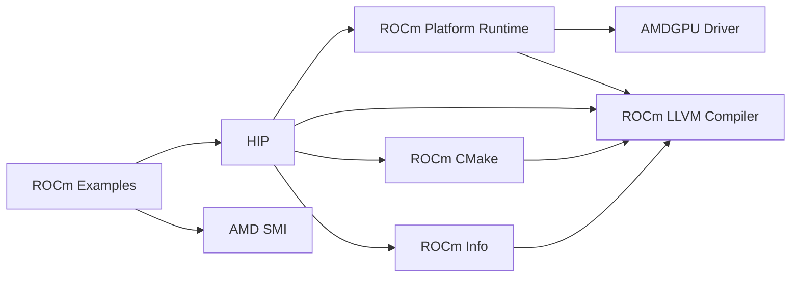
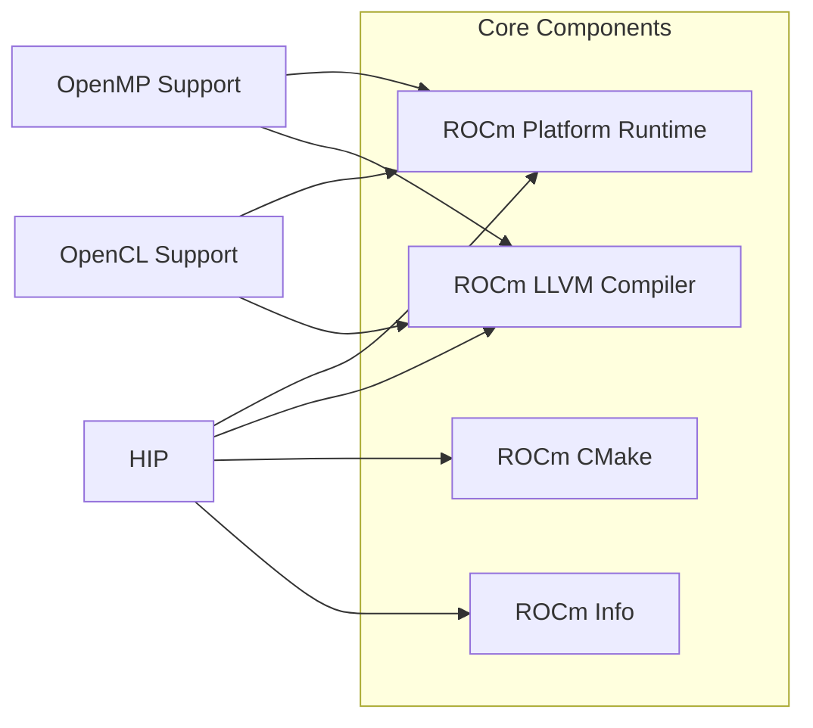
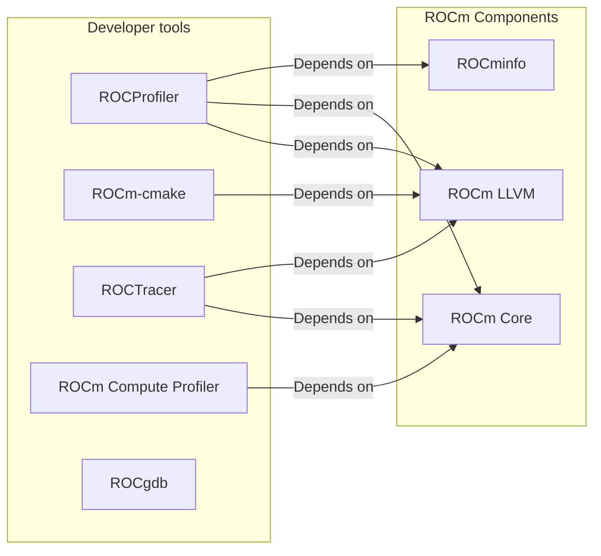
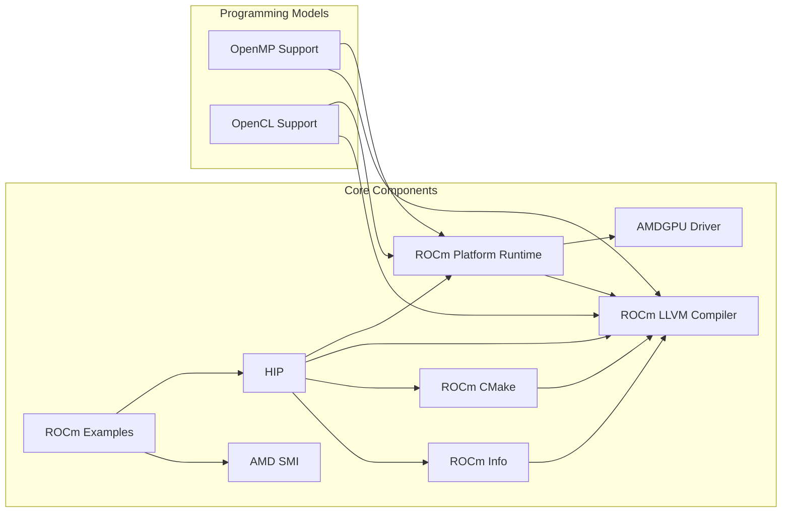

# Overview of ROCm Ecosystem (v6.4.1-20250610)

!!! warning "Work-in-progress"
    This document is a work-in-progress.
    It may still contain inaccuracies or mistakes.

    This overview is being created in the context of adding support for ROCm to EESSI, the European Environment for Scientific Software Installations (<https://eessi.io>).

    *Last update: 10 Jun 2025*

[Jump to Overview](#Introduction) | [Jump to ABC](#ABC-of-ROCm) | [Jump to Changelog](#Changelog)

## Table of Contents {: #Table-of-Contents }

1. [Introduction](#Introduction)
2. [AMD GPU Microarchitectures](#AMD-GPU-Microarchitectures)
3. [Core Components](#Core-Components)
4. [Programming Models](#Programming-Models)
5. [Compiler Ecosystem](#Compiler-Ecosystem)
6. [Developer Tools](#Developer-Tools)
7. [Libraries and Frameworks](#Libraries-and-Frameworks)
8. [Compatibility Policies](#Compatibility-Policies)
9. [AMD GPUs in Azure](#AMD-GPUs-in-Azure)

## Introduction {: #Introduction }

The AMD [ROCm](#ROCm)™ (Radeon Open Compute) platform is an open-source software stack designed for GPU computing. [ROCm](#ROCm) 6.4.x provides a comprehensive set of tools, libraries, and software development kits that enable developers to harness the power of AMD's hardware accelerators.

[ROCm](#ROCm) serves as AMD's unified platform for high-performance computing (HPC), artificial intelligence (AI), and machine learning workloads, offering a viable alternative to NVIDIA's CUDA ecosystem. The platform is designed with portability, performance, and open standards in mind.

The [ROCm](#ROCm) software stack consists of six major parts:

1. AMD GPU Microarchitectures: the microarchitectures used by AMD GPU hardware
2. Core Components: software essential to using AMD GPUs (drivers, runtimes, etc)
3. Programming Models: how to create programs that run on AMD GPUs
4. Compiler Ecosystem: compilers with support for the programming models
5. Developer Tools: debugging, profiling, and tracing tools
6. Libraries and Frameworks: for common operations and programming structures

## AMD GPU Microarchitectures {: #AMD-GPU-Microarchitectures }

AMD's GPU architectures have evolved significantly over the years, with distinct product lines targeting different market segments.

### CDNA (Compute DNA) {: #CDNA-Compute-DNA }

[CDNA](#CDNA) is AMD's data center and HPC-focused architecture for GPU compute workloads.

1. [CDNA](#CDNA) 1 (2020)
    * Used in [AMD Instinct](#AMD-Instinct) MI100 accelerator
    * Matrix Core Technology for AI/ML workloads
2. [CDNA](#CDNA) 2 (2021)
    * Powers [AMD Instinct](#AMD-Instinct) MI200 series
    * MCM (multi-chip module) design with chiplets
    * Infinity Fabric connections for multi-GPU scaling
3. [CDNA](#CDNA) 3 (2023)
    * Powers [AMD Instinct](#AMD-Instinct) MI300 series
    * Integrates CPU and GPU in the same package (for example MI300A) (APD - Accelerated Processing Device)
    * Enhanced AI and HPC capabilities

### RDNA (Radeon DNA) {: #RDNA-Radeon-DNA }

[RDNA](#RDNA) is AMD's consumer-focused graphics architecture, designed for gaming and content creation.

1. [RDNA](#RDNA) 1 (2019)
    * First introduced with the [Radeon RX](#Radeon-RX) 5000 series
2. [RDNA](#RDNA) 2 (2020)
    * Powers [Radeon RX](#Radeon-RX) 6000 series
    * Used in PlayStation 5 and Xbox Series X/S consoles
3. [RDNA](#RDNA) 3 (2022)
    * Powers [Radeon RX](#Radeon-RX) 7000 series
    * Chiplet-based design (first for consumer GPUs)
4. [RDNA](#RDNA) 4 (2024)
    * Powers latest [Radeon RX](#Radeon-RX) 8000 and 9000 series

### Earlier Architectures {: #Earlier-Architectures }

1. [GCN](#GCN) (Graphics Core Next) - 2011-2019
    * Five generations (GCN 1-5)
    * Transitioned to [RDNA](#RDNA) for consumer products
    * Powered Radeon HD 7000 through RX Vega and some RX 500 series
2. [Vega](#Vega) (2017)
    * Based on [GCN](#GCN) 5
    * Used in Radeon RX Vega and Radeon VII

### GFX Codes {: #GFX-Codes }

In LLVM each AMDGPU processor has an architecture ([GFX](#GFX)) code that indicates which specific microarchitecture is used. These codes are critical for hardware compatibility and optimization with ROCm. Generally, AMD uses the "gfxAB" format, where A is a major version indicator and B a two-digit minor version indicator. The format "gfxA" is also used to refer to a family of architectures with the same major version indicator.

An overview of gfx codes:

* GFX6 (GCN): gfx600, gfx601, gfx602
* GFX7 (GCN): gfx700, ..., gfx705
* GFX8 (GCN): gfx801, gfx802, gfx803, gfx805, gfx810
* GFX9 (Vega): gfx900, gfx902, gfx904, gfx906
* GFX9 (CDNA1): gfx908
* GFX9 (CDNA2): gfx90a
* GFX9 (CDNA3): gfx942
* GFX10.1 (RDNA1): gfx1010, ..., gfx1013
* GFX10.3 (RDNA2): gfx1030, ..., gfx1036
* GFX11 (RDNA3): gfx1100, ..., gfx1103
* GFX11 (RDNA3.5): gfx1150, ..., gfx1153
* GFX12 (RDNA4): gfx1200, gfx1201

[Source](https://llvm.org/docs/AMDGPUUsage.html)

## Core Components {: #Core-Components }

[AMD Docs Source](https://rocm.docs.amd.com/en/latest/reference/rocm-tools.html) |
[DeepWiki Source](https://deepwiki.com/ROCm/ROCm/1-rocm-overview) |
[DeepWiki Source](https://deepwiki.com/ROCm/ROCm/2.1-core-runtime-components) |
[Github](https://github.com/ROCm/ROCm)

* [AMDGPU Driver](#AMDGPU-Driver) with KFD ([Github](https://github.com/ROCm/ROCK-Kernel-Driver))
    * The kernel-mode driver for AMD GPUs
* [Platform Runtime](#Platform-Runtime) ([Github](https://github.com/ROCm/ROCR-Runtime))
    * Runtime that manages GPU resources, scheduling, and memory management
* [ROCm-LLVM](#ROCm-LLVM) ([Github](https://github.com/ROCm/llvm-project))
    * AMD-maintained fork of the LLVM git repository
* [HIP](#HIP) ([Github](https://github.com/ROCm/hip))
    * C++ Heterogeneous-Compute Interface for Portability
    * Runtime API and kernel language
* [AMD SMI](#AMD-SMI) (System Management Interface) ([Github](https://github.com/ROCm/amdsmi))
    * AMD SMI - equivalent to nvidia-smi
    * Successor to ROCm SMI
* [ROCm SMI](#ROCm-SMI) (System Management Interface) ([Github](https://github.com/ROCm/rocm_smi_lib)) (deprecated)
    * ROCm SMI LIB - equivalent to nvidia-smi
* ROCm CMake ([Github](https://github.com/ROCm/rocm-cmake))
    * CMake modules for common build and dev tasks within ROCm
    * Build dependency for many ROCm libraries
* ROCm Core ([Github](https://github.com/ROCm/rocm-core))
    * ROCm package with version and install path info
    * Pretty much all ROCm packages depend on this
* ROCm Info ([Github](https://github.com/ROCm/rocminfo))
    * ROCm application for reporting system info
* ROCm Examples ([Github](https://github.com/ROCm/rocm-examples))
    * A collection of examples for the ROCm software stack

### Core Components Dependencies

## Programming Models {: #Programming-Models }

### HIP (Heterogeneous-Computing Interface for Portability) {: #HIP-Heterogeneous-Computing-Interface-for-Portability }

[HIP](#HIP) is AMD's C++ runtime API and kernel language that allows developers to write portable code that can run on both AMD and NVIDIA GPUs. It's a key component of [ROCm](#ROCm)'s strategy for facilitating code migration from CUDA.

[HIP](#HIP) is a core component of [ROCm](#ROCm), see the [core components](#Core-Components) section for more details.

* [HIP Github](https://github.com/ROCm/hip)
* [CLR Github](https://github.com/ROCm/clr)
* Features:
    * CUDA-like programming model with familiar syntax
    * Source-level compatibility with CUDA
    * Tools to automate conversion of CUDA code ([HIPIFY](#HIPIFY)) ([Github](https://github.com/ROCm/HIPIFY))
    * Runtime API and kernel language for GPU computing

### OpenMP Support {: #OpenMP-Support }

[ROCm](#ROCm) supports [OpenMP](#OpenMP) offloading, which allows developers to use directive-based programming to offload computations to GPUs.

[OpenMP](#OpenMP) support is implemented by the [ROCm LLVM compiler](#ROCm-LLVM).

* Features:
    * Familiar pragma-based approach
    * Incremental parallelization of existing CPU code
    * Support for target offload constructs

### OpenCL Support {: #OpenCL-Support }

While not the primary focus of [ROCm](#ROCm), [OpenCL](#OpenCL) support is maintained for compatibility with existing code bases and as an open standard option.

* [Github](https://github.com/ROCm/clr)

### Programming Models Dependencies

## Compiler Ecosystem {: #Compiler-Ecosystem }

[ROCm](#ROCm) provides a comprehensive set of compilers to support various programming languages and models. These compilers are essential for translating high-level code into optimized machine code for AMD GPUs.

### C/C++ Compilers

* [ROCm-LLVM](#ROCm-LLVM) (AMDGPU LLVM / amdclang++) ([Github](https://github.com/ROCm/llvm-project)):
    * The foundation of [ROCm](#ROCm)'s compiler toolchain
    * Based on LLVM/Clang infrastructure with AMD GPU-specific additions
    * Supports HIP, OpenMP offloading, and other programming models
* [AOMP](#AOMP) (AMD OpenMP Compiler) ([Github](https://github.com/ROCm/aomp)) (preview):
    * Specialized for OpenMP target offloading to AMD GPUs
    * Based on the LLVM project with specific optimizations for OpenMP
    * Supports OpenMP 5.0+ features relevant to GPU offloading
    * Currently a development-preview, not yet a full product
* [AOCC](#AOCC) (AMD Optimizing C/C++ Compiler):
    * Primarily focused on AMD CPU optimization
    * Can be used in conjunction with [ROCm](#ROCm) for heterogeneous computing
    * Based on LLVM/Clang with AMD-specific optimizations
    * Closed source
* HIPCC:
    * Compiler wrapper for HIP applications
    * Simplifies compilation process by handling complex flag combinations
    * Part of the [HIP](#HIP) package and the [ROCm-LLVM](#ROCm-LLVM) project

### Fortran Compilers

* [AOCC](#AOCC) (AMD Optimizing Fortran Compiler):
    * Based on Flang and LLVM
    * Supports GPU offloading via OpenMP directives
    * Optimized for AMD architectures
* Flang for ROCm ([Github](https://github.com/ROCm/flang)) (deprecated):
    * Part of the LLVM project's Fortran implementation
    * The new Flang implementation (as described in LLVM's blog post) brings improved compatibility and performance

## Developer Tools {: #Developer-Tools }

[ROCm](#ROCm) offers several tools to aid in development, debugging, and performance optimization:

* ROCgdb: Debugger for HIP and OpenCL applications ([Github](https://github.com/ROCm/ROCgdb))
* ROCProfiler: Performance profiling tool ([Github](https://github.com/ROCm/rocprofiler))
* rocm-cmake: CMake modules for ROCm ([Github](https://github.com/ROCm/rocm-cmake))
* ROCm Compute Profiler: Performance analysis tool for AMD GPUs ([Github](https://github.com/ROCm/rocprofiler-compute))
* ROCTracer: API tracing library ([Github](https://github.com/ROCm/roctracer))

### Developer Tools Dependencies

## Libraries and Frameworks {: #Libraries-and-Frameworks }

[ROCm](#ROCm) provides a rich set of libraries to accelerate various computational workloads.

### Core Math Libraries

* rocBLAS: Basic Linear Algebra Subprograms implementation ([Github](https://github.com/ROCm/rocBLAS))
* rocSOLVER: Linear algebra solver library ([Github](https://github.com/ROCm/rocSOLVER))
* rocFFT: Fast Fourier Transform implementation ([Github](https://github.com/ROCm/rocFFT))
* rocRAND: Random number generator library ([Github](https://github.com/ROCm/rocRAND))
* rocSPARSE: Sparse matrix routines ([Github](https://github.com/ROCm/rocSPARSE))

### ML/DL Frameworks

* MIOpen: Deep learning primitives library ([Github](https://github.com/ROCm/MIOpen))
* ROCm TensorFlow: TensorFlow support for AMD GPUs ([Github](https://github.com/ROCm/tensorflow-upstream))
* ROCm PyTorch: PyTorch support for AMD GPUs ([Github](https://github.com/ROCm/pytorch))
* RCCL: Communication library for multi-GPU/multi-node training ([Github](https://github.com/ROCm/rccl))

### Communication Libraries

* ROCm Communication Collectives Library (RCCL): Optimized collective operations ([Github](https://github.com/ROCm/rccl))
* UCX: Unified Communication X support ([Github](https://github.com/openucx/ucx))
* ROCm MPI: Message Passing Interface integration ([Github](https://github.com/ROCm/rocm_smi_lib))

## Dependencies Graph

## Compatibility Policies {: #Compatibility-Policies }

[Source](https://rocm.docs.amd.com/en/latest/compatibility/compatibility-matrix.html)

### ROCm Version and GPU Driver Compatibility

[ROCm](#ROCm) follows a versioning scheme that ensures compatibility between the software stack and GPU drivers.

1. Major Version Compatibility:
    * Major ROCm versions (e.g., 6.x) typically maintain driver compatibility within the same major version.
    * Major version upgrades may require driver updates.
2. Minor Version Compatibility:
    * Minor versions (e.g., 6.4.x) are generally compatible with drivers designed for the same major version.
    * Backward compatibility is maintained where possible, but newer hardware features may require newer drivers.

### ROCm Version and glibc Compatibility

[Source](https://rocm.docs.amd.com/en/latest/compatibility/compatibility-matrix.html#operating-systems-kernel-and-glibc-versions)

Versions of glibc supported by ROCm 6.4:

* 2.28
* 2.31
* 2.34
* 2.35
* 2.36
* 2.38
* 2.39

## AMD GPUs in Azure {: #AMD-GPUs-in-Azure }

Azure offers several VM series featuring AMD GPUs. The following is an overview of available SKUs.

[Source](https://learn.microsoft.com/en-us/azure/virtual-machines/sizes/overview?tabs=breakdownseries%2Cgeneralsizelist%2Ccomputesizelist%2Cmemorysizelist%2Cstoragesizelist%2Cgpusizelist%2Cfpgasizelist%2Chpcsizelist#gpu-accelerated)

* NVv4 series ([Azure](https://learn.microsoft.com/en-us/azure/virtual-machines/sizes/gpu-accelerated/nvv4-series?tabs=sizebasic))
    * cpu: AMD EPYC 7V12 (Rome) [x86-64]
    * gpu: AMD Instinct MI25 GPU (16GB)
* NGads\_V620 series ([Azure](https://learn.microsoft.com/en-us/azure/virtual-machines/sizes/gpu-accelerated/ngadsv620-series?tabs=sizebasic))
    * cpu: AMD EPYC 7763 (Milan) [x86-64]
    * gpu: AMD Radeon PRO V620 GPU (32GB)
* NVads\_V710\_v5 series ([Azure](https://learn.microsoft.com/en-us/azure/virtual-machines/sizes/gpu-accelerated/nvadsv710-v5-series?tabs=sizebasic))
    * cpu: AMD EPYC 9V64 F (Genoa) [x86-64]
    * gpu: AMD Radeon™ Pro V710
* ND-MI300X-V5 series ([Azure](https://learn.microsoft.com/en-us/azure/virtual-machines/sizes/gpu-accelerated/ndmi300xv5-series?tabs=sizebasic))
    * cpu: Intel Xeon (Sapphire Rapids) [x86-64]
    * gpu: AMD Instinct MI300X GPU (192GB)

# ABC of ROCm {: #ABC-of-ROCm }

[AMDGPU Driver](#AMDGPU-Driver) | [AMD Instinct](#AMD-Instinct) | [AMD SMI](#AMD-SMI) | [AOCC](#AOCC) | [AOMP](#AOMP) | [CDNA](#CDNA) | [GCN](#GCN) | [GFX](#GFX) | [HIP](#HIP) | [HIPIFY](#HIPIFY) | [OpenCL](#OpenCL) | [OpenMP](#OpenMP) | [Platform Runtime](#Platform-Runtime) | [Radeon RX](#Radeon-RX) | [RDNA](#RDNA) | [ROCm](#ROCm) | [ROCm-LLVM](#ROCm-LLVM) | [ROCm SMI](#ROCm-SMI) | [Vega](#Vega)

## A

### [AMDGPU Driver](#Core-Components) {: #AMDGPU-Driver }
The kernel-mode driver for AMD GPUs that provides the foundation for ROCm's functionality, including the Kernel Fusion Driver (KFD) that enables compute capabilities.

### [AMD Instinct](#AMD-GPU-Microarchitectures) {: #AMD-Instinct }
AMD Instinct is AMD's dedicated compute accelerator lineup for data centers and AI/HPC applications, optimized for the ROCm software platform.

[AMD Docs](https://instinct.docs.amd.com/latest/)

### [AMD SMI](#Core-Components) {: #AMD-SMI }
AMD SMI (System Management Interface) is a command-line tool within the ROCm ecosystem that allows users to query and control various aspects of AMD GPUs. ROCm SMI is an older, more limited interface primarily used for hardware monitoring that has been largely superseded by AMD SMI, which offers a broader range of management capabilities.

[AMD Docs](https://rocm.docs.amd.com/projects/amdsmi/en/latest/index.html)

### [AOCC](#Compiler-Ecosystem) {: #AOCC }
AMD Optimizing C/C++/Fortran Compiler, AMD's optimizing compiler suite primarily focused on AMD CPU optimization but can work with ROCm for heterogeneous computing.

[AMD Docs](https://rocm.docs.amd.com/projects/llvm-project/en/latest/index.html)

### [AOMP](#Compiler-Ecosystem) {: #AOMP }
AMD OpenMP Compiler, a specialized compiler (development-preview) for OpenMP target offloading to AMD GPUs, supporting OpenMP 5.0+ features for GPU computing.

## C

### [CDNA](#CDNA-Compute-DNA) {: #CDNA }
CDNA (Compute DNA) is AMD's GPU architecture optimized specifically for data center and high-performance computing workloads within the ROCm ecosystem.

[AMD Docs](https://rocm.docs.amd.com/en/latest/reference/gpu-arch-specs.html) and [AMD Docs](https://rocm.docs.amd.com/en/latest/conceptual/gpu-arch.html)

## G

### [GCN](#Earlier-Architectures) {: #GCN }
GCN (Graphics Core Next) is AMD's older GPU architecture that served as the foundation for their compute-focused platforms in early ROCm releases.

[AMD Docs](https://rocm.docs.amd.com/en/latest/reference/gpu-arch-specs.html) and [AMD Docs](https://rocm.docs.amd.com/en/latest/conceptual/gpu-arch.html)

### [GFX](#GFX-Codes) {: #GFX }
GFX codes in AMD ROCm are architecture identifiers that specify GPU hardware generations, determining compatibility and optimization targets for HPC and machine learning workloads on AMD GPUs.

[AMD Docs](https://rocm.docs.amd.com/en/latest/reference/gpu-arch-specs.html) and [AMD Docs](https://rocm.docs.amd.com/en/latest/conceptual/gpu-arch.html)

## H

### [HIP](#HIP-Heterogeneous-Computing-Interface-for-Portability) {: #HIP }
HIP (Heterogeneous-Compute Interface for Portability) is AMD's C++ runtime API and kernel language that allows developers to write portable code that can run on both AMD GPUs and NVIDIA GPUs, serving as a key component of the ROCm platform for high-performance computing and machine learning workloads.

[AMD Docs](https://rocm.docs.amd.com/projects/HIP/en/latest/index.html)

### [HIPIFY](#HIP-Heterogeneous-Computing-Interface-for-Portability) {: #HIPIFY }
HIPIFY is a tool within AMD's ROCm platform that converts CUDA code into portable HIP (Heterogeneous-computing Interface for Portability) code to enable GPU applications to run on AMD hardware.

[AMD Docs](https://rocm.docs.amd.com/projects/HIPIFY/en/latest/index.html)

## O

### [OpenCL](#OpenCL-Support) {: #OpenCL }
OpenCL is a framework that allows developers to write programs that execute across heterogeneous platforms (including AMD GPUs) by using the OpenCL runtime and compiler infrastructure provided within the ROCm ecosystem.

### [OpenMP](#OpenMP-Support) {: #OpenMP }
OpenMP is a parallel programming model supported through the ROCm toolchain that allows developers to write multi-threaded CPU and GPU code using familiar OpenMP directives, targeting AMD GPUs via the Clang/LLVM compiler infrastructure.

## P

### [Platform Runtime](#Core-Components) {: #Platform-Runtime }
The Platform Runtime refers to the ROCr (ROCm Runtime) layer that provides low-level APIs for managing GPU resources, memory, and queues, forming the foundation upon which higher-level programming models like HIP operate.

[AMD Docs](https://rocm.docs.amd.com/projects/ROCR-Runtime/en/latest/index.html)

## R

### [Radeon RX](#AMD-GPU-Microarchitectures) {: #Radeon-RX }
AMD Radeon RX is a consumer-focused GPU series primarily designed for gaming and content creation.

### [RDNA](#RDNA-Radeon-DNA) {: #RDNA }
RDNA (Radeon DNA) is AMD's consumer-focused graphics architecture optimized for gaming and media applications within the ROCm ecosystem.

[AMD Docs](https://rocm.docs.amd.com/en/latest/reference/gpu-arch-specs.html) and [AMD Docs](https://rocm.docs.amd.com/en/latest/conceptual/gpu-arch.html)

### [ROCm](#Introduction) {: #ROCm }
Radeon Open Compute is an open-source software stack developed by AMD for GPU computing and machine learning applications.

[AMD Docs](https://rocm.docs.amd.com/en/latest/)

### [ROCm-LLVM](#Compiler-Ecosystem) {: #ROCm-LLVM }
AMD ROCm's LLVM implementation is a modified version of the LLVM compiler infrastructure that enables GPU code generation, optimization, and execution for AMD GPUs within the ROCm (Radeon Open Compute) platform, providing essential support for high-performance computing and machine learning workloads.

[AMD Docs](https://rocm.docs.amd.com/projects/llvm-project/en/latest/index.html)

### [ROCm SMI](#Core-Components) {: #ROCm-SMI }
ROCm SMI (System Management Interface) is a command-line utility for monitoring and managing AMD GPUs within the ROCm ecosystem, providing functionality to query hardware information, control power states, monitor temperature, configure memory, and manage device performance. ROCm SMI is an older, more limited interface primarily used for hardware monitoring that has been largely superseded by AMD SMI, which offers a broader range of management capabilities.

[AMD Docs](https://rocm.docs.amd.com/projects/rocm_smi_lib/en/latest/index.html)

## V

### [Vega](#Earlier-Architectures) {: #Vega }
Vega refers to AMD's GPU architecture that was one of the first to fully support the ROCm ecosystem for high-performance computing and machine learning workloads.

[AMD Docs](https://rocm.docs.amd.com/en/latest/reference/gpu-arch-specs.html) and [AMD Docs](https://rocm.docs.amd.com/en/latest/conceptual/gpu-arch.html)

# Changelog {: #Changelog }

## v6.4.1-20250606

* started changelog
* moved github and azure links
* removed ROCTracer from core components
* added HIP, ROCm-core, and ROCm-cmake to core components
* improved core components dependencies graph
* improved programming models dependencies graph
* removed compilers dependencies graph
* added a big dependencies graph
