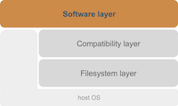

# Software layer

The top layer of the EESSI project is the **software layer**,
which provides the actual scientific software installations.

To install the software we include in our stack,
we use [**EasyBuild**](https://easybuild.readthedocs.io),
a framework for installing scientific software on HPC systems.
These installations are optimized for a particular system architecture
(specific CPU and GPU generation).

To access these software installation we provide *environment module files*
and use [**Lmod**](https://lmod.readthedocs.io), a modern environment modules tool which has been widely
adopted in the HPC community in recent years.

We leverage the [**archspec**](https://archspec.readthedocs.io) Python library
to automatically select the best suited part of the software stack for
a particular host, based on its system architecture.

The software layer is maintained through our [https://github.com/EESSI/easybuild-layer](https://github.com/EESSI/easybuild-layer) GitHub repository.
