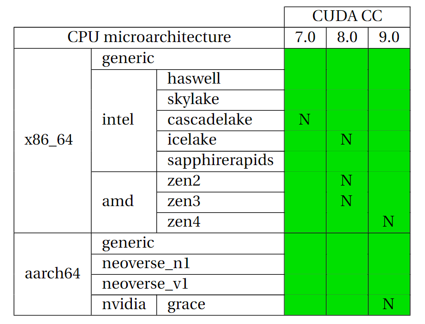

# GPU targets

## Nvidia

The 2023.06 software-layer has optimized code for the major GPU CUDA Compute Capabilities 7.0, 8.0 and 9.0, for all CPU targets listed in [CPU targets](cpu_targets.md). Since Nvidia guarantees forwards compatiblity with in a major CUDA Compute Capability (i.e. a GPU with CUDA Compute Capability 8.6 can run code built for CUDA Compute Capability 8.0), this means that all cards with Compute Capability 7.X, 8.X and 9.X are supported. The decision to only ship code optimized for the major architectures was made to keep the amount of software builds that need to be done at a reasonable level - even just building the major CUDA Compute Capabilities for all CPU targets requires around 40 builds.

Not all builds are done natively, i.e. on a system actually containing a CPU and GPU of the type that is being build for. The table below shows an overview of the supported CPU/GPU architectures (in green). The combinations marked with an 'N' are built natively.

## AMD

Support for AMD GPUs is a work in progress.
