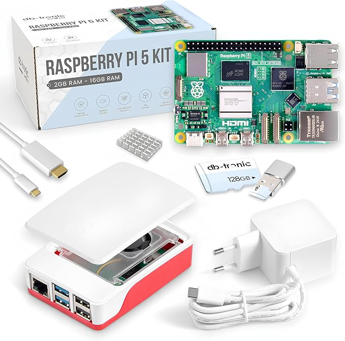

# EESSI CI/CD hackathon (2 Oct 2025, Copenhagen)

On Thursday 2 October 2025 (09:00-17:00 CEST), a continuous integration and continuous deployment (commonly referred to as CI/CD) hackathon will be organised in the wake of the
[EuroHPC User Days](https://eurohpc-ju.europa.eu/media-events/events/eurohpc-user-days-2025-2025-09-30_en)
which takes place 30 Sept + 1 Oct 2025 in Copenhagen. 

_Provided by [EuroHPC CoE MultiXscale](https://www.multixscale.eu) in collaboration with [CASTIEL2](https://hpc-portal.eu/projects/castiel-2-coordination-and-support-action) and [EuroCC Denmark](https://www.deic.dk/EuroCC2)_

!!! tip
    **The hackathon is a hybrid event with space for about 25 in-person participants.**
    
    Attending the sessions is free, but you must be registered to attend in person or to join the Zoom webinar session for online participation!

    See also [Registration](#registration).

The hackathon will give a general introduction to CI/CD, and then focus on the specific issues that can affect CI/CD workflows in the HPC domain. It will introduce the European Environment for Scientific Software Installations (EESSI, [https://eessi.io](https://eessi.io)) and some of the tools that EESSI is creating to help to address these issues.

A general outline of the program is:

- What is CI/CD
- What makes CI different in the HPC domain
- How to leverage EESSI to enable HPC-oriented CI
- Using EESSI CI services for GitHub/GitLab
- Introduction to EESSI CD services

Ample time will be provided for participants to follow prepared examples, as well as time to investigate the implementation of some of the practices for their own application codes.

The session will be recorded. Recordings, slides, and materials used will be made publicly available shortly after the event via this page.

**If you have any questions regarding this event, please send an email to `support@eessi.io`.**

!!! danger "Raspberry Pi Starter Kit prize!"
    For the on-site participants of the hackathon, a **Raspberry Pi 5 Starter Kit prize** will be awarded to the most impressive project!

    

        
    

## Venue

The event will take place at the Royal Danish Library's Cultural Centre, in the [Black Diamond](https://www.kb.dk/en/visit-us/black-diamond-copenhagen) building.

## Online

Online participation is available via Zoom *(practical information to join will be shared with registered participants)*.

## Format

- Hybrid format
    - Space for 25 in-person attendees
    - Online participation via Zoom
- Mix of presentation & hands-on exercises
    - ~2.5h of content
    - ~2.5h for hands-on
    - ~30min for final Q&A

## Registration

Both in person and online attendance is free of charge, but registration is required.

**Register via [https://event.ugent.be/registration/eessi202510](https://event.ugent.be/registration/eessi202510)**

## Agenda

* `[09:00-09:15]` Informal welcome + practical info
* `[09:15-09:45]` Round table: introduce yourself
* `[09:45-10:15]` Quick refresher on EESSI & EasyBuild *[Lara + Helena]*
* `[10:00-11:00]` EESSI for Continuous Integration (CI) *[Alan]*
* `[11:00-11:15]` *(short break)*
* `[11:15-12:00]` EESSI for Continuous Deployment (CD) *[Alan]*
* `[12:00-12:30]` *(short lunch break)*
* `[12:30-15:45]` Hands-on session (with support from EESSI team members)
    * `[12:30-12:45]` Quick presentation, different scenarios *[Kenneth]*
    * `[12:45]` Start with guided exercise (at your own pace)
    * Follow-up with pick your own adventure (medium/advanced)
    * Online participants: ask for help in [`#cicd` channel in EESSI Slack](https://eessi-hpc.slack.com/archives/C096B9JSD0C)
        * Join EESSI Slack via [`Slack channel` link on EESSI website](https://www.eessi.io)
        * Ask to jump in Zoom breakout room to have 1-on-1 with EESSI team member
* `[15:45-16:00]` *(short break)*
* `[16:00-17:00]` Show & tell *(optional)*
    * Both for in-person and online participants
* `[16:55-17:00]` Raspberry Pi start kit prize for most impressive project *(in-person only!)*

## Preparatory Material

While most of the content will be introduced on the day, it is likely very beneficial to follow some topics from the recent EESSI webinar series relevant to the hackathon:

- [Introduction to EESSI](https://www.eessi.io/docs/training/2025/webinar-series-2025Q2/#introduction-to-eessi)
- [Introduction to EasyBuild](https://www.eessi.io/docs/training/2025/webinar-series-2025Q2/#introduction-to-easybuild)

Familiarity with [Git](https://swcarpentry.github.io/git-novice/) is also useful, as is some experience with building and/or installing software packages.

## Q&A via Slack

For posting questions or comments during the event, we strongly prefer that you post them
in the **`#cicd` channel in the EESSI Slack** ([direct link to that channel](https://eessi-hpc.slack.com/archives/C096B9JSD0C).

If you haven't joined the EESSI Slack yet, first use the "`Slack channel`" link on the [EESSI website (https://eessi.io)](https://eessi.io).

There will also be an opportunity to ask questions directly to the speakers, should you wish to do so.

## Useful links

- EESSI website: [https://eessi.io](https://eessi.io)
- EESSI documentation: [https://eessi.io/docs](https://eessi.io/docs)
- EESSI in CI: [https://www.eessi.io/docs/using_eessi/eessi_in_ci/](https://www.eessi.io/docs/using_eessi/eessi_in_ci/)
- EasyBuild website: [https://easybuild.io](https://easybuild.io)
- EasyBuild documentation: [https://docs.easybuild.io](https://docs.easybuild.io)
- MultiXscale website: [https://www.multixscale.eu](https://www.multixscale.eu)

## Organisers

- Bob Dröge (Univ. of Groningen) *[remote]*
- Kenneth Hoste (Ghent University)
- Alan O'Cais (freelancer EuroHPC projects for Ghent University)
- Lara Peeters (Ghent University)
- Thomas Röblitz (Univ. of Bergen)
- Pedro Santos Neves (Univ. of Groningen) *[remote]*
- Richard Topouchian (Univ. of Bergen) *[remote]*
- Helena Vela Belrtran (Do IT Now)
