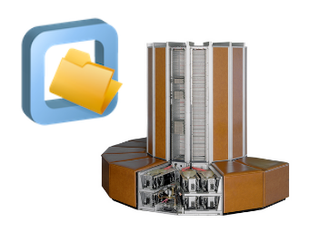

# Best Practices for CernVM-FS in HPC

 

This is an introductory tutorial to [CernVM-FS](https://cernvm.cern.ch/fs/), the CernVM File System,
with a focus on employing it in the context of High-Performance Computing (HPC).

In this tutorial you will learn what CernVM-FS is, how to get access to existing CernVM-FS repositories,
how to configure CernVM-FS, and how to use CernVM-FS [repositories](appendix/terminology.md#repository)
on HPC infrastructure.

**[Ready to go? Click here to start the tutorial!](cvmfs/what-is-cvmfs.md)**

## Recording

A first long-form (~3h15min) virtual edition of this tutorial was held on 4 December 2023,
see [here](https://multixscale.github.io/cvmfs-tutorial-hpc-best-practices/) (recording available)

A slightly shorter (~2h) updated version of this tutorial was presented as a part of the
[EESSI webinar series in May 2025](../webinar-series-2025Q2.md).

The recording of this session is embedded below:

<iframe width="560" height="315" src="https://www.youtube.com/embed/5-IYnxCz_aQ?si=zqgYBiZCdY5islK8" title="YouTube video player" frameborder="0" allow="accelerometer; autoplay; clipboard-write; encrypted-media; gyroscope; picture-in-picture; web-share" referrerpolicy="strict-origin-when-cross-origin" allowfullscreen></iframe>

## Slides

[Available for download here](../EESSI-webinars-MayJune-2025-002-Introduction-to-CernVM-FS-20250512.pdf)

## Contents

- [Home](index.md)
- [Introduction to CernVM-FS](cvmfs/index.md):
    - [What is CernVM-FS?](cvmfs/what-is-cvmfs.md)
    - [Technical details](cvmfs/technical-details.md)
    - [Flagship repositories](cvmfs/flagship-repositories.md)
- [EESSI](eessi/index.md)
    - [What is EESSI?](eessi/what-is-eessi.md)
    - [Motivation & goals](eessi/motivation-goals.md)
    - [Inspiration](eessi/inspiration.md)
    - [High-level design](eessi/high-level-design.md)
    - [Using EESSI](eessi/using-eessi.md)
    - [Getting support](eessi/support.md)
- [Accessing repositories](access/index.md)
    - [CernVM-FS client system](access/client.md)
    - [Squid proxy server](access/proxy.md)
    - [Private Stratum 1 replica server](access/stratum1.md)
    - [Alternative access methods](access/alternatives.md)
- [Configuration on HPC systems](configuration_hpc.md)
- [Troubleshooting](troubleshooting.md)
- [Monitoring CernVM-FS](monitoring.md)
- [Performance aspects](performance.md)
- [Containers](containers.md)
- [Creating a CernVM-FS repository](creating-repo.md)
- [Appendix: Terminology](appendix/terminology.md)

## Intended audience

This tutorial is intended for people with a background in HPC (system administrators, support team members,
end users, etc.) and who are new to CernVM-FS; no specific prior knowledge or experience with it is required.

We expect it to be most valuable to people who are interested in using or providing access to one or more existing
CernVM-FS repositories on HPC infrastructure.

## Prerequisites

- Basic knowledge of Linux shell environment
- Basic knowledge of networking (IP address, port, latency)
- Basic knowledge of Linux file systems
- Familiarity with High-Performance Computing environments is a plus
- Hands-on experience with running scientific software workloads is a plus

## Practical information

### Slack channel

Dedicated channel in EESSI Slack: [`#cvmfs-best-practices-hpc`](https://eessi-hpc.slack.com/archives/C068DV7GY3V)

[Click here to join the EESSI Slack]({{ config.extra.slack_invite_url }})

## MultiXscale

This tutorial was developed and organised in the context of the [MultiXscale EuroHPC
Centre-of-Excellence](https://www.multixscale.eu).

Funded by the European Union. This work has received funding from the [European High Performance Computing Joint
Undertaking (JU)](https://eurohpc-ju.europa.eu) and countries participating in the project under grant agreement No 101093169.

## Contributors

* Jakob Blomer (CERN, Switzerland)
* Bob Dröge (University of Groningen, The Netherlands)
* Kenneth Hoste (Ghent University, Belgium)
* Alan O'Cais (University of Barcelona, Spain; CECAM)
* Lara Peeters (Ghent University, Belgium)
* Laura Promberger (CERN, Switzerland)
* Thomas Röblitz (University of Bergen, Norway)
* Caspar van Leeuwen (SURF, The Netherlands)
* Valentin Völkl (CERN, Switzerland)

## Additional resources

* [CernVM-FS website](https://cernvm.cern.ch/fs)
* [CernVM-FS documentation](https://cvmfs.readthedocs.io)
* [CernVM-FS @ GitHub](https://github.com/cvmfs)
* [CernVM-FS forum](https://cernvm-forum.cern.ch)
* [Introduction to CernVM-FS by *Jakob Blomer (CERN)* (2021)](https://easybuild.io/eum21/#cvmfs-talk)
* [Introductory tutorial on CernVM-FS (2021)](https://cvmfs-contrib.github.io/cvmfs-tutorial-2021)
